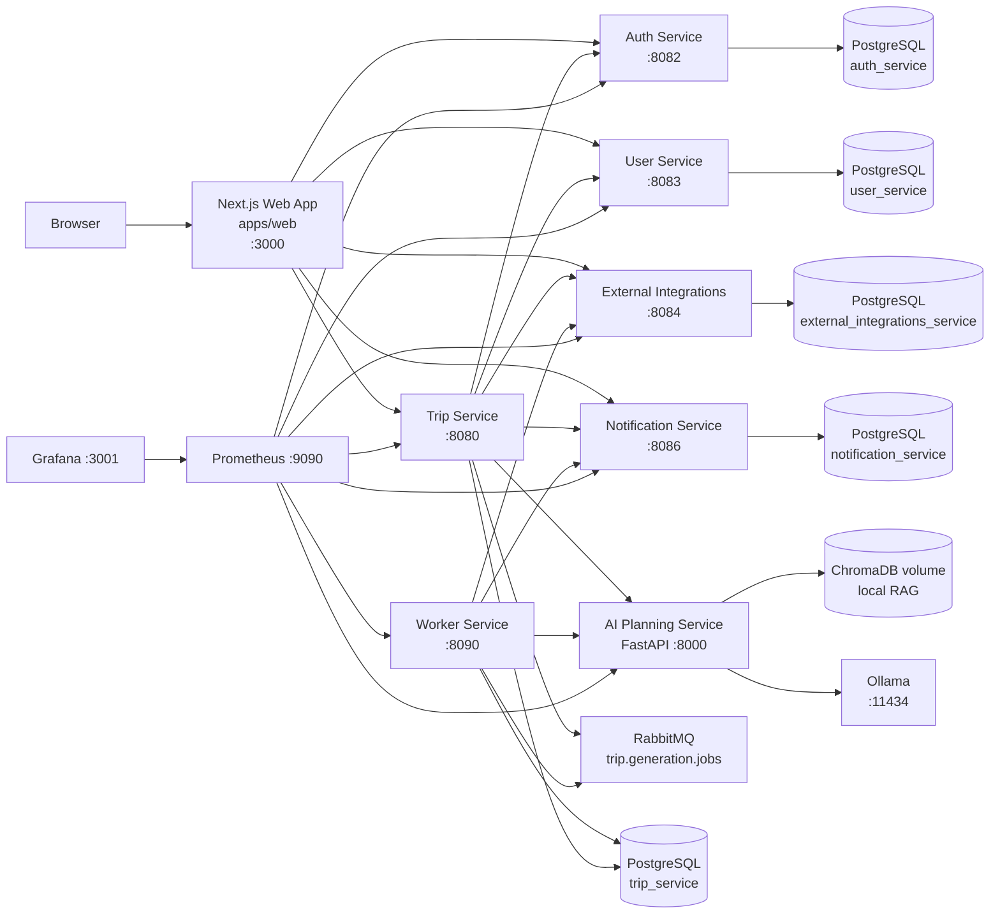
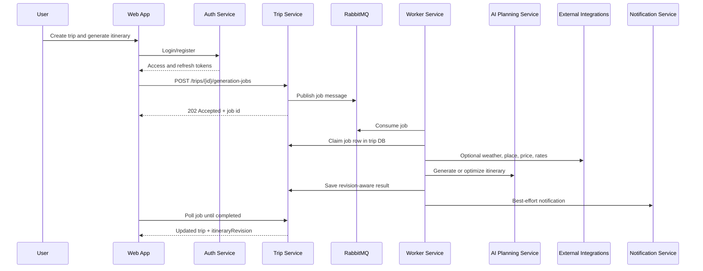

# Travel AI App

Travel AI App is a local-first, multi-service travel planning system. It
combines a Next.js web app, Go microservices, a FastAPI AI planning service,
RabbitMQ-backed generation jobs, PostgreSQL-owned service data, and a local
Prometheus/Grafana observability stack.

The default development stack runs at `http://localhost:3000`.

## System Map



## Services

| Area | Path | Port | Responsibility |
| ---- | ---- | ---- | -------------- |
| Web app | [apps/web](apps/web/README.md) | `3000` | Trip UX, collaboration, exports, notifications, calendar controls. |
| Auth | [services/auth-service](services/auth-service/README.md) | `8082` | Email/password auth, JWT access tokens, refresh-token rotation, internal user lookup. |
| Trips | [services/trip-service](services/trip-service/README.md) | `8080` | Trip ownership, collaborators, itinerary revisions, jobs, budgets, comments, shares, activity. |
| Users | [services/user-service](services/user-service/README.md) | `8083` | Travel profile and preference data scoped by Auth JWT `sub`. |
| External integrations | [services/external-integrations-service](services/external-integrations-service/README.md) | `8084` | Places, routes, weather, exchange rates, price estimates, Google Calendar integration boundary. |
| Notifications | [services/notification-service](services/notification-service/README.md) | `8086` | In-app notifications, SSE, preferences, optional email and browser push. |
| Worker | [services/worker-service](services/worker-service/README.md) | `8090` | RabbitMQ consumer for slow generation and budget optimization jobs. |
| AI planning | [services/ai-planning-service](services/ai-planning-service/README.md) | `8000` | Itinerary generation, regeneration, budget proposals, destination context, local RAG. |
| Local infra | [infra](infra/README.md) | mixed | Docker Compose, Postgres, RabbitMQ, Ollama, Adminer, Prometheus, Grafana. |
| Observability | [infra/observability](infra/observability/README.md) | `9090`, `3001` | Metrics, dashboards, correlation IDs, label rules. |

## Core Workflows



Key product capabilities:

- Authenticated trip planning with private ownership and collaborator roles.
- Optimistic concurrency through `itineraryRevision` and explicit
  `expectedItineraryRevision` writes.
- Asynchronous full generation, day/item regeneration, quality improvement, and
  budget optimization jobs.
- Version history, restore, comments, activity feed, presence, and advisory edit
  locks for private trips.
- Public read-only share links with optional expiration and password unlock.
- Budget summaries with multi-currency conversion, accommodation cost support,
  provider ticket estimates, and reviewable AI budget proposals.
- Optional place, route, weather, exchange-rate, ticket-price, Google Calendar,
  email, and browser push integrations behind mock-first provider boundaries.

## Quick Start

```bash
cp infra/.env.example infra/.env
./scripts/dev-setup.sh
docker compose -f infra/docker-compose.yml --env-file infra/.env up --build
```

Open:

- Web app: `http://localhost:3000`
- Grafana: `http://localhost:3001` (`admin` / `admin`)
- Prometheus: `http://localhost:9090`
- RabbitMQ management: `http://localhost:15672` (`guest` / `guest`)
- Adminer: `http://localhost:8081`

Run the full-stack smoke test:

```bash
./scripts/smoke-test.sh
```

## Development Commands

From the repository root:

```bash
cp infra/.env.example infra/.env
./scripts/dev-setup.sh
./scripts/index-knowledge.sh
./scripts/smoke-test.sh
docker compose -f infra/docker-compose.yml --env-file infra/.env up --build
```

From a Go service directory:

```bash
make fmt
make vet
make test
make build
```

From `services/ai-planning-service`:

```bash
make install
make fmt-check
make lint
make test
```

From `apps/web`:

```bash
npm install
npm run dev
npm run typecheck
npm run build
```

## Repository Layout

```text
.
├── apps/web                         # Next.js App Router frontend
├── services/
│   ├── auth-service                 # Go auth service
│   ├── trip-service                 # Go trip/domain orchestration service
│   ├── user-service                 # Go profile/preferences service
│   ├── external-integrations-service# Go provider boundary service
│   ├── notification-service         # Go notification service
│   ├── worker-service               # Go RabbitMQ job worker
│   └── ai-planning-service          # FastAPI AI service
├── infra                            # Docker Compose and local observability
├── scripts                          # Setup, smoke tests, indexing helpers
├── packages                         # Reserved for shared packages
└── graphify-out                     # Generated codebase knowledge graph
```

## Configuration And Security

- Start from `infra/.env.example`; keep real secrets in `infra/.env` or the
  shell environment only.
- Auth, Trip, User, and Notification services must share `JWT_ACCESS_SECRET` in
  local development.
- Internal service calls use `INTERNAL_SERVICE_TOKEN`; do not expose internal
  endpoints outside a private network.
- Browser-facing URLs use `NEXT_PUBLIC_*`; server-side Next.js proxy URLs use
  `*_INTERNAL_URL`.
- Do not log access tokens, refresh tokens, internal service tokens, OAuth
  tokens, API keys, full prompts, full preference payloads, or full private
  itinerary JSON.

## Documentation Map

- Run the whole stack: [infra/README.md](infra/README.md)
- Metrics and dashboards: [infra/observability/README.md](infra/observability/README.md)
- Frontend behavior: [apps/web/README.md](apps/web/README.md)
- Trip orchestration: [services/trip-service/README.md](services/trip-service/README.md)
- AI generation and RAG: [services/ai-planning-service/README.md](services/ai-planning-service/README.md)

The generated codebase graph starts at [graphify-out/wiki/index.md](graphify-out/wiki/index.md).
