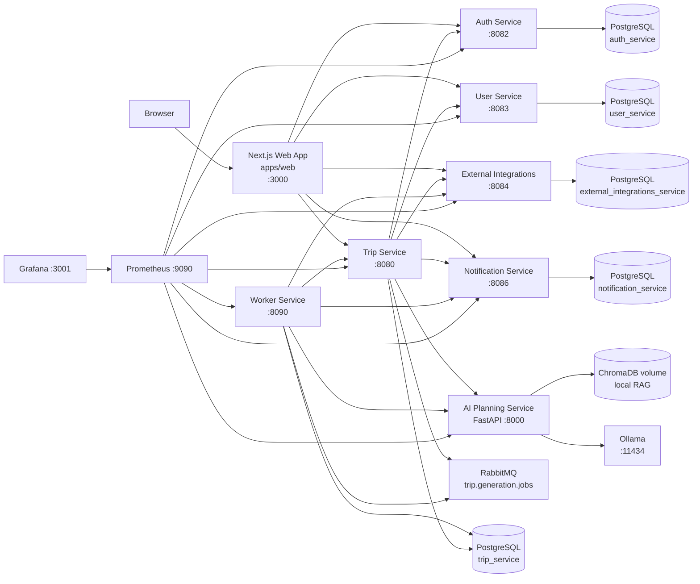
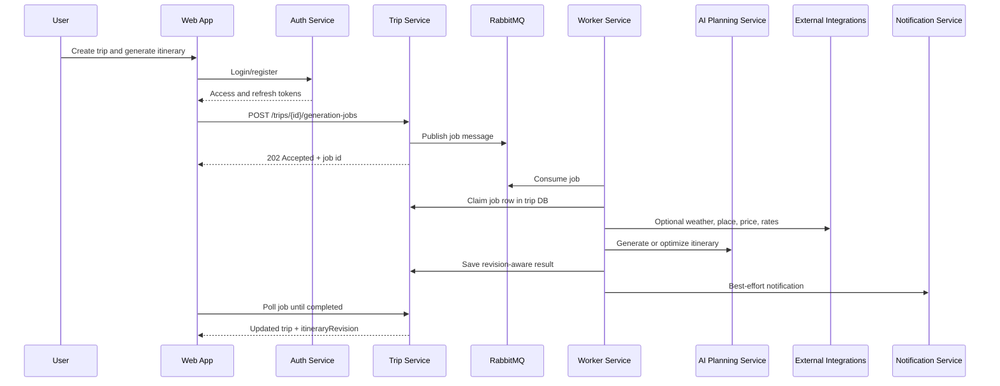

# Travel AI App

Travel AI App is a local-first, multi-service travel planning system. It
combines a Next.js web app, Go microservices, a FastAPI AI planning service,
RabbitMQ-backed generation jobs, PostgreSQL-owned service data, and a local
Prometheus/Grafana observability stack.

The default development stack runs at `http://localhost:3000`.

Internationalization v1 supports English (`en`), Spanish (`es`), Ukrainian
(`uk`), and French (`fr`). The web UI uses English as its catalog fallback,
User Service persists the preference, and Trip Service forwards the requested
output language to AI Planning Service.

Smart Trip Constraints & Preference Engine v1 centralizes trip settings, user
preferences, route data, workspace policy, budget, language, and previous-trip
signals into one normalized planning context. Trip Service exposes a preview
endpoint, sends the same context to AI Planning Service for discovery,
generation, regeneration, template adaptation, repair, and budget optimization,
and keeps deterministic backend validation authoritative after AI returns.

Collaborative Trip Decision & Voting v1 adds private trip polls, editable
collaborator votes, itinerary item reactions, trip-linked discovery suggestion
votes, and a live group preference summary. Trip Service folds that summary into
AI planning constraints as advisory guidance while workspace policy, revision
checks, and deterministic validation remain authoritative.

Smart Pre-Trip Reminders & Timeline v1 turns preparation into a private reminder
timeline generated from trip dates, checklist items, route/transport context,
weather, accommodation, and collaborators. Trip Service owns reminder records,
Worker Service polls a protected Trip Service endpoint for due reminders, and
Notification Service sends in-app/email/push notifications through existing
preferences.

## System Map



## Services

| Area | Path | Port | Responsibility |
| ---- | ---- | ---- | -------------- |
| Web app | [apps/web](apps/web/README.md) | `3000` | Workspace/trip UX, collaboration, exports, notifications, calendar controls, PWA install/offline experience. |
| Auth | [services/auth-service](services/auth-service/README.md) | `8082` | Email/password auth, JWT access tokens, refresh-token rotation, internal user lookup. |
| Trips | [services/trip-service](services/trip-service/README.md) | `8080` | Personal/workspace trip ownership, collaborators, itinerary revisions, jobs, budgets, checklists, reminders, comments, shares, activity. |
| Users | [services/user-service](services/user-service/README.md) | `8083` | Travel profile, preferences, workspace membership, and invitations scoped by Auth JWT `sub`. |
| External integrations | [services/external-integrations-service](services/external-integrations-service/README.md) | `8084` | Places, routes, weather, exchange rates, price estimates, Google Calendar integration boundary. Central per-provider rate-limit and daily-quota enforcement (Provider Quota & Rate-Limit Management v1). |
| Notifications | [services/notification-service](services/notification-service/README.md) | `8086` | In-app notifications, SSE, preferences, optional email and browser push. |
| Worker | [services/worker-service](services/worker-service/README.md) | `8090` | RabbitMQ consumer for slow generation and budget optimization jobs. |
| AI planning | [services/ai-planning-service](services/ai-planning-service/README.md) | `8000` | Itinerary generation, packing checklist generation, regeneration, budget proposals, destination context, local RAG. |
| Local infra | [infra](infra/README.md) | mixed | Docker Compose, Postgres, RabbitMQ, Ollama, Adminer, Prometheus, Grafana. |
| Observability | [infra/observability](infra/observability/README.md) | `9090`, `3001` | Metrics, dashboards, correlation IDs, label rules. |

## Core Workflows



Key product capabilities:

- Authenticated trip planning with private ownership and collaborator roles.
- Multi-Tenant / Team Workspace v1: users can create workspaces, invite members,
  accept/decline invitations, switch between Personal/All/workspace scopes, and
  create workspace-owned trips governed by owner/admin/member/viewer roles.
- Smart Trip Constraints & Preference Engine v1: preview the AI planning
  context, detect warnings/blockers such as disallowed flights or unrealistic
  route density, and pass one normalized constraints object through AI flows.
- Collaborative Trip Decision & Voting v1: owners/editors can create and manage
  trip polls; owners, editors, and accepted viewers can vote/react; group
  preferences guide regeneration, repair, budget optimization, discovery, and
  route planning without automatically applying winning choices.
- Smart Packing & Preparation Checklist v1: owners/editors can generate an
  AI-assisted private trip checklist from itinerary, route, weather, budget,
  traveler, and preference context; add/manual-edit items; assign collaborators;
  check items; preserve manual/checked items on regeneration; and include a
  sanitized summary in private exports. Public shares do not expose checklist
  data.
- Smart Pre-Trip Reminders & Timeline v1: owners/editors can generate a
  deterministic preparation timeline from dates, checklist items, route legs,
  transport modes, accommodation, weather, and collaborators; add/edit/complete/
  disable/delete reminders; preserve manual/completed reminders on regeneration;
  and receive due reminders through Notification Service preferences. Public
  shares do not expose reminders, reminders do not mutate itineraries or approval
  state, and users must verify official requirements themselves.
- Route Alternatives & Comparison v1: users can generate 2-4 advisory
  multi-destination route options before a trip exists or from an existing trip,
  compare stops, transfer modes, rough cost/time, difficulty, scores, pros/cons,
  and warnings, refine the shortlist, create a trip from one option, apply one
  to an existing trip with confirmation, and turn alternatives into a normal
  collaborative poll.
- Optimistic concurrency through `itineraryRevision` and explicit
  `expectedItineraryRevision` writes, plus Advanced Collaborative Diff/Merge v1
  for safe day/item-level recovery of stale itinerary drafts.
- Offline Trip Mode v1 for previously opened private trips: IndexedDB cached
  trip snapshots, cached itinerary/budget/accommodation viewing, queued offline
  itinerary edits, and revision-safe sync with the same diff/merge recovery.
- Advanced PWA Install Experience v1: strong manifest, install prompt,
  iOS Add to Home Screen instructions, installed-app detection, safe service
  worker update banner, `/offline-trips`, and settings integration.
- Asynchronous full generation, day/item regeneration, quality improvement, and
  budget optimization jobs.
- Version history, restore, comments, activity feed, presence, and advisory edit
  locks for private trips.
- Public read-only share links with optional expiration and password unlock.
- Budget summaries with multi-currency conversion, accommodation cost support,
  provider ticket estimates, and reviewable AI budget proposals.
- Cost Splitting Between Travelers v1: trip traveler roster, per-item and
  accommodation allocation rules, per-traveler summaries, and CSV/PDF exports
  for planning estimates.
- Shared Expenses & Settlement v1: private trip collaborators can record actual
  paid expenses, choose equal/selected/custom/payer-only splits, compare actual
  spend to the planned budget, view deterministic balance and settlement
  suggestions, and mark suggestions paid. This is collaborative bookkeeping only:
  no real payment is initiated or processed.
- Cost Analytics Dashboard v1 with trip and workspace cost rollups, expensive
  item insights, missing estimate warnings, and browser-generated CSV/PDF cost
  reports.
- Workspace Shared Budgets v1: owner/admin-managed workspace budget limits,
  primary budget utilization in analytics, read-only member/viewer summaries,
  over-budget insights, and CSV/PDF budget reports for planning estimates.
- Trip Templates v1: users can save completed trips as sanitized private or
  workspace templates, browse a template library, and create new trips from
  templates with shifted dates and unchecked live availability.
- AI Template Adaptation v1: users can adapt a reusable template to a new
  destination, duration, budget, pace, travelers, and interests via a background
  `template_adaptation` job. The Worker calls AI Planning Service `/adapt-template`
  (deterministic mock or Ollama), Trip Service validates/repairs and saves the
  adapted itinerary, optionally falls back to a deterministic template copy, and
  marks the created trip as AI-adapted for review. It never auto-books or
  auto-approves; costs are estimates and availability stays unchecked.
- AI Trip Discovery v1: Create Trip supports prompt-based destination ideas,
  smart Surprise Me, preference/past-trip/workspace-policy personalization,
  iterative refinements, and confirmation-only trip creation with optional
  itinerary generation. Suggestions use rough budgets and never book travel.
- Multi-Destination & Multi-Modal Travel Planning v1: trips can remain classic
  single-destination plans or carry a structured route with origin, ordered
  stops, transfer legs, transport modes, trip styles, and estimated transfer
  costs. The create flow includes a route builder, AI generation creates
  transfer days/items in mock and Ollama modes, trip detail shows route overview
  and approximate map lines, and budget/policy/risk/public-share paths consume
  route data where practical. Estimates are not live schedules or bookings.
- Route Alternatives & Comparison v1: the create trip flow and trip detail route
  overview can request AI route alternatives, compare scored options, refine the
  set, create/apply a selected route only after explicit confirmation, and create
  a standard trip poll from route options. Estimates and map lines are
  approximate; no schedules, prices, tickets, permits, or bookings are live.
- Workspace Approval Workflow v1: workspace trips carry a lightweight approval
  status (draft → pending → approved / changes requested / cancelled). Editors
  submit trips for review against a readiness checklist, owners/admins approve or
  request changes from a per-workspace approvals queue, material edits reset an
  approved trip back to draft, and every action records approval history,
  notifications, and activity. It is planning approval only — no locking, legal
  signatures, or compliance workflow.
- Smart Approval Risk Scoring v1: Trip Service computes deterministic,
  explainable 0-100 risk scores for workspace trip approvals from policy,
  budget, cost-splitting, availability, AI/template fallback, and itinerary
  structure signals. The Web App shows risk badges in trip headers and approval
  queues, adds factor breakdowns to the approval panel, and requires explicit
  acknowledgement for critical-risk submissions.
- AI Policy-Aware Trip Repair v1: workspace trip editors can start a
  `policy_repair` job from approval risk or the trip tools panel. Trip Service
  sends the current itinerary, policy evaluation, approval risk, selected
  repair mode, and constraints to AI Planning Service `/repair-itinerary`, then
  stores a pending repair proposal with before/after risk/policy summaries and a
  bounded itinerary diff. Repairs are never auto-applied or auto-approved;
  applying a proposal checks `itineraryRevision`, replaces the itinerary through
  the normal versioned save path, records activity, and resets approval to
  draft when required.
- Optional place, route, weather, exchange-rate, ticket-price, Google Calendar,
  email, and browser push integrations behind mock-first provider boundaries.
- Provider Quota & Rate-Limit Management v1: External Integrations Service
  enforces per-provider in-memory rate limits and Postgres-backed daily quotas
  before calling real providers, with controlled `provider_rate_limited` /
  `provider_quota_exceeded` errors, worker retry classification, and an Ops
  Dashboard Provider Quotas panel.
- Advanced Availability Provider Adapters v1: a real **Ticketmaster** Discovery
  API adapter behind the stable `/availability/search` abstraction, with
  deterministic matching/confidence scoring, conservative low-confidence
  handling, provider-specific caching (checked before quota), shared quota/
  rate-limit and fallback behavior, an enriched availability UI (provider badge,
  confidence, price differences, venue, external booking links), and richer
  approval-checklist availability warnings. Mock stays the default/fallback; no
  in-app booking or payments.

## Quick Start

```bash
cp infra/.env.example infra/.env
./scripts/dev-setup.sh
docker compose -f infra/docker-compose.yml --env-file infra/.env up --build
```

Open:

- Web app: `http://localhost:3000`
- Grafana: `http://localhost:3001` (`admin` / `admin`)
- Prometheus: `http://localhost:9090`
- RabbitMQ management: `http://localhost:15672` (`guest` / `guest`)
- Adminer: `http://localhost:8081`

Run the full-stack smoke test:

```bash
./scripts/smoke-test.sh
```

## Development Commands

From the repository root:

```bash
cp infra/.env.example infra/.env
./scripts/dev-setup.sh
./scripts/index-knowledge.sh
./scripts/smoke-test.sh
docker compose -f infra/docker-compose.yml --env-file infra/.env up --build
```

From a Go service directory:

```bash
make fmt
make vet
make test
make build
```

From `services/ai-planning-service`:

```bash
make install
make fmt-check
make lint
make test
```

From `apps/web`:

```bash
npm install
npm run dev
npm run typecheck
npm run build
```

## Repository Layout

```text
.
├── apps/web                         # Next.js App Router frontend
├── services/
│   ├── auth-service                 # Go auth service
│   ├── trip-service                 # Go trip/domain orchestration service
│   ├── user-service                 # Go profile/preferences service
│   ├── external-integrations-service# Go provider boundary service
│   ├── notification-service         # Go notification service
│   ├── worker-service               # Go RabbitMQ job worker
│   └── ai-planning-service          # FastAPI AI service
├── infra                            # Docker Compose and local observability
├── scripts                          # Setup, smoke tests, indexing helpers
├── packages                         # Reserved for shared packages
└── graphify-out                     # Generated codebase knowledge graph
```

## Configuration And Security

- Start from `infra/.env.example`; keep real secrets in `infra/.env` or the
  shell environment only.
- Auth, Trip, User, and Notification services must share `JWT_ACCESS_SECRET` in
  local development.
- Internal service calls use `INTERNAL_SERVICE_TOKEN`; do not expose internal
  endpoints outside a private network.
- Browser-facing URLs use `NEXT_PUBLIC_*`; server-side Next.js proxy URLs use
  `*_INTERNAL_URL`.
- The internal Ops Dashboard is off by default. Enable it only with
  `OPS_DASHBOARD_ENABLED=true` and a comma-separated `OPS_ADMIN_EMAILS`
  allowlist; its UI lives at `/ops`.
- Do not log access tokens, refresh tokens, internal service tokens, OAuth
  tokens, API keys, full prompts, full preference payloads, or full private
  itinerary JSON.

## Documentation Map

- Run the whole stack: [infra/README.md](infra/README.md)
- Metrics and dashboards: [infra/observability/README.md](infra/observability/README.md)
- Frontend behavior: [apps/web/README.md](apps/web/README.md)
- Trip orchestration: [services/trip-service/README.md](services/trip-service/README.md)
- AI generation and RAG: [services/ai-planning-service/README.md](services/ai-planning-service/README.md)

The generated codebase graph starts at [graphify-out/wiki/index.md](graphify-out/wiki/index.md).

## Workspace Policy Rules v1

Workspaces can define one active planning policy with versioned budget,
availability, route, schedule, rest, transport, and activity-type rules. Trip
Service evaluates workspace trips deterministically, adds the result to
approval readiness, and blocks submission only for violated rules configured
as `blocking`. AI generation/adaptation receives active rules as best-effort
guidance; backend evaluation remains authoritative.

## Group Availability & Date Coordination v1

Trip collaborators can now submit manual available, unavailable, and preferred
date ranges. Trip Service computes deterministic scored date windows, owners or
editors can create a date poll from those options, and applying an option fixes
the trip dates for later planning constraints and AI generation. V1 is advisory
and manual: it does not import calendar free/busy data, book anything, or rewrite
an existing itinerary unless the user explicitly queues regeneration.
