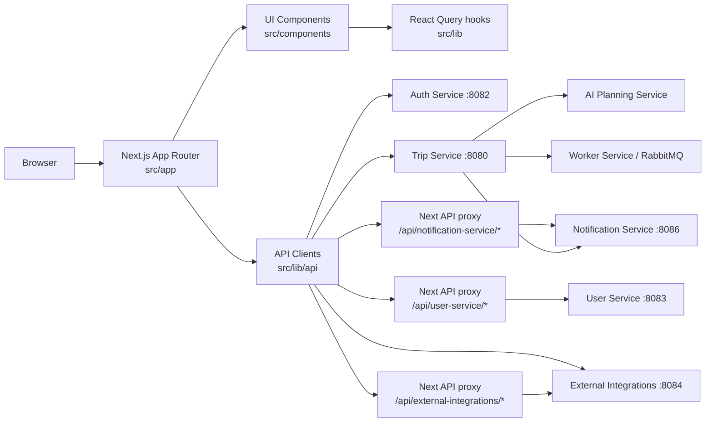
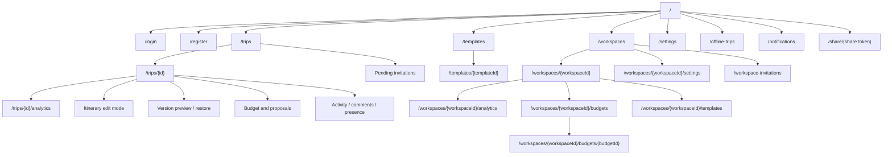
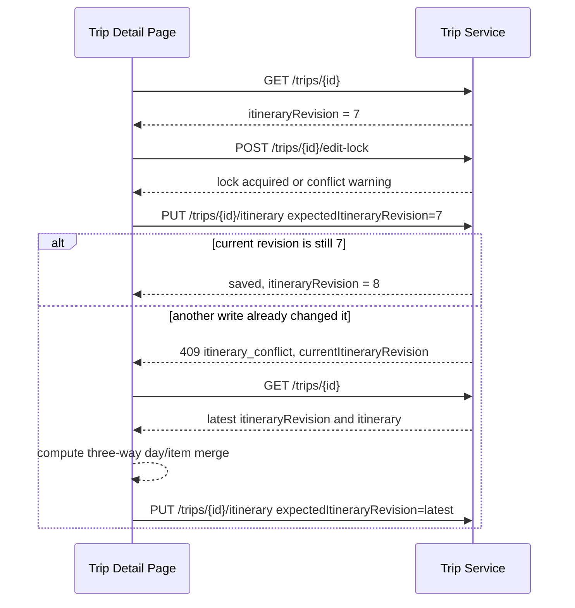

# Travel AI Planner Web

Next.js App Router frontend for the Travel AI App. The web app owns the browser
experience for authentication, workspace planning, trip planning, itinerary
editing, collaboration, notifications, exports, calendar sync controls, maps,
weather, budgets, route-leg transport search, and ticket/activity availability
checks.

## Performance query conventions

Use `src/lib/query-keys.ts` for new TanStack Query keys and keep private trip data under the trip detail prefix. Queries must wait for required IDs/permissions and, for heavy modules, the visible or deep-linked section. Default freshness is 30 seconds; expensive health/readiness/confidence views use 45 seconds, weather uses 10 minutes, and only queued/running jobs poll aggressively.

Mutations invalidate the smallest dependency set. For example, an expense write refreshes that trip’s expense subtree, budget summary/confidence, health, activity, and Command Center—not all trips. The trip page loads its compact summary first, uses card-level degraded states, activates detailed sections with `IntersectionObserver`, and dynamically imports maps and heavy panels without changing layout. Set `NEXT_PUBLIC_WEB_VITALS_ENDPOINT` to report normalized LCP/CLS/INP; use `scripts/performance-smoke-test.sh` and the Performance & Reliability steps in `scripts/web-smoke-test.md` before release.

## Internationalization

The app supports `en`, `es`, `uk`, and `fr` without locale-prefixed routes.
Message catalogs live in `messages/*.json`; English is merged underneath the
selected catalog so missing keys do not crash the UI. Language resolution is:
authenticated profile, then `app_language` in local storage, then the browser
language, then English. Use `useTranslations(namespace)` for UI copy,
`useAppLanguage()` when a request or export needs the language code, and the
helpers in `src/lib/i18n/format.ts` for dates, numbers, percentages, and money.

Add a key to `messages/en.json` first, then translate it in the other catalogs.
The settings selector applies changes immediately and persists them to the
profile when signed in.

## Onboarding and first run

New users with no trips see a lightweight first-run dashboard with direct
routes into known-destination creation, AI discovery, templates,
multi-destination planning, and a read-only demo. `/getting-started` contains a
skippable four-step preference wizard that saves to the existing User Service
profile/preferences endpoints. Create Trip then prefills currency, language,
pace, walking, transport, origin, and travel styles from those records.

Onboarding progress is analytics-free and browser-local under the user-scoped
`onboarding:{userId}` key. Dismissed feature tips and per-trip setup cards use
separate user-scoped keys. A first trip gets a computed setup checklist in its
Command Center until most useful setup work is complete, the user dismisses it,
or onboarding is finished. `/demo-trip` uses only sample props and exposes no
mutation or sharing actions. See `docs/frontend/onboarding.md` for state,
checklist, accessibility, i18n, and tip-extension guidance.

Existing trip text, comments, notes, template names, and other user content are
never translated automatically. Some legacy screens and email/backend fallback
messages can still be English in v1.

## UX Primitives

Frontend UX Polish & Usability Hardening v1 standardizes repeated states in
`src/components/ui`. Use `PageLoadingState` before page identity is available,
`SectionLoadingState`/`CardSkeleton` for progressive card loading, `EmptyState`
for valid no-data states, and `ErrorState`/`InlineError` for recoverable failures.
Mutation buttons can use `ButtonSpinner`; mobile editors use
`StickyMobileActionBar`.

Use `ConfirmDialog` for destructive or important changes and
`UnsavedChangesDialog` for local draft loss. Confirmation copy must explain
what changes, what remains, and whether the action is reversible. Forms connect
`FieldHint` and errors to fields, and long forms use `FormErrorSummary` with
stable field IDs.

Trip-detail deep links are mapped in
`src/lib/trip-command-center/navigation.ts`. New targets need a stable DOM ID,
scroll margin, keyboard focus, a temporary highlight, and friendly missing-target
feedback. Add every new user-facing key to all four message catalogs. See
`docs/frontend/ux-guidelines.md` and `docs/frontend/ux-polish-audit.md` for the
full patterns and migration status.

## Global Command Palette

Authenticated pages mount `GlobalCommandPalette` under `src/app/providers.tsx`.
Cmd+K/Ctrl+K opens a keyboard-friendly dialog that searches Trip Service
`GET /search`, mixes in local quick commands, boosts cached current-trip route
and itinerary matches, and stores up to 20 recent selections in user-scoped
localStorage. Public share pages disable the private palette.

Command definitions live in `src/lib/command-palette/commands.ts`; recent item
storage lives in `src/lib/command-palette/recent-items.ts`; the API client is
`src/lib/api/search.ts`. Result hrefs use existing trip query deep links, so new
searchable UI targets must add stable IDs and mapping entries in
`src/lib/trip-command-center/navigation.ts`. Commands are UI shortcuts only:
backend permissions still authorize every destination action.

## Frontend Boundary



The browser calls public service URLs for normal JSON APIs. Same-origin Next.js
API proxy routes are used where a browser flow needs an internal Docker hostname
or tighter path filtering, such as User Service workspace/profile calls,
notification streams, and calendar OAuth calls.

## Capabilities

| Area | What the UI supports |
| ---- | -------------------- |
| Auth | Register, login, refresh/logout, current-user lookup. |
| Onboarding | Skippable first-run dashboard and preference wizard, four existing trip entry paths, read-only demo trip, first-trip setup checklist, contextual tips, restart controls, and user-scoped local progress. |
| Trips | Create/list/detail trips, generate itineraries, edit and restore versions. |
| Search | Cmd/Ctrl+K global command palette with permission-aware backend results, local quick actions, recent items, current-trip boosts, and deep links into trip sections. |
| Trip Command Center | Default trip overview that summarizes health, next best action, route/transport, budget confidence, group readiness, checklist/reminders, expenses/settlements, approval/policy, recent activity, offline sync, and grouped navigation. |
| Routes | Multi-destination route builder with origin, stops, reorder/remove controls, per-leg transport modes, route-leg transport option search/compare/attach, trip styles, validation warnings, route overview, transfer item rendering, and approximate route-map lines. |
| Route alternatives | AI route alternatives panel with cards, comparison table, route-order preview, refinement controls, create-trip/apply dialogs, and route-poll creation. |
| Trip discovery | Create Trip has known-destination and AI discovery modes with prompt chips, Surprise Me, refinements, route suggestions, confirmation, and optional itinerary generation. |
| Decisions | Trip detail has a Decisions section for polls, editable votes, item reactions, group preference summaries, and trip-linked discovery suggestion voting. |
| Trip health | Trip detail shows a private readiness badge, score panel, category summary, top fixes, and filterable consistency issues from Trip Service health checks. |
| Group readiness | Trip detail shows private group readiness, per-collaborator blockers, category progress, top actions, and owner/editor nudge controls from Trip Service. |
| Templates | Save trips as private/workspace templates, browse the template library, preview itinerary structure, create new trips from templates, and adapt templates to a new destination with AI. |
| Workspaces | Workspace switcher, create/list/settings pages, member invites/roles/removal, pending invitations, workspace trip filtering. |
| Collaboration | Invite registered users, viewer/editor roles, pending invitations, shared trips. |
| Concurrency | `itineraryRevision` conflict recovery, advisory presence, soft edit locks. |
| Jobs | Async full generation, partial regeneration, quality improvement, budget optimization, and generation reliability badges/warnings. |
| Reminders | Private Reminders/Timeline panel with rule-based generation, manual reminders, filters, completion/disable actions, stale warnings, and notification preferences. |
| Budget | Trip budget, workspace shared budgets, item costs, accommodation cost, selected transport estimates, summaries, budget confidence, traveler cost splitting, cost analytics dashboards, optimization proposals. |
| Receipts | Receipt upload for private trip expenses, mock OCR review, authenticated image/PDF preview, create-expense-from-receipt, attach/delete receipt actions. |
| AI repair | Workspace trip repair jobs, pending repair proposals, before/after itinerary diff preview, revision-safe apply/discard, and approval risk integration. |
| Places | Manual place attachment, auto-match review, map markers, opening-hours warnings. |
| Availability | Per-item availability checks with a provider badge (Ticketmaster/Mock/Fallback), match-confidence label, price qualifier (`From`/`Est.`), venue/date, price-difference vs the current estimate, safe external booking links, low-confidence/fallback warnings, and apply-price updates that preserve cost-split rules. |
| Context | Weather cards, route/distance estimates, accommodation routing anchors. |
| Sharing | Public read-only share links, expiration, password unlock, sanitized exports. |
| Notifications | Header bell, unread count, SSE stream, preferences, optional browser push. |
| Calendar | Google Calendar connect/sync/disconnect controls through backend services. |
| Export | Browser-generated PDF, CSV cost reports, and `.ics` downloads for private and public views. |
| Offline / PWA | Installable PWA manifest, app update banner, `/offline-trips`, IndexedDB trip companion cache including selected route transport details, offline itinerary/checklist/reminder/expense/receipt-draft queue, sync status, and revision conflict recovery. Transport search remains online-only. |

## Route-Leg Transport Search

Saved route legs can search provider-backed transport options through Trip
Service and External Integrations Service. Editors can compare mode/operator,
departure and arrival times, duration, transfers, price, confidence, and
warnings, then attach one selected option to the route leg. The selection updates
the route estimate and budget summary but never creates an expense or booking.

Selected options are visible in private trip detail, public shares, PDF exports,
and offline cached trips. Search and external booking/provider links are
disabled when offline. Every selected option remains an estimate until the user
verifies schedules, prices, and tickets outside the app.

## Trip Reminders

Completed private trip detail pages include a Reminders/Timeline panel after the
packing checklist. Owners/editors can generate reminders from trip dates,
checklist items, route/transport context, accommodation, weather, and
collaborators; add manual reminders; edit, delete, assign, complete/reopen, and
disable/enable reminders; and filter by category, status, assignee, high
priority, or upcoming-only. Assigned collaborators can complete/reopen/disable
their own assigned reminders when the backend permits it.

The panel groups reminders into Overdue, Today, This week, Later, Completed, and
Disabled, shows pending/overdue/today/high-priority/assigned-to-me summary
counts, and displays a stale warning when the backend detects that trip dates,
route, accommodation, or checklist data may have changed since generation.
Regeneration preserves manual and completed reminders by default and can replace
generated pending reminders only when the user opts in.

Frontend contracts live in:

- `src/entities/trip-reminder/model/trip-reminder.ts`
- `src/lib/api/trip-reminders.ts`
- `src/hooks/useTripReminders.ts`
- `src/components/trip-reminders/*`

Notification settings include `Pre-trip reminders` and `Checklist reminders`
for in-app, email, and push channels. Private PDF exports include the reminder
timeline; public shares and public exports exclude reminders. Reminders are
preparation aids only: users must verify official requirements, tickets,
bookings, permits, weather, legal/visa/medical details, and schedules
themselves. SMS, WhatsApp/Telegram, automatic booking confirmation, recurring
reminders, and calendar reminder export are not part of v1.

## Trip Health

Private trip detail pages call `GET /trips/{id}/health` for authenticated
owners, editors, and accepted viewers. Public share pages do not call or render
trip health. The header badge links to the Health section, and the Health panel
shows score, readiness level, category summaries, top fixes, readiness
checklist, and filterable issue cards.

Frontend contracts live in:

- `src/types/trip-health.ts`
- `src/lib/api/trip-health.ts`
- `src/hooks/useTripHealth.ts`
- `src/components/trip-health/*`

Trip health queries are invalidated after mutations that can affect readiness:
itinerary generation/edit/restore, route and selected transport changes, budget
updates and optimization, availability/date decisions, polls and votes,
checklists, reminders, accommodation, expenses/receipts/settlements, policy
evaluation, approval actions, and place review updates.

Health output is advisory. The UI links users back to existing trip sections to
fix issues, but it does not auto-apply route, budget, checklist, reminder,
expense, policy, or approval changes.

## Group Readiness

Private trip detail pages call `GET /trips/{id}/group-readiness` through
`src/lib/api/group-readiness.ts` and `useGroupReadiness`. The Group Readiness
panel shows the group score, readiness level, category progress, top actions,
and a collaborator table with each member's open items, completed items, and
next action.

Owners and editors can send nudges from the panel. The UI uses
`useSendGroupReadinessNudge` and the Trip Service nudge routes for missing
availability, assigned checklist/reminder work, pending votes, and pending
settlements. Successful nudges invalidate group readiness, activity, and
notification queries so the trip page and header bell update from backend
state.

Frontend contracts live in:

- `src/types/group-readiness.ts`
- `src/lib/api/group-readiness.ts`
- `src/hooks/useGroupReadiness.ts`
- `src/hooks/useSendGroupReadinessNudge.ts`
- `src/components/group-readiness/*`

The Trip Command Center consumes the same response for its group readiness card
and can promote the backend top action into the next best action list. Readiness
queries refresh after availability, poll, checklist, reminder, expense,
settlement, and approval-related data changes. Public share pages do not call or
render group readiness, and offline private views can show only previously
cached surrounding trip data, not send nudges.

Group readiness is advisory. It helps collaborators see who still needs to act,
but it does not vote for users, complete assignments, settle payments, approve
workspace trips, mutate itineraries, or expose private comments/calendar event
details.

## Budget Confidence

Private trip detail pages call `GET /trips/{id}/budget-confidence` through
`src/lib/api/budget-confidence.ts` and `useBudgetConfidence`. The Budget panel
shows the score, confidence level, risk level, category coverage, source
quality, planned-vs-actual deltas, risk issues, and recommended actions.

The Trip Command Center uses the same query to make the Budget card and next
best action prefer confidence risk over a plain budget-summary overrun. Cache
invalidations are wired to budget edits, itinerary/repair/optimization changes,
accommodation, route/selected transport, expenses, receipts, and offline sync
events that can change the score.

Budget confidence is advisory. It helps users find missing or weak cost data,
but it does not create bookings, payments, settlements, or policy enforcement.

## Trip Command Center

Private trip detail pages now open on an Overview / Trip Command Center section.
It is a Web App orchestration layer over existing trip data, not a new backend
workflow or scoring model. It reuses Trip Health, budget confidence, budget
summary, availability, polls, checklist, reminders, expenses, settlements,
approval, policy, activity, and offline-sync state to answer what changed,
whether the trip is ready, and what the user should do next.

The command center includes:

- A trip summary header with route/destination, dates, health, approval, and
  offline badges.
- One permission-aware next best action. Owners/editors get editing actions;
  viewers are routed to actions they can perform, such as availability, voting,
  assigned checklist/reminder work, or expense review.
- Top fixes from Trip Health, without duplicating health scoring logic.
- Readiness cards for health, route/transport, budget confidence, group readiness,
  checklist/reminders, expenses/settlements, approval/policy, recent activity,
  and offline status.
- A grouped navigation model: Plan, Prepare, Money, Team, and Control. Existing
  deep links such as `?tab=budget`, `?tab=route`, and `?tab=health` are mapped
  to the matching anchored sections.

Personal trips hide workspace-only approval/policy readiness. Single-destination
trips simplify route readiness. Public share pages keep their existing read-only
experience and do not expose private command-center data such as health,
expenses, receipts, offline sync, approval, policy, or collaboration readiness.

Limitations: readiness is advisory, some cards can be unavailable until their
source data has been generated or loaded, and the overview summarizes data from
other sections rather than replacing the underlying tools.

## Travel Assistant Copilot

Authenticated private trip pages mount the floating `TripCopilot` button and
mobile-friendly side panel from `src/components/copilot/`. The session-local
conversation hook is `src/hooks/useTripCopilot.ts`; it calls
`src/lib/api/copilot.ts` and renders suggested prompts, loading/error states,
source badges, and only the deep links returned by Trip Service. Copilot is not
rendered on public-share pages or offline snapshots.

The panel sends the active tab/path as focus context, but Trip Service rebuilds
all trip data from the authenticated trip. It is advisory: it cannot book, pay,
delete, edit a trip, apply repair, restore a version, send nudges, or upload a
receipt. Viewers can ask questions and receive view-only guidance; the backend
removes actions they cannot use. User-facing labels live in the `copilot`
namespace in all four message catalogs.

## Generation Reliability UI

Generation job responses and itinerary version history can include
`generationQuality`, produced by Trip Service after AI output validation and
repair. The web app surfaces this as compact badges on active generation jobs
and itinerary versions, plus inline warning/remaining-issue summaries when a
saved output needed repair or still has non-blocking warnings.

Frontend contracts and components live in:

- `src/types/generation-quality.ts`
- `src/components/generation-quality/*`
- `src/entities/generation-job/model/generation-jobs.ts`
- `src/entities/itinerary/model/itinerary-version.ts`

## Receipt Upload & Expense OCR

The Expenses panel supports private receipt upload when the trip is online.
Owners/editors can upload a receipt from the expenses header, review mock OCR
suggestions side-by-side with the authenticated preview, edit title, amount,
currency, category, date, payer, participants, and notes, then explicitly create
the expense. No expense is created until the user submits the reviewed form.

Expense rows show a receipt indicator and attached receipt summaries. Users with
permission can attach an unlinked receipt, upload a receipt directly to an
existing expense, preview image/PDF files through authenticated blob loading,
and delete receipt links/files. Receipt upload is disabled in offline private
views, but users can explicitly stage local receipt drafts for upload and OCR
after reconnecting. Receipt upload is omitted from public share views.

Frontend contracts live in:

- `src/entities/receipt/model/receipt.ts`
- `src/lib/api/receipts.ts`
- `src/hooks/useUploadReceipt.ts`
- `src/hooks/useTripReceipts.ts`
- `src/hooks/useReceipt.ts`
- `src/hooks/useExtractReceipt.ts`
- `src/hooks/useCreateExpenseFromReceipt.ts`
- `src/hooks/useAttachReceiptToExpense.ts`
- `src/hooks/useDeleteReceipt.ts`
- `src/components/receipts/*`

Limitations: OCR can be wrong and must be verified, raw OCR text is shown only
on authorized detail preview, public exports/shares exclude receipt files, and
v1 does not include bank sync, automatic payment matching, item-level parsing,
tax compliance, invoice generation, or real payments.

## Create Trip discovery mode

`/trips/new` keeps the existing destination form and adds “Help me choose”.
The discovery UI supports a natural-language prompt, localized quick chips,
budget/duration/origin/workspace context, smart Surprise Me, per-card rejection
or similarity feedback, a refinement bar, and recent session history. Choosing
a card opens a confirmation dialog; no trip is created before confirmation.

The `tripDiscovery` namespace exists in all four message catalogs. API functions
live in `src/lib/api/trip-discovery.ts`, shared request/response contracts in
`src/types/trip-discovery.ts`, and React Query mutations in
`src/hooks/useTripDiscovery.ts`.

Trip-linked discovery sessions can show group vote controls on suggestion cards:
Favorite, Like, Dislike, and Not interested. Personal unlinked discovery hides
those controls. Counts come from Trip Service suggestion-vote endpoints and are
not used to create a trip automatically.

## Trip Decisions

Trip detail pages include a Decisions section before the itinerary. It shows open
polls first, closed polls below, and a group preferences panel with top choices,
must-have items, skip candidates, preferred transport/destinations/dates, and the
AI constraint summary used by backend planning flows.

Owners and editors see `Create poll` and can close/archive polls. Accepted
viewers can vote but cannot create or manage polls. Voting and itinerary
reactions require the online private Trip Service API; offline pages can show
cached results read-only and disable writes.

Frontend contracts live in:

- `src/types/trip-decisions.ts`
- `src/lib/api/trip-decisions.ts`
- `src/hooks/useTripPolls.ts`
- `src/hooks/useCreateTripPoll.ts`
- `src/hooks/useVoteTripPoll.ts`
- `src/hooks/useCloseTripPoll.ts`
- `src/hooks/useArchiveTripPoll.ts`
- `src/hooks/useItineraryReactions.ts`
- `src/hooks/useSetItineraryReaction.ts`
- `src/hooks/useGroupPreferences.ts`
- `src/hooks/useVoteDiscoverySuggestion.ts`
- `src/components/trip-decisions/*`

Supported poll templates are destination, transport, date, activities,
accommodation, and budget. Item cards expose compact Must-have, Want, Neutral,
and Skip reactions with counts and selected state.

Limitations: decisions are advisory; public share visitors cannot vote; AI does
not automatically apply winning choices; there is no anonymous voting,
ranked-choice survey builder, booking, payment, or approval replacement.

## Multi-Destination Route Builder

`/trips/new` supports `Single destination`, `Multi-destination route`, and
`Help me choose`. The route builder lives in `src/components/routes` and lets
users set an origin, add/remove/reorder stops, enter dates or nights, select
transport modes per leg, choose trip styles, and review validation warnings such
as rushed routes, long transfers, avoided modes, camping without campsite-style
stops, and hiking verification notes.

Created route trips send `tripType: "multi_destination"` and `route` through
the normal `POST /trips` API. Trip detail shows a route overview, transfer cards
inside the itinerary, and numbered map stop markers with dashed approximate
lines when provider geometry is not available. Editors can update the route via
`GET/PUT /trips/{id}/route`; the UI warns that existing itineraries may become
outdated and should be regenerated.

Route labels are localized through the `routes`, `transportModes`, and
`tripStyles` namespaces in `en`, `es`, `uk`, and `fr`.

### Route Builder UX Polish v1

Private trip detail pages now use the visual Route Builder in
`src/components/route-builder`:

- A vertical timeline renders the origin, ordered stops, route-leg mode,
  duration, estimated price, selected operator/service, confidence, provider
  warnings, and the explicit `Not booked` disclaimer.
- Owners and editors can create a local route draft, reorder stops with native
  drag-and-drop or accessible up/down buttons, edit stop dates/details, remove
  stops, and change leg modes. Viewers and public shares remain read-only.
- Leg reconciliation preserves IDs and selected transport only when an
  origin/destination pair is unchanged. Changed pairs get local IDs and drop
  incompatible selected options; stop/date edits visibly mark connected
  selections stale.
- Saving opens an impact preview covering removed/stale transport, itinerary,
  budget, reminders, approval, and Trip Health. The existing revision-aware
  `PUT /trips/{id}/route` endpoint remains authoritative, including `409`
  conflict handling.
- Route validation combines unsaved-draft checks with route, transport, and
  itinerary issues from Trip Health. Stop/day mapping identifies missing or
  mismatched assignments, missing transfers, and activities that overlap a
  selected transport interval.
- Route metrics summarize stop and leg counts, transfer time, estimated cost,
  selected-transport coverage, low-confidence legs, longest transfer, and a
  deterministic relaxed/balanced/intense label.
- Route saves refresh trip, route, health, budget, budget confidence,
  reminders, approval/risk, group readiness, planning constraints, and activity
  query data. The existing trip snapshot cache then retains the saved route and
  selected transport for offline viewing.
- Offline trips show the cached timeline and transport details, but disable
  reorder, save, search, and attach actions with an internet-required notice.
  Public shares use the Trip Service's sanitized route and never render editing
  or provider-search controls.

Route Builder strings use the `route`, `transport`, and `tripHealth` namespaces
in `en`, `es`, `uk`, and `fr`. Deep links can target
`?tab=route&legId=<id>` or `?tab=route&stopId=<id>`.

## Route Alternatives

`/trips/new` includes a Route Alternatives panel inside the multi-destination
flow. Users can describe a route goal, compare generated alternatives, refine
with quick prompts such as cheaper, more relaxed, fewer stops, no flights, more
train-friendly, camping, hiking, or shorter transfers, and create a trip only
after confirming a selected alternative.

Trip detail pages expose `Find better routes` near the route overview for
owners/editors. The panel sends the current trip route as context, shows route
cards and a comparison table, and applies a selected route only through a
confirmation dialog with the current `itineraryRevision`. It can also create a
standard Decisions poll from the route alternatives; group preferences then show
the preferred route alternative and pass that vote summary back into planning
constraints.

Frontend contracts live in:

- `src/types/route-alternatives.ts`
- `src/lib/api/route-alternatives.ts`
- `src/hooks/useSuggestRouteAlternatives.ts`
- `src/hooks/useRouteAlternativeSession.ts`
- `src/hooks/useRefineRouteAlternatives.ts`
- `src/hooks/useCreateTripFromRouteAlternative.ts`
- `src/hooks/useSuggestTripRouteAlternatives.ts`
- `src/hooks/useApplyRouteAlternative.ts`
- `src/hooks/useCreateRouteAlternativesPoll.ts`
- `src/components/route-alternatives/*`

The `routeAlternatives` message namespace is present in `en`, `es`, `uk`, and
`fr`. Route budgets, transfer times, difficulty, scores, warnings, and map lines
are approximate planning aids. There are no live schedules, ticket prices,
bookings, permits, car-rental checkout, or automatic route replacement.

## Advanced Preferences And Constraints Preview

Smart Trip Constraints v1 exposes shared frontend contracts in
`src/types/planning-constraints.ts`, an API client in
`src/lib/api/planning-constraints.ts`, and a TanStack Query mutation hook in
`src/hooks/usePlanningConstraintsPreview.ts`. Reusable UI lives under
`src/components/planning-constraints`:

- `AdvancedTripPreferencesForm` edits budget strictness, pace, walking limit,
  transport modes, car availability, max transfer hours, trip styles,
  accommodation preferences, avoid/must-have lists, accessibility notes, food
  preferences, and output language.
- `PlanningConstraintsPreviewPanel` shows the AI planning summary.
- `PlanningConstraintsSummaryCard` renders language, budget, pace, transport,
  styles, workspace policy rule count, and warning/blocker counts.
- `PlanningConstraintIssuesList` groups info, warning, and blocking issues with
  suggested actions.

The `planningConstraints` message namespace is present in `en`, `es`, `uk`, and
`fr`. Supported action types include route, budget, preference, transport,
accommodation, workspace-policy, and AI-repair recommendations. Page-level
workflows can use the preview endpoint before generation, route updates, trip
discovery, template adaptation, repair, or budget optimization. Warnings do not
always block generation; blockers require changing the input except in repair,
where blockers become repair targets.

Constraints guide AI output, but backend policy and itinerary validation remain
authoritative. Route feasibility, transfer time, walking distance, and budget
signals are estimates. The app does not make bookings or provide legal,
medical, or accessibility guarantees.

## Source Layout

```text
apps/web
├── src/app                         # App Router routes and route handlers
├── src/components                  # Feature and layout components
├── src/lib/api                     # Service clients and DTO adapters
├── src/lib                         # Hooks, formatting, export, notifications
├── src/types                       # Shared TypeScript types
├── public/icons                    # PWA icons (placeholder assets in v1)
├── public/screenshots              # PWA install screenshots (placeholder assets in v1)
├── public/sw.js                    # Browser push, update, and offline fallback service worker
└── package.json
```

## Run Locally

```bash
cd apps/web
cp .env.example .env.local
npm install
npm run dev
```

The development server starts on `http://localhost:3000`.

For the full stack, prefer the repository-level compose flow:

```bash
cp infra/.env.example infra/.env
docker compose -f infra/docker-compose.yml --env-file infra/.env up --build
```

## Environment

| Variable | Purpose |
| -------- | ------- |
| `NEXT_PUBLIC_AUTH_SERVICE_URL` | Browser-facing Auth Service URL. |
| `NEXT_PUBLIC_TRIP_SERVICE_URL` | Browser-facing Trip Service URL. |
| `NEXT_PUBLIC_USER_SERVICE_URL` | Browser-facing User Service URL. |
| `NEXT_PUBLIC_EXTERNAL_INTEGRATIONS_SERVICE_URL` | Browser-facing place/route/weather/calendar/availability URL. |
| `NEXT_PUBLIC_NOTIFICATION_SERVICE_URL` | Browser-facing Notification Service URL. |
| `NEXT_PUBLIC_WORKER_SERVICE_URL` | Browser-facing Worker Service URL for local ops checks. |
| `TRIP_SERVICE_INTERNAL_URL` | Server-side URL for Next route handlers inside Docker. |
| `USER_SERVICE_INTERNAL_URL` | Server-side User Service proxy URL. |
| `NOTIFICATION_SERVICE_INTERNAL_URL` | Server-side notification proxy URL. |
| `EXTERNAL_INTEGRATIONS_SERVICE_INTERNAL_URL` | Server-side external-integrations proxy URL. |
| `WORKER_SERVICE_INTERNAL_URL` | Server-side worker proxy URL. |

Local defaults:

```bash
NEXT_PUBLIC_AUTH_SERVICE_URL=http://localhost:8082
NEXT_PUBLIC_TRIP_SERVICE_URL=http://localhost:8080
NEXT_PUBLIC_USER_SERVICE_URL=http://localhost:8083
NEXT_PUBLIC_EXTERNAL_INTEGRATIONS_SERVICE_URL=http://localhost:8084
NEXT_PUBLIC_NOTIFICATION_SERVICE_URL=http://localhost:8086
NEXT_PUBLIC_WORKER_SERVICE_URL=http://localhost:8090
TRIP_SERVICE_INTERNAL_URL=http://localhost:8080
USER_SERVICE_INTERNAL_URL=http://localhost:8083
NOTIFICATION_SERVICE_INTERNAL_URL=http://localhost:8086
EXTERNAL_INTEGRATIONS_SERVICE_INTERNAL_URL=http://localhost:8084
WORKER_SERVICE_INTERNAL_URL=http://localhost:8090
```

## Main Routes

- `/ops` is an allowlisted internal operations dashboard. It is hidden from
  navigation and expects backend `OPS_DASHBOARD_ENABLED=true` plus matching
  `OPS_ADMIN_EMAILS`. Besides jobs, queues, DLQ, workers, and provider health it
  includes a **Provider Quotas** panel (see below).

### Provider Quotas panel

Sourced from External Integrations Service `/ops/providers/quotas`, it shows per
provider: category, status, requests today, daily quota, remaining, minute limit,
blocked-today, fallback-today, and the last blocked time. Statuses map to colors:
`healthy` (green), `nearing_quota` / `rate_limited_recently` (amber),
`quota_exceeded` (red), `disabled` / `unknown` (grey). It refreshes on the shared
Ops interval and has a manual Refresh button. "View details" expands the
operation-level breakdown plus the last 7 days of usage. A dev-only "Reset (dev)"
button appears when the service reports `resetAllowed` (never in production) and
requires a confirmation before clearing today's counters. Interpret `blocked` as
calls rejected by a rate limit or quota, and `fallback` as limited calls that
were served from mock/cache instead.



Workspace budget routes:

- `/workspaces/{workspaceId}/budgets` lists active and archived shared budgets,
  shows primary budget usage previews, and exposes create/edit/archive/make
  primary actions to owner/admin roles only.
- `/workspaces/{workspaceId}/budgets/{budgetId}` shows budget utilization, cost
  by trip/category/source, expensive items, insights, warnings, and CSV/PDF
  export.
- `/workspaces/{workspaceId}/analytics` shows the active primary budget when
  present and can apply its period as the analytics date filter.

Workspace budgets are planning estimates only. They do not block trip edits, do
not represent payments, and do not split or settle costs between members.

## Cost Splitting Between Travelers

Private trip detail pages include a cost-splitting section for completed trips.
Owners and editors can add trip travelers, edit names/emails/roles, remove
travelers, and assign item or accommodation costs as equal, selected-equal, or
custom percentage splits. Viewers can read the roster and summary but cannot
change allocations.

The itinerary and accommodation panels expose split controls only for costs that
already have an estimate. The summary shows estimated total, allocated total,
unassigned costs, defaulted rules, invalid rules, per-traveler totals,
category/day breakdowns, and item-level detail. CSV and PDF exports are generated
in the browser from the summary response.

Limitations: this is planning allocation only. It does not collect money, settle
debts, create reimbursements, invite users from traveler rows, or replace
booking/payment/accounting tools. Offline mode can show cached trip costs, but
traveler management and split-rule writes require the online private API.

## Service Calls By Feature

| Feature | Primary calls |
| ------- | ------------- |
| Auth | `POST /auth/register`, `POST /auth/login`, `POST /auth/refresh`, `POST /auth/logout`, `GET /auth/me` |
| Trip list/detail | `GET /trips`, `GET /trips/shared-with-me`, `GET /trips/{id}` |
| Trip routes | `GET /trips/{id}/route`, `PUT /trips/{id}/route`, `tripType`/`route` on `POST /trips` |
| Templates | `GET /trip-templates`, `POST /trips/{id}/templates`, `GET/PATCH /trip-templates/{id}`, archive/duplicate/create-trip routes, `POST /trip-templates/{id}/adaptation-jobs`, `GET /workspaces/{workspaceId}/templates` |
| Workspaces | `/workspaces`, `/workspaces/{id}`, `/workspaces/{id}/members*`, `/workspace-invitations*` through `/api/user-service` |
| Generation jobs | `POST /trips/{id}/generation-jobs`, `GET /trips/{id}/generation-jobs/{jobId}`, `POST /trips/{id}/generation-jobs/{jobId}/cancel` |
| Itinerary writes | `PUT /trips/{id}/itinerary`, version restore, day/item regeneration compatibility routes |
| Collaboration | `/trips/{id}/collaborators`, `/collaboration/invitations` |
| Decisions | `/trips/{id}/polls*`, `/trips/{id}/itinerary/reactions*`, `GET /trips/{id}/group-preferences`, `/trip-discovery/sessions/{sessionId}/votes` |
| Group readiness | `GET /trips/{id}/group-readiness`, `POST /trips/{id}/group-readiness/nudge*` |
| Presence and locks | `/trips/{id}/presence/*`, `/trips/{id}/edit-lock` |
| Comments and activity | `/trips/{id}/comments*`, `/trips/{id}/activity*` |
| Sharing | `/trips/{id}/share`, `/public/trips/{shareToken}/*` |
| Budget | `/trips/{id}/budget`, `/trips/{id}/budget-summary`, `/trips/{id}/budget-confidence`, `/workspaces/{workspaceId}/budgets*`, budget optimization job/proposal routes |
| AI repair | `/trips/{id}/repair-jobs`, `/trips/{id}/repair-proposals*`, apply/discard repair proposal routes |
| Cost splitting | `/trips/{id}/travelers`, `/trips/{id}/cost-splitting/summary`, item/accommodation cost-split update routes |
| Cost analytics | `/trips/{id}/analytics/costs`, `/workspaces/{workspaceId}/analytics/costs`; browser-generated CSV/PDF reports |
| Places/routes/weather | `/places/search`, `/places/{placeId}`, `/routes/estimate`, `/weather/forecast` |
| Availability | `POST /availability/search` through the External Integrations API/proxy |
| Calendar | `/calendar/google/*`, `/trips/{id}/calendar-sync/google/*` |
| Notifications | `/notifications*`, `/notifications/preferences`, `/notifications/push/*` |

## AI Policy-Aware Trip Repair

Workspace trip detail pages expose `Repair with AI` in the repair proposals
panel and through approval-risk suggested actions with type `repair_with_ai`.
The control is available only when the user can edit the trip, the trip belongs
to a workspace, the app is online, and the trip has an itinerary. Viewers,
public-share sessions, offline mode, and personal trips do not create/apply
repair proposals in v1.

The dialog collects repair mode, high-severity risk-factor selection for
`selected_issues`, preservation constraints, max changed items, and special
instructions. Submitting starts a `policy_repair` job and the page polls the
shared generation-job status until a pending proposal is ready.

Pending proposals show repair mode, status, before/after risk score when
available, cost before/after, changed/added/removed/moved counts, addressed
issues, warnings, and a preview that fetches full proposal detail on demand.
The preview displays grouped added/removed/modified/moved changes plus side by
side current and repaired itinerary days.

Applying a repair asks the Trip Service to replace the full itinerary with
`expectedItineraryRevision` from the current trip. A stale proposal returns a
conflict and the UI tells the user to generate a new repair. Successful apply
refetches trip detail, version history, budget, approval risk, policy
evaluation, route estimates, activity, and proposal caches. Discard marks the
proposal discarded without changing the itinerary.

Limitations shown by the flow: repairs are proposals, not automatic edits;
applying a proposal does not approve the trip, book anything, or apply provider
prices; availability and costs should be checked again after repair.

## Trip Templates

The web app exposes Trip Templates v1 at `/templates`,
`/templates/{templateId}`, and `/workspaces/{workspaceId}/templates`.
Editable completed trip detail pages show `Save as template`; templates can be
used to create new personal or workspace trips.

Workspace owner/admin/member roles can save and use workspace templates.
Workspace viewers can browse them but cannot create workspace trips from them.
Template previews are read-only in v1; only metadata can be edited.

Limitations shown in the UI: templates copy itinerary structure and approximate
costs only. They do not reuse live availability, booking links, comments,
collaborators, share links, or calendar sync state, and prices should be
verified before booking.

### Adapt with AI

The template detail page and library cards show `Adapt with AI` alongside
`Use template directly` for anyone who can use the template (hidden for workspace
viewers). The dialog (`AdaptTemplateWithAiDialog`) collects a title, destination,
start date, duration, scope (personal or an editable workspace), optional budget,
travelers, pace, interests, avoid list, special instructions, and a
"fallback to a deterministic copy" checkbox (default on). Submitting creates the
draft trip plus a `template_adaptation` job and shows an inline status card
(Queued → Adapting → Completed/Failed) that polls until terminal:

- **Completed** shows the adaptation summary (major changes + warnings) and an
  `Open trip` button.
- **Failed** shows the error and offers `Use template directly`.

The created trip page shows a banner ("Created by AI adapting a template… please
review costs, availability, and timing"), including a fallback notice when the
deterministic copy was used. Workspace-adapted trips are created as draft
approval status (review the approval checklist — nothing is auto-submitted), and
availability cards stay unchecked until you check items manually.

**Limitations:** AI adaptation produces a reviewable draft, not a confirmed plan.
Costs are estimates, availability and opening hours must be checked, booking is
never automatic, and substitutions can be imperfect. Workspace trips still
require approval when your workflow uses it.

## Revision-Safe Editing



## Route Planning Limitations

- Transfer durations and costs are estimates, not live schedules or prices.
- The app does not book train, bus, flight, ferry, rental-car, campsite, permit,
  hotel, or activity inventory.
- Hiking/camping guidance requires local verification and is not GPS navigation
  or a safety guarantee.
- Route lines on maps may be straight-line approximations.
- Changing a route does not automatically rewrite the full itinerary; regenerate
  affected days or the trip when needed.
- Route validation and intensity labels are advisory, selected transport is not
  a booking, and schedules and prices must be verified with the provider.
- Offline route editing and transport search are not supported in v1; cached
  route and selected-transport details remain viewable.

Manual itinerary edits, version restores, budget proposal applies, and direct
regeneration compatibility routes all rely on backend revision checks. Presence
and edit locks are advisory UX signals; revision checks are the real data-safety
mechanism.

When a manual save is stale, the web app compares the edit-session base
itinerary, the user's draft, and the latest itinerary from Trip Service. Safe
non-overlapping day/item changes can be previewed and applied on top of the
latest revision only after explicit confirmation. Overlapping changes show
per-conflict choices to keep the latest version or keep the local version.

Current v1 limitations:

- Merge granularity is day-level and item-level only.
- There is no CRDT, operational transform, live co-editing, or text-level merge.
- Item identity uses `item.id` when present, then stable name/time/type matching;
  reorders are harder to recover when generated items do not have stable IDs.
- The backend revision check remains authoritative, and every merged save still
  sends the latest `expectedItineraryRevision`.

## Cost Analytics Dashboard

Trip cost analytics live at `/trips/{id}/analytics` and workspace rollups live at
`/workspaces/{workspaceId}/analytics`. The dashboards show approximate estimated
totals, budget utilization, missing and uncertain estimates, cost by
day/category/source/confidence, expensive items, warnings, and actionable links
back to the itinerary or workspace trip.

Workspace analytics supports a target currency selector plus all-trips,
this-year, next-12-months, and custom date filters. Viewer roles can read
analytics and export reports; edit-oriented actions are shown only when the
current role can edit trips.

Reports are generated in the browser:

- CSV sections include summary, day/trip rollups, category/source/month tables,
  expensive items, and warnings.
- PDF reports reuse the existing lightweight text PDF generator and include the
  same planning-purpose disclaimer.

Limitations: costs are estimates for planning only; provider prices,
availability, exchange rates, and booking costs may change; analytics are not
accounting, tax, invoice, payment, debt-splitting, or financial-advice reports.

### Availability card

`AvailabilityCard` calls `POST /availability/search` (via the External
Integrations API client — provider keys stay backend-only) for likely-bookable
items. It shows the top-level status (Available / Limited / Unavailable /
Unknown), a provider badge (Ticketmaster, Mock, or **Fallback estimate**),
a "Checked N minutes ago" label, a High/Medium/Low match-confidence label, and
each option's price with its qualifier (`From`/`Est.`/exact), venue, date, start
times, and per-option warnings. When the item already has an estimate, the card
shows the provider-vs-current price difference and flags notable increases.
Applying a price ("Apply price estimate") sets `estimatedCost` with
`source: "provider"`, preserves any existing cost-split rule, records a
`priceEnrichment` + lightweight `availabilityCheck` on the item via the normal
itinerary save (with revision-conflict detection), and notes that the final
price must be verified. Low-confidence / unmatched results disable apply and show
a "Verify to apply" hint; medium-confidence apply requires confirmation. Booking
links open the provider site in a new tab (`target="_blank"`,
`rel="noopener noreferrer"`) — booking is completed on the provider site; there
is no in-app checkout, and fallback/mock data is clearly not verified real-world
availability.

## Offline Trip Mode

Offline Trip Mode v1 is scoped to private authenticated trip detail pages. After
a successful online trip load, the web app stores sanitized companion data in
IndexedDB database `travel-ai-offline-v1`:

- `cachedTrips` and `cachedTripDetails`: trip detail, route, accommodation,
  budget summary when available, itinerary revision, cached timestamp, and user.
- `cachedChecklists`, `cachedReminders`, `cachedExpenses`,
  `cachedExpenseSummaries`, and `cachedSettlements`: read-through snapshots used
  by the trip companion panels when offline.
- `offlineReceiptDrafts`: local receipt files explicitly staged by the user for
  later upload and OCR when the app is online.
- `pendingMutations`: queued itinerary, checklist, reminder, expense, and
  receipt-upload mutations with status, attempts, idempotency metadata, and
  user-visible error fields.
- `syncLogs`, `offlineSettings`, and `syncMetadata`: local sync/status
  bookkeeping.

When the browser is offline or the trip fetch fails with a network-like error,
the trip page falls back to the cached snapshot for that user. Cached pages are
marked as saved copies and online-only actions are disabled or hidden: AI jobs,
budget optimization, place search/review writes, comments, collaborators,
sharing, calendar sync, activity/presence streams, and push subscription changes
still require internet access.

Offline itinerary saves create or update the local pending mutation, keep the
original `baseRevision`, update the cached trip optimistically, and show a
pending offline change indicator. Checklist checks/manual items, manual
reminders, reminder status changes, manual expenses, and receipt upload drafts
are queued with local pending badges and can be synced or discarded from the
Offline Trip Companion panel. When the app is online again, the sync queue
replays itinerary updates through `PUT /trips/{id}/itinerary` with
`expectedItineraryRevision`, then companion writes through their normal Trip
Service APIs. A `409 itinerary_conflict` keeps the local itinerary draft, fetches
the latest trip, and opens the existing three-way diff/merge dialog.

The existing `public/sw.js` still owns push notification events. It also caches a
small app shell fallback (`/offline`) and static Next.js assets conservatively;
API response data remains in IndexedDB, not the Cache API. The app manifest is
available at `/manifest.json`.

Privacy notes:

- Offline data is stored in this browser and can include private itinerary,
  checklist, reminder, expense, settlement, and receipt-draft details.
- Access tokens, refresh tokens, OAuth tokens, API keys, push secrets, and raw AI
  prompts are not stored by the offline module.
- Logging out clears cached trips and queued mutations for the current user.
- On shared devices, log out to remove device-local offline data.

Current v1 limitations:

- Only previously opened private trips are available offline.
- Offline writes are limited to itinerary edits, checklist checks/manual items,
  manual reminders and status changes, manual expenses, and receipt upload
  drafts. AI generation, OCR, route estimation, provider calls, and conflict
  resolution still run online only.
- Comments, calendar sync, AI jobs, place search, route/weather refreshes, and
  collaboration management need internet access.
- Multi-device offline merge, CRDTs, native mobile offline storage, offline AI
  generation, and encrypted IndexedDB are out of scope.

## PWA Install Experience

Advanced PWA Install Experience v1 is frontend-only. The app manifest at
`/manifest.json` includes install metadata, local icons, shortcuts for trips,
offline trips, new trip, and notifications, plus generated placeholder
screenshots. Replace the placeholder icons and screenshots with final branded
art before a production launch.

Authenticated users can see a respectful install banner after meaningful trip
engagement and a delay. Chromium-family browsers use the `beforeinstallprompt`
event without asking for notification permission. iOS Safari users get manual
Add to Home Screen instructions. The app detects standalone display mode,
including iOS `navigator.standalone`, and hides install prompts once installed.

`public/sw.js` remains the single service worker for browser push. It also keeps
a conservative offline fallback for navigations to `/offline`, caches only the
small app shell assets, and does not broadly cache API responses. Service worker
updates wait for explicit user action: if no offline drafts are pending, the app
shows `Refresh to update`; if pending offline itinerary changes exist, it links
to `/offline-trips` instead of refreshing automatically.

`/offline-trips` lists cached trips for the current user, shows pending offline
mutation status, supports sync/discard actions, and allows cached copies or all
offline data to be removed after confirmation. The settings page includes an
`App and offline access` section with install status, storage estimate, cached
trip count, pending change count, clear data controls, and passive push status.

PWA limitations:

- Install support depends on browser and platform.
- iOS requires Safari Share -> Add to Home Screen.
- Offline trips must be opened online once before they are available offline.
- Clearing offline data removes cached trips and pending offline changes stored
  on this device.
- App updates may require a refresh, and refresh is not offered directly while
  offline drafts are pending.

## Notifications And Push

The header notification bell uses polling plus an authenticated fetch-based SSE
stream. Native `EventSource` is not used because the stream needs
`Authorization: Bearer <accessToken>`.

Browser push uses `public/sw.js`, the Push API, and VAPID keys served by
Notification Service:

- `GET /notifications/push/public-key`
- `POST /notifications/push/subscribe`
- `DELETE /notifications/push/unsubscribe`
- `GET /notifications/push/status`

Push is opt-in by explicit user action and requires `WEB_PUSH_ENABLED=true` plus
VAPID keys on the Notification Service.

## Workspace Approval Workflow

Workspace trips show an **Approval** panel on the trip detail page
(`src/features/trip-approval/ui/TripApprovalPanel.tsx`) with a status badge, the
readiness checklist, role-aware actions, risk scoring, and approval history:

- Editors can **Submit for approval** (acknowledging warnings and adding an
  optional note). Warnings are shown but never block submission; a missing
  itinerary blocker does.
- Owners/admins see **Approve** and **Request changes** (note required) for
  pending trips; the submitter or an owner/admin can **Cancel** a pending
  submission.
- The panel warns that editing an approved or pending trip will move it back to
  draft (the backend reset is authoritative). Personal trips show
  "Approval not required".
- Approval actions require connectivity; offline they are disabled with a note.
- Workspace approval risk comes from `GET /trips/{id}/approval-risk` via
  `src/lib/api/approval-risk.ts` and `useTripApprovalRisk`. Trip headers and
  workspace approval queues show compact risk badges; the approval panel expands
  medium/high/critical factors with suggested actions that route to budget
  confidence, budget,
  analytics, cost-splitting, availability, accommodation, policy, or itinerary
  editing surfaces.
- Critical risk must be explicitly acknowledged in the submit dialog before an
  otherwise submittable trip can be sent for review.

The workspace approvals queue lives at `/workspaces/[workspaceId]/approvals`
(linked from the workspace nav) and lists trips by status tabs (Pending, Changes
requested, Draft, Approved, All) with per-status counts, checklist status, risk
badges/top reasons, and Approve / Request changes actions for owners/admins.

Data flows through `src/entities/approval`, `src/entities/approval-risk`,
`src/lib/api/approvals.ts`, `src/lib/api/approval-risk.ts`, and the
`useTripApproval` / `useWorkspaceApprovals` / `useTripApprovalRisk` hooks
(TanStack Query), which invalidate the trip, approval state/history, risk,
activity, notifications, and the workspace queue after each action.

Limitations: this is lightweight planning approval — it does not lock trips,
support multi-step chains or delegation, and there are no offline approval
mutations.

## Quality Checks

```bash
npm run typecheck
npm run test
npm run build
```

## Workspace Policy Rules v1

Workspace policy settings live at
`/workspaces/[workspaceId]/settings/policy`. Owners/admins can configure or
archive the active policy; members/viewers see the form read-only. The trip
detail page includes a policy badge/panel with counts, affected days/items,
suggested actions, and a live re-check action.

The approval checklist links to the full policy panel. Blocking violations
disable approval submission; warnings remain acknowledgeable. Workspace AI
actions explain that constraints are guidance and still require review.
Personal trips have no workspace policy. Policies are not legal/compliance or
expense enforcement.

The repository-level smoke test exercises the web-facing service contracts:

```bash
./scripts/smoke-test.sh
```

## Dates And Availability

Private trip detail pages include a **Dates** section for group date
coordination. Accepted collaborators can enter available, unavailable, and
preferred date ranges, min/max trip days, timezone, and notes. Mutations are
disabled offline; v1 does not expose public availability forms.

Accepted private collaborators can also click **Import from Google Calendar** to
manually import free/busy data. If Google Calendar is disconnected, the dialog
shows the existing connect flow. Users choose a date range, timezone, fully-busy
threshold, whether fully/partially busy days should become unavailable, whether
free weekends should be suggested as preferred dates, and whether to merge or
replace their own availability. The app always shows a preview first and only
applies the imported suggestions after explicit confirmation.

The preview shows summary counts, suggested date ranges, busy hours, and busy
block counts for the current user only. It never renders event titles,
descriptions, attendees, locations, event IDs, or calendar names. After apply,
the normal availability and date-option queries refresh; other collaborators see
only the regular availability ranges and generic date-option conflicts.

The section shows submitted/missing counts, scored date options, conflicts,
pros/cons, and warnings. Owners/editors can request missing availability, apply
a selected option with an explicit regeneration checkbox, or create an existing
collaboration poll from selected options. Applying dates updates the trip and
may make the current itinerary stale unless regeneration is queued.

Limitations: Google Calendar is the only calendar provider in v1, import is
manual rather than continuous, only busy/free blocks are imported, a free
calendar does not mean the user wants to travel, scores are advisory, and no
booking/reservation action happens.

## Security Notes

- Tokens are stored in `localStorage` for development v1. Use secure httpOnly
  cookies before production.
- Public share pages use separate short-lived public share tokens; they are not
  Auth Service JWTs.
- Public share pages never render private collaboration, comments, activity,
  budget optimization, edit, notification, settings, or calendar-sync controls.
- The browser never receives third-party provider API keys, SMTP credentials,
  VAPID private keys, OAuth secrets, internal service tokens, or raw AI prompts.
- Authenticated IndexedDB keys include the user ID; public-share responses never
  enter the private trip cache. Logout clears that user's cached trips, pending
  changes, receipt blobs, settings, and sync logs.
- Offline receipt blobs require explicit confirmation, show a sensitive-data
  warning, and can be deleted before sync. A server 403 stops automatic retry.
- `OFFLINE_CACHE_MAX_AGE_DAYS` defaults to 30 through the public build variable.
- Next emits anti-sniffing, frame, referrer, permissions, report-only CSP, and
  production-only HSTS headers. CSP remains report-only for the v1 rollout.

## Ops AI generations

Allowlisted operators can open `/ops/ai-generations` and a trace detail page to
inspect safe AI generation timelines, prompt versions, model metadata,
validation/repair counts, and controlled errors. The UI deliberately never
shows raw prompts; a clearly marked redacted snapshot is rendered only when
the server has explicitly retained one. Non-ops users receive no trace data.

## Notification digests and noise control

Settings exposes per-category delivery modes for in-app, email, and push,
daily/weekly digest times, IANA-timezone quiet hours, and urgent bypass control.
Trip detail exposes trip/category mutes with optional expiry. The notification
page previews pending digests, filters categories, groups by date/trip/category,
shows priority/grouped counts, and supports global or trip-level read actions.
Digest text is deterministic rather than AI-generated.
# Personalization v2

The web app includes a Settings preference-completeness card, reusable explainability and feedback-chip components, and personalized match reasons on discovery and route-alternative cards. Feedback is sent only to the authenticated Trip Service and settings make clear that it is used inside the app, not for advertising.
