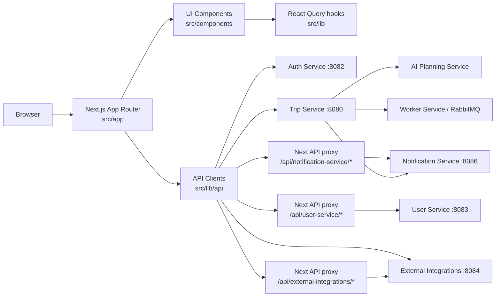
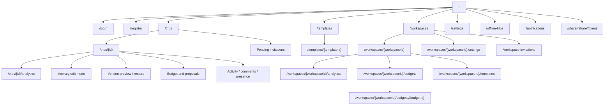
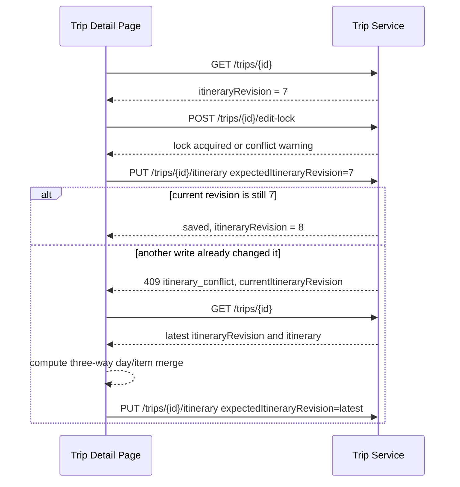

# Travel AI Planner Web

Next.js App Router frontend for the Travel AI App. The web app owns the browser
experience for authentication, workspace planning, trip planning, itinerary
editing, collaboration, notifications, exports, calendar sync controls, maps,
weather, budgets, and ticket/activity availability checks.

## Frontend Boundary



The browser calls public service URLs for normal JSON APIs. Same-origin Next.js
API proxy routes are used where a browser flow needs an internal Docker hostname
or tighter path filtering, such as User Service workspace/profile calls,
notification streams, and calendar OAuth calls.

## Capabilities

| Area | What the UI supports |
| ---- | -------------------- |
| Auth | Register, login, refresh/logout, current-user lookup. |
| Trips | Create/list/detail trips, generate itineraries, edit and restore versions. |
| Templates | Save trips as private/workspace templates, browse the template library, preview itinerary structure, and create new trips from templates. |
| Workspaces | Workspace switcher, create/list/settings pages, member invites/roles/removal, pending invitations, workspace trip filtering. |
| Collaboration | Invite registered users, viewer/editor roles, pending invitations, shared trips. |
| Concurrency | `itineraryRevision` conflict recovery, advisory presence, soft edit locks. |
| Jobs | Async full generation, partial regeneration, quality improvement, budget optimization. |
| Budget | Trip budget, workspace shared budgets, item costs, accommodation cost, summaries, traveler cost splitting, cost analytics dashboards, optimization proposals. |
| Places | Manual place attachment, auto-match review, map markers, opening-hours warnings. |
| Availability | Per-item availability checks, provider prices, external booking links, and apply-price updates. |
| Context | Weather cards, route/distance estimates, accommodation routing anchors. |
| Sharing | Public read-only share links, expiration, password unlock, sanitized exports. |
| Notifications | Header bell, unread count, SSE stream, preferences, optional browser push. |
| Calendar | Google Calendar connect/sync/disconnect controls through backend services. |
| Export | Browser-generated PDF, CSV cost reports, and `.ics` downloads for private and public views. |
| Offline / PWA | Installable PWA manifest, app update banner, `/offline-trips`, IndexedDB trip cache, offline itinerary drafts, and revision conflict recovery. |

## Source Layout

```text
apps/web
├── src/app                         # App Router routes and route handlers
├── src/components                  # Feature and layout components
├── src/lib/api                     # Service clients and DTO adapters
├── src/lib                         # Hooks, formatting, export, notifications
├── src/types                       # Shared TypeScript types
├── public/icons                    # PWA icons (placeholder assets in v1)
├── public/screenshots              # PWA install screenshots (placeholder assets in v1)
├── public/sw.js                    # Browser push, update, and offline fallback service worker
└── package.json
```

## Run Locally

```bash
cd apps/web
cp .env.example .env.local
npm install
npm run dev
```

The development server starts on `http://localhost:3000`.

For the full stack, prefer the repository-level compose flow:

```bash
cp infra/.env.example infra/.env
docker compose -f infra/docker-compose.yml --env-file infra/.env up --build
```

## Environment

| Variable | Purpose |
| -------- | ------- |
| `NEXT_PUBLIC_AUTH_SERVICE_URL` | Browser-facing Auth Service URL. |
| `NEXT_PUBLIC_TRIP_SERVICE_URL` | Browser-facing Trip Service URL. |
| `NEXT_PUBLIC_USER_SERVICE_URL` | Browser-facing User Service URL. |
| `NEXT_PUBLIC_EXTERNAL_INTEGRATIONS_SERVICE_URL` | Browser-facing place/route/weather/calendar/availability URL. |
| `NEXT_PUBLIC_NOTIFICATION_SERVICE_URL` | Browser-facing Notification Service URL. |
| `NEXT_PUBLIC_WORKER_SERVICE_URL` | Browser-facing Worker Service URL for local ops checks. |
| `TRIP_SERVICE_INTERNAL_URL` | Server-side URL for Next route handlers inside Docker. |
| `USER_SERVICE_INTERNAL_URL` | Server-side User Service proxy URL. |
| `NOTIFICATION_SERVICE_INTERNAL_URL` | Server-side notification proxy URL. |
| `EXTERNAL_INTEGRATIONS_SERVICE_INTERNAL_URL` | Server-side external-integrations proxy URL. |
| `WORKER_SERVICE_INTERNAL_URL` | Server-side worker proxy URL. |

Local defaults:

```bash
NEXT_PUBLIC_AUTH_SERVICE_URL=http://localhost:8082
NEXT_PUBLIC_TRIP_SERVICE_URL=http://localhost:8080
NEXT_PUBLIC_USER_SERVICE_URL=http://localhost:8083
NEXT_PUBLIC_EXTERNAL_INTEGRATIONS_SERVICE_URL=http://localhost:8084
NEXT_PUBLIC_NOTIFICATION_SERVICE_URL=http://localhost:8086
NEXT_PUBLIC_WORKER_SERVICE_URL=http://localhost:8090
TRIP_SERVICE_INTERNAL_URL=http://localhost:8080
USER_SERVICE_INTERNAL_URL=http://localhost:8083
NOTIFICATION_SERVICE_INTERNAL_URL=http://localhost:8086
EXTERNAL_INTEGRATIONS_SERVICE_INTERNAL_URL=http://localhost:8084
WORKER_SERVICE_INTERNAL_URL=http://localhost:8090
```

## Main Routes

- `/ops` is an allowlisted internal operations dashboard. It is hidden from
  navigation and expects backend `OPS_DASHBOARD_ENABLED=true` plus matching
  `OPS_ADMIN_EMAILS`. Besides jobs, queues, DLQ, workers, and provider health it
  includes a **Provider Quotas** panel (see below).

### Provider Quotas panel

Sourced from External Integrations Service `/ops/providers/quotas`, it shows per
provider: category, status, requests today, daily quota, remaining, minute limit,
blocked-today, fallback-today, and the last blocked time. Statuses map to colors:
`healthy` (green), `nearing_quota` / `rate_limited_recently` (amber),
`quota_exceeded` (red), `disabled` / `unknown` (grey). It refreshes on the shared
Ops interval and has a manual Refresh button. "View details" expands the
operation-level breakdown plus the last 7 days of usage. A dev-only "Reset (dev)"
button appears when the service reports `resetAllowed` (never in production) and
requires a confirmation before clearing today's counters. Interpret `blocked` as
calls rejected by a rate limit or quota, and `fallback` as limited calls that
were served from mock/cache instead.



Workspace budget routes:

- `/workspaces/{workspaceId}/budgets` lists active and archived shared budgets,
  shows primary budget usage previews, and exposes create/edit/archive/make
  primary actions to owner/admin roles only.
- `/workspaces/{workspaceId}/budgets/{budgetId}` shows budget utilization, cost
  by trip/category/source, expensive items, insights, warnings, and CSV/PDF
  export.
- `/workspaces/{workspaceId}/analytics` shows the active primary budget when
  present and can apply its period as the analytics date filter.

Workspace budgets are planning estimates only. They do not block trip edits, do
not represent payments, and do not split or settle costs between members.

## Cost Splitting Between Travelers

Private trip detail pages include a cost-splitting section for completed trips.
Owners and editors can add trip travelers, edit names/emails/roles, remove
travelers, and assign item or accommodation costs as equal, selected-equal, or
custom percentage splits. Viewers can read the roster and summary but cannot
change allocations.

The itinerary and accommodation panels expose split controls only for costs that
already have an estimate. The summary shows estimated total, allocated total,
unassigned costs, defaulted rules, invalid rules, per-traveler totals,
category/day breakdowns, and item-level detail. CSV and PDF exports are generated
in the browser from the summary response.

Limitations: this is planning allocation only. It does not collect money, settle
debts, create reimbursements, invite users from traveler rows, or replace
booking/payment/accounting tools. Offline mode can show cached trip costs, but
traveler management and split-rule writes require the online private API.

## Service Calls By Feature

| Feature | Primary calls |
| ------- | ------------- |
| Auth | `POST /auth/register`, `POST /auth/login`, `POST /auth/refresh`, `POST /auth/logout`, `GET /auth/me` |
| Trip list/detail | `GET /trips`, `GET /trips/shared-with-me`, `GET /trips/{id}` |
| Templates | `GET /trip-templates`, `POST /trips/{id}/templates`, `GET/PATCH /trip-templates/{id}`, archive/duplicate/create-trip routes, `GET /workspaces/{workspaceId}/templates` |
| Workspaces | `/workspaces`, `/workspaces/{id}`, `/workspaces/{id}/members*`, `/workspace-invitations*` through `/api/user-service` |
| Generation jobs | `POST /trips/{id}/generation-jobs`, `GET /trips/{id}/generation-jobs/{jobId}`, `POST /trips/{id}/generation-jobs/{jobId}/cancel` |
| Itinerary writes | `PUT /trips/{id}/itinerary`, version restore, day/item regeneration compatibility routes |
| Collaboration | `/trips/{id}/collaborators`, `/collaboration/invitations` |
| Presence and locks | `/trips/{id}/presence/*`, `/trips/{id}/edit-lock` |
| Comments and activity | `/trips/{id}/comments*`, `/trips/{id}/activity*` |
| Sharing | `/trips/{id}/share`, `/public/trips/{shareToken}/*` |
| Budget | `/trips/{id}/budget`, `/trips/{id}/budget-summary`, `/workspaces/{workspaceId}/budgets*`, budget optimization job/proposal routes |
| Cost splitting | `/trips/{id}/travelers`, `/trips/{id}/cost-splitting/summary`, item/accommodation cost-split update routes |
| Cost analytics | `/trips/{id}/analytics/costs`, `/workspaces/{workspaceId}/analytics/costs`; browser-generated CSV/PDF reports |
| Places/routes/weather | `/places/search`, `/places/{placeId}`, `/routes/estimate`, `/weather/forecast` |
| Availability | `POST /availability/search` through the External Integrations API/proxy |
| Calendar | `/calendar/google/*`, `/trips/{id}/calendar-sync/google/*` |
| Notifications | `/notifications*`, `/notifications/preferences`, `/notifications/push/*` |

## Trip Templates

The web app exposes Trip Templates v1 at `/templates`,
`/templates/{templateId}`, and `/workspaces/{workspaceId}/templates`.
Editable completed trip detail pages show `Save as template`; templates can be
used to create new personal or workspace trips.

Workspace owner/admin/member roles can save and use workspace templates.
Workspace viewers can browse them but cannot create workspace trips from them.
Template previews are read-only in v1; only metadata can be edited.

Limitations shown in the UI: templates copy itinerary structure and approximate
costs only. They do not reuse live availability, booking links, comments,
collaborators, share links, or calendar sync state, and prices should be
verified before booking.

## Revision-Safe Editing



Manual itinerary edits, version restores, budget proposal applies, and direct
regeneration compatibility routes all rely on backend revision checks. Presence
and edit locks are advisory UX signals; revision checks are the real data-safety
mechanism.

When a manual save is stale, the web app compares the edit-session base
itinerary, the user's draft, and the latest itinerary from Trip Service. Safe
non-overlapping day/item changes can be previewed and applied on top of the
latest revision only after explicit confirmation. Overlapping changes show
per-conflict choices to keep the latest version or keep the local version.

Current v1 limitations:

- Merge granularity is day-level and item-level only.
- There is no CRDT, operational transform, live co-editing, or text-level merge.
- Item identity uses `item.id` when present, then stable name/time/type matching;
  reorders are harder to recover when generated items do not have stable IDs.
- The backend revision check remains authoritative, and every merged save still
  sends the latest `expectedItineraryRevision`.

## Cost Analytics Dashboard

Trip cost analytics live at `/trips/{id}/analytics` and workspace rollups live at
`/workspaces/{workspaceId}/analytics`. The dashboards show approximate estimated
totals, budget utilization, missing and uncertain estimates, cost by
day/category/source/confidence, expensive items, warnings, and actionable links
back to the itinerary or workspace trip.

Workspace analytics supports a target currency selector plus all-trips,
this-year, next-12-months, and custom date filters. Viewer roles can read
analytics and export reports; edit-oriented actions are shown only when the
current role can edit trips.

Reports are generated in the browser:

- CSV sections include summary, day/trip rollups, category/source/month tables,
  expensive items, and warnings.
- PDF reports reuse the existing lightweight text PDF generator and include the
  same planning-purpose disclaimer.

Limitations: costs are estimates for planning only; provider prices,
availability, exchange rates, and booking costs may change; analytics are not
accounting, tax, invoice, payment, debt-splitting, or financial-advice reports.

## Offline Trip Mode

Offline Trip Mode v1 is frontend-only and scoped to private authenticated trip
detail pages. After a successful online trip load, the web app stores a sanitized
snapshot in IndexedDB database `travel-ai-offline-v1`:

- `cachedTrips`: trip detail, cached budget summary when available,
  accommodation basics, workspace metadata already present on the trip DTO,
  `itineraryRevision`, `cachedAt`, and `userId`.
- `pendingMutations`: one coalesced `update_itinerary` mutation per trip/user,
  including `baseRevision`, `baseItinerary`, `draftItinerary`, status, attempts,
  and user-visible error fields.
- `syncMetadata`: reserved for future sync bookkeeping.

When the browser is offline or the trip fetch fails with a network-like error,
the trip page falls back to the cached snapshot for that user. Cached pages are
marked as saved copies and online-only actions are disabled or hidden: AI jobs,
budget optimization, place search/review writes, comments, collaborators,
sharing, calendar sync, activity/presence streams, and push subscription changes
still require internet access.

Offline itinerary saves create or update the local pending mutation, keep the
original `baseRevision`, update the cached trip optimistically, and show a
pending offline change indicator. When the app is online again, the sync queue
replays pending itinerary updates through `PUT /trips/{id}/itinerary` with
`expectedItineraryRevision`. A `409 itinerary_conflict` keeps the local draft,
fetches the latest trip, and opens the existing three-way diff/merge dialog.

The existing `public/sw.js` still owns push notification events. It also caches a
small app shell fallback (`/offline`) and static Next.js assets conservatively;
API response data remains in IndexedDB, not the Cache API. The app manifest is
available at `/manifest.json`.

Privacy notes:

- Offline data is stored in this browser and can include private itinerary
  details.
- Access tokens, refresh tokens, OAuth tokens, API keys, push secrets, and raw AI
  prompts are not stored by the offline module.
- Logging out clears cached trips and queued mutations for the current user.
- On shared devices, log out to remove device-local offline data.

Current v1 limitations:

- Only previously opened private trips are available offline.
- Only itinerary edits are supported offline.
- Comments, calendar sync, AI jobs, place search, route/weather refreshes, and
  collaboration management need internet access.
- Multi-device offline merge, CRDTs, native mobile offline storage, offline AI
  generation, and encrypted IndexedDB are out of scope.

## PWA Install Experience

Advanced PWA Install Experience v1 is frontend-only. The app manifest at
`/manifest.json` includes install metadata, local icons, shortcuts for trips,
offline trips, new trip, and notifications, plus generated placeholder
screenshots. Replace the placeholder icons and screenshots with final branded
art before a production launch.

Authenticated users can see a respectful install banner after meaningful trip
engagement and a delay. Chromium-family browsers use the `beforeinstallprompt`
event without asking for notification permission. iOS Safari users get manual
Add to Home Screen instructions. The app detects standalone display mode,
including iOS `navigator.standalone`, and hides install prompts once installed.

`public/sw.js` remains the single service worker for browser push. It also keeps
a conservative offline fallback for navigations to `/offline`, caches only the
small app shell assets, and does not broadly cache API responses. Service worker
updates wait for explicit user action: if no offline drafts are pending, the app
shows `Refresh to update`; if pending offline itinerary changes exist, it links
to `/offline-trips` instead of refreshing automatically.

`/offline-trips` lists cached trips for the current user, shows pending offline
mutation status, supports sync/discard actions, and allows cached copies or all
offline data to be removed after confirmation. The settings page includes an
`App and offline access` section with install status, storage estimate, cached
trip count, pending change count, clear data controls, and passive push status.

PWA limitations:

- Install support depends on browser and platform.
- iOS requires Safari Share -> Add to Home Screen.
- Offline trips must be opened online once before they are available offline.
- Clearing offline data removes cached trips and pending offline changes stored
  on this device.
- App updates may require a refresh, and refresh is not offered directly while
  offline drafts are pending.

## Notifications And Push

The header notification bell uses polling plus an authenticated fetch-based SSE
stream. Native `EventSource` is not used because the stream needs
`Authorization: Bearer <accessToken>`.

Browser push uses `public/sw.js`, the Push API, and VAPID keys served by
Notification Service:

- `GET /notifications/push/public-key`
- `POST /notifications/push/subscribe`
- `DELETE /notifications/push/unsubscribe`
- `GET /notifications/push/status`

Push is opt-in by explicit user action and requires `WEB_PUSH_ENABLED=true` plus
VAPID keys on the Notification Service.

## Quality Checks

```bash
npm run typecheck
npm run test
npm run build
```

The repository-level smoke test exercises the web-facing service contracts:

```bash
./scripts/smoke-test.sh
```

## Security Notes

- Tokens are stored in `localStorage` for development v1. Use secure httpOnly
  cookies before production.
- Public share pages use separate short-lived public share tokens; they are not
  Auth Service JWTs.
- Public share pages never render private collaboration, comments, activity,
  budget optimization, edit, notification, settings, or calendar-sync controls.
- The browser never receives third-party provider API keys, SMTP credentials,
  VAPID private keys, OAuth secrets, internal service tokens, or raw AI prompts.
