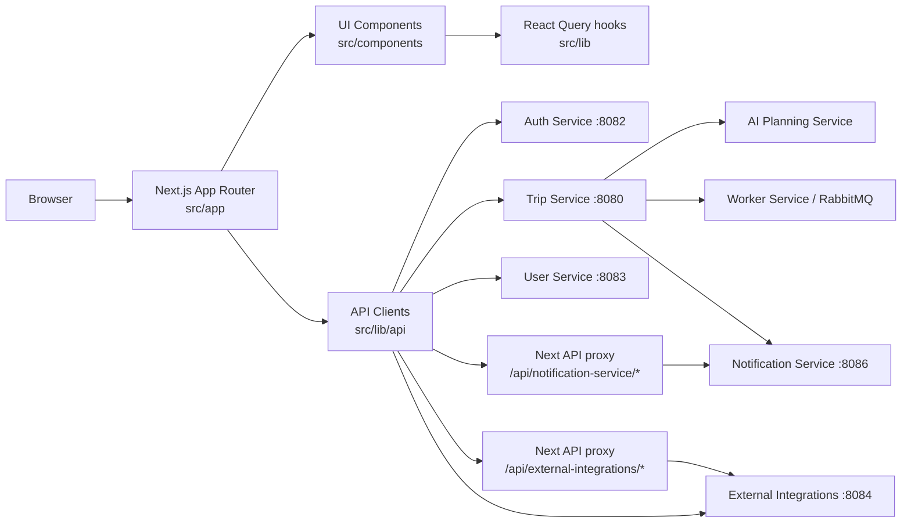
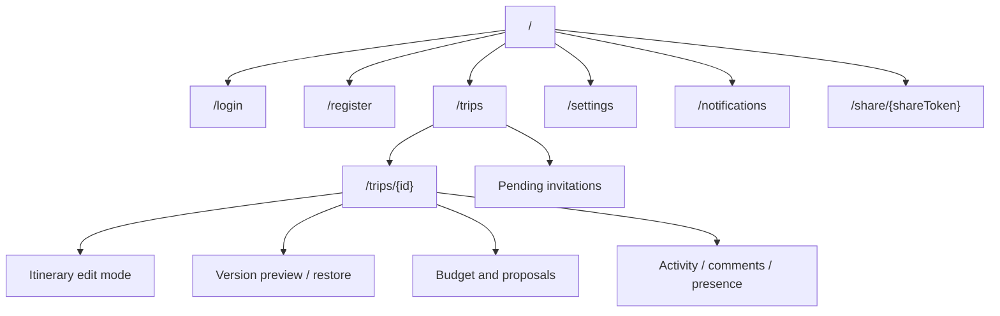
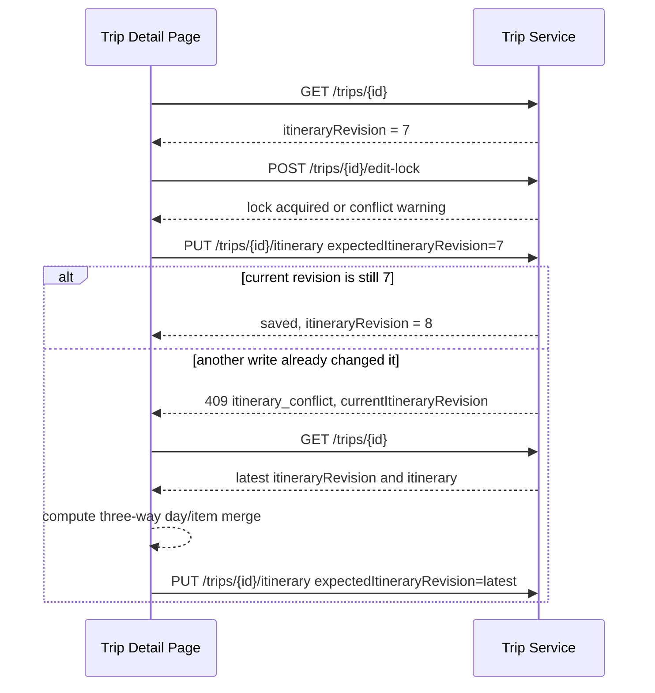

# Travel AI Planner Web

Next.js App Router frontend for the Travel AI App. The web app owns the browser
experience for authentication, trip planning, itinerary editing, collaboration,
notifications, exports, calendar sync controls, maps, weather, budgets, and
public share pages.

## Frontend Boundary



The browser calls public service URLs for normal JSON APIs. Same-origin Next.js
API proxy routes are used where a browser flow needs an internal Docker hostname
or tighter path filtering, such as notification and calendar OAuth calls.

## Capabilities

| Area | What the UI supports |
| ---- | -------------------- |
| Auth | Register, login, refresh/logout, current-user lookup. |
| Trips | Create/list/detail trips, generate itineraries, edit and restore versions. |
| Collaboration | Invite registered users, viewer/editor roles, pending invitations, shared trips. |
| Concurrency | `itineraryRevision` conflict recovery, advisory presence, soft edit locks. |
| Jobs | Async full generation, partial regeneration, quality improvement, budget optimization. |
| Budget | Trip budget, item costs, accommodation cost, summaries, optimization proposals. |
| Places | Manual place attachment, auto-match review, map markers, opening-hours warnings. |
| Context | Weather cards, route/distance estimates, accommodation routing anchors. |
| Sharing | Public read-only share links, expiration, password unlock, sanitized exports. |
| Notifications | Header bell, unread count, SSE stream, preferences, optional browser push. |
| Calendar | Google Calendar connect/sync/disconnect controls through backend services. |
| Export | Browser-generated PDF and `.ics` downloads for private and public views. |
| Offline | Previously opened private trips can be viewed from IndexedDB, edited as offline itinerary drafts, and synced later with revision conflict recovery. |

## Source Layout

```text
apps/web
├── src/app                         # App Router routes and route handlers
├── src/components                  # Feature and layout components
├── src/lib/api                     # Service clients and DTO adapters
├── src/lib                         # Hooks, formatting, export, notifications
├── src/types                       # Shared TypeScript types
├── public/sw.js                    # Browser push service worker
└── package.json
```

## Run Locally

```bash
cd apps/web
cp .env.example .env.local
npm install
npm run dev
```

The development server starts on `http://localhost:3000`.

For the full stack, prefer the repository-level compose flow:

```bash
cp infra/.env.example infra/.env
docker compose -f infra/docker-compose.yml --env-file infra/.env up --build
```

## Environment

| Variable | Purpose |
| -------- | ------- |
| `NEXT_PUBLIC_AUTH_SERVICE_URL` | Browser-facing Auth Service URL. |
| `NEXT_PUBLIC_TRIP_SERVICE_URL` | Browser-facing Trip Service URL. |
| `NEXT_PUBLIC_USER_SERVICE_URL` | Browser-facing User Service URL. |
| `NEXT_PUBLIC_EXTERNAL_INTEGRATIONS_SERVICE_URL` | Browser-facing place/route/weather/calendar URL. |
| `NEXT_PUBLIC_NOTIFICATION_SERVICE_URL` | Browser-facing Notification Service URL. |
| `TRIP_SERVICE_INTERNAL_URL` | Server-side URL for Next route handlers inside Docker. |
| `NOTIFICATION_SERVICE_INTERNAL_URL` | Server-side notification proxy URL. |
| `EXTERNAL_INTEGRATIONS_SERVICE_INTERNAL_URL` | Server-side external-integrations proxy URL. |

Local defaults:

```bash
NEXT_PUBLIC_AUTH_SERVICE_URL=http://localhost:8082
NEXT_PUBLIC_TRIP_SERVICE_URL=http://localhost:8080
NEXT_PUBLIC_USER_SERVICE_URL=http://localhost:8083
NEXT_PUBLIC_EXTERNAL_INTEGRATIONS_SERVICE_URL=http://localhost:8084
NEXT_PUBLIC_NOTIFICATION_SERVICE_URL=http://localhost:8086
TRIP_SERVICE_INTERNAL_URL=http://localhost:8080
NOTIFICATION_SERVICE_INTERNAL_URL=http://localhost:8086
EXTERNAL_INTEGRATIONS_SERVICE_INTERNAL_URL=http://localhost:8084
```

## Main Routes



## Service Calls By Feature

| Feature | Primary calls |
| ------- | ------------- |
| Auth | `POST /auth/register`, `POST /auth/login`, `POST /auth/refresh`, `POST /auth/logout`, `GET /auth/me` |
| Trip list/detail | `GET /trips`, `GET /trips/shared-with-me`, `GET /trips/{id}` |
| Generation jobs | `POST /trips/{id}/generation-jobs`, `GET /trips/{id}/generation-jobs/{jobId}`, `POST /trips/{id}/generation-jobs/{jobId}/cancel` |
| Itinerary writes | `PUT /trips/{id}/itinerary`, version restore, day/item regeneration compatibility routes |
| Collaboration | `/trips/{id}/collaborators`, `/collaboration/invitations` |
| Presence and locks | `/trips/{id}/presence/*`, `/trips/{id}/edit-lock` |
| Comments and activity | `/trips/{id}/comments*`, `/trips/{id}/activity*` |
| Sharing | `/trips/{id}/share`, `/public/trips/{shareToken}/*` |
| Budget | `/trips/{id}/budget`, `/trips/{id}/budget-summary`, budget optimization job/proposal routes |
| Places/routes/weather | `/places/search`, `/places/{placeId}`, `/routes/estimate`, `/weather/forecast` |
| Calendar | `/calendar/google/*`, `/trips/{id}/calendar-sync/google/*` |
| Notifications | `/notifications*`, `/notifications/preferences`, `/notifications/push/*` |

## Revision-Safe Editing



Manual itinerary edits, version restores, budget proposal applies, and direct
regeneration compatibility routes all rely on backend revision checks. Presence
and edit locks are advisory UX signals; revision checks are the real data-safety
mechanism.

When a manual save is stale, the web app compares the edit-session base
itinerary, the user's draft, and the latest itinerary from Trip Service. Safe
non-overlapping day/item changes can be previewed and applied on top of the
latest revision only after explicit confirmation. Overlapping changes show
per-conflict choices to keep the latest version or keep the local version.

Current v1 limitations:

- Merge granularity is day-level and item-level only.
- There is no CRDT, operational transform, live co-editing, or text-level merge.
- Item identity uses `item.id` when present, then stable name/time/type matching;
  reorders are harder to recover when generated items do not have stable IDs.
- The backend revision check remains authoritative, and every merged save still
  sends the latest `expectedItineraryRevision`.

## Offline Trip Mode

Offline Trip Mode v1 is frontend-only and scoped to private authenticated trip
detail pages. After a successful online trip load, the web app stores a sanitized
snapshot in IndexedDB database `travel-ai-offline-v1`:

- `cachedTrips`: trip detail, cached budget summary when available,
  accommodation basics, `itineraryRevision`, `cachedAt`, and `userId`.
- `pendingMutations`: one coalesced `update_itinerary` mutation per trip/user,
  including `baseRevision`, `baseItinerary`, `draftItinerary`, status, attempts,
  and user-visible error fields.
- `syncMetadata`: reserved for future sync bookkeeping.

When the browser is offline or the trip fetch fails with a network-like error,
the trip page falls back to the cached snapshot for that user. Cached pages are
marked as saved copies and online-only actions are disabled or hidden: AI jobs,
budget optimization, place search/review writes, comments, collaborators,
sharing, calendar sync, activity/presence streams, and push subscription changes
still require internet access.

Offline itinerary saves create or update the local pending mutation, keep the
original `baseRevision`, update the cached trip optimistically, and show a
pending offline change indicator. When the app is online again, the sync queue
replays pending itinerary updates through `PUT /trips/{id}/itinerary` with
`expectedItineraryRevision`. A `409 itinerary_conflict` keeps the local draft,
fetches the latest trip, and opens the existing three-way diff/merge dialog.

The existing `public/sw.js` still owns push notification events. It also caches a
small app shell fallback (`/offline`) and static Next.js assets conservatively;
API response data remains in IndexedDB, not the Cache API. The app manifest is
available at `/manifest.json`.

Privacy notes:

- Offline data is stored in this browser and can include private itinerary
  details.
- Access tokens, refresh tokens, OAuth tokens, API keys, push secrets, and raw AI
  prompts are not stored by the offline module.
- Logging out clears cached trips and queued mutations for the current user.
- On shared devices, log out to remove device-local offline data.

Current v1 limitations:

- Only previously opened private trips are available offline.
- Only itinerary edits are supported offline.
- Comments, calendar sync, AI jobs, place search, route/weather refreshes, and
  collaboration management need internet access.
- Multi-device offline merge, CRDTs, native mobile offline storage, offline AI
  generation, and encrypted IndexedDB are out of scope.

## Notifications And Push

The header notification bell uses polling plus an authenticated fetch-based SSE
stream. Native `EventSource` is not used because the stream needs
`Authorization: Bearer <accessToken>`.

Browser push uses `public/sw.js`, the Push API, and VAPID keys served by
Notification Service:

- `GET /notifications/push/public-key`
- `POST /notifications/push/subscribe`
- `DELETE /notifications/push/unsubscribe`
- `GET /notifications/push/status`

Push is opt-in by explicit user action and requires `WEB_PUSH_ENABLED=true` plus
VAPID keys on the Notification Service.

## Quality Checks

```bash
npm run typecheck
npm run test
npm run build
```

The repository-level smoke test exercises the web-facing service contracts:

```bash
./scripts/smoke-test.sh
```

## Security Notes

- Tokens are stored in `localStorage` for development v1. Use secure httpOnly
  cookies before production.
- Public share pages use separate short-lived public share tokens; they are not
  Auth Service JWTs.
- Public share pages never render private collaboration, comments, activity,
  budget optimization, edit, notification, settings, or calendar-sync controls.
- The browser never receives third-party provider API keys, SMTP credentials,
  VAPID private keys, OAuth secrets, internal service tokens, or raw AI prompts.
