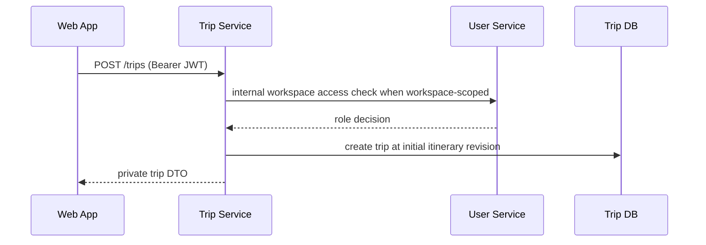
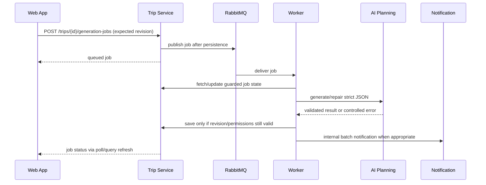
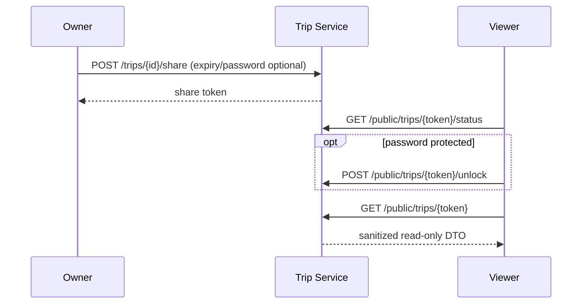

# Key flows

These diagrams show responsibility boundaries rather than every request field.

## Register, login, and refresh

```mermaid
sequenceDiagram
  participant W as Web App
  participant A as Auth Service
  participant DB as Auth DB
  W->>A: POST /auth/register or /auth/login
  A->>DB: create/find user; store/validate refresh token
  A-->>W: access JWT + rotating refresh token
  W->>A: POST /auth/refresh
  A->>DB: revoke old refresh token; store replacement
  A-->>W: new access + refresh token
```

## Create a trip



## AI generation job lifecycle



## Itinerary conflict, public share, and collaboration

```mermaid
sequenceDiagram
  participant E as Editor
  participant T as Trip Service
  participant DB as Trip DB
  E->>T: PUT itinerary + expectedItineraryRevision
  T->>DB: compare-and-write revision
  alt current revision
    DB-->>T: incremented revision
    T-->>E: updated itinerary
  else stale revision
    DB-->>T: conflict
    T-->>E: conflict; refetch/merge before retry
  end
```



Collaborator invitations are created by a permitted trip owner/editor, linked
to an existing identity lookup, and accepted/declined through authenticated
trip routes. Permissions are checked on every subsequent request; a UI role
badge never grants access.

## Related docs

- [Trips feature guide](../features/trips.md)
- [AI generation guide](../features/ai-generation.md)
- [API overview](../api/overview.md)
