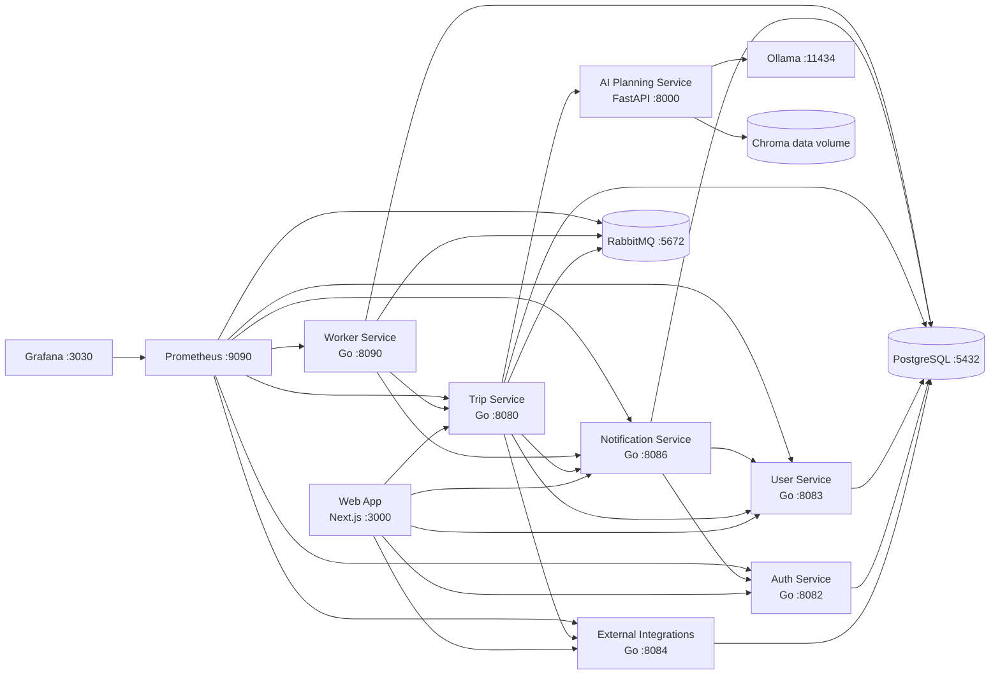

# Architecture overview

Travel AI App is a local-first travel planner. The Next.js application is the
browser surface; Go services own identity, profiles, trips, notifications,
background work, and provider integration; FastAPI owns AI generation and
prompt/schema validation. Each database-owning service uses its own Postgres
database within the local Postgres instance.

## Responsibilities

| Component | Primary responsibility | Profile |
| --- | --- | --- |
| Web App | UI, PWA cache, offline mutation queue, locale-aware browser experience | `core` |
| Auth Service | Users, passwords, access JWTs, rotating refresh tokens | `core` |
| User Service | Profiles, preferences, workspaces and memberships | `core` |
| Trip Service | Trip state, authorization, revisions, collaboration, exports, orchestration | `core` |
| Notification Service | In-app, email, push, SSE, preferences and digests | `core` |
| Worker Service | RabbitMQ consumers, scheduled jobs, retries and DLQs | `core` |
| External Integrations | Mock/real provider adapters, calendar OAuth and quota controls | `core` |
| AI Planning Service | Strict JSON generation, regeneration, repair, discovery and RAG | `ai`, `rag` |

## Communication and security

- Browser requests use public service URLs or constrained Next.js proxy routes.
  Private APIs validate an Auth Service-issued bearer JWT locally.
- Service-to-service calls use `X-Internal-Service-Token` (and service name)
  on explicitly mounted `/internal/*` routes. Do not expose these routes to
  browser clients.
- Trip Service orchestrates user context, notifications, providers, AI, and
  jobs; it does not write another service's tables. Worker has one documented
  v1 legacy exception: its job processor writes Trip Service-owned job state
  directly. Treat that as a compatibility boundary, not a pattern for new work;
  new cross-service changes should use authenticated APIs.
- Web responses for public shares are sanitized server-side. Public endpoints
  never expose private comments, receipts, raw OCR, provider secrets, prompts,
  or credentials.

## Local infrastructure and delivery

`core` supplies Postgres, RabbitMQ, and application services. `ai` adds Ollama
and FastAPI; `rag` enables the AI/RAG stack; `observability` adds Prometheus and
Grafana. Compose health checks call `/ready`; liveness is `/health`.

The test profile is isolated and mock-only. CI runs frontend, Go, Python,
migrations, integration, browser, image, security, and smoke checks. See
[testing strategy](../testing/strategy.md) and [common commands](../development/common-commands.md).

## Related docs

- [Service boundaries](service-boundaries.md)
- [Data ownership](data-ownership.md)
- [Key flows](key-flows.md)
- [Ports](../development/ports.md)
