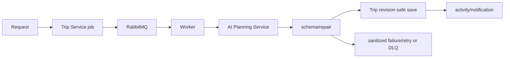

# AI generation

Trip Service owns user-facing generation jobs and persisted trip changes. AI
Planning Service owns prompt construction, strict schema validation, controlled
repair, destination discovery, route alternatives, checklist, Copilot, recap,
and template adaptation outputs.

## Modes and lifecycle

- `core` is mock-first: Trip Service can use deterministic mock generation
  without an Ollama download.
- `ai` starts FastAPI and Ollama; `rag` enables RAG/Chroma configuration and
  embedding model work. `./scripts/dev-setup.sh --ai` prepares models; use
  `--rag` to include RAG.
- A client creates a revision-aware generation job. Trip Service persists and
  publishes it; Worker consumes/retries it; AI returns strict JSON; Trip Service
  validates, rechecks revision/access, then persists or records a controlled
  failure. Notifications/activity are optional side effects.

## Input and privacy rules

Prompts receive only the bounded planning context needed for the task.
Credentials, raw receipts/OCR, raw calendar data, private notes/comments and
unnecessary personal data are excluded. Keep prompt/payload logging disabled
by default; never put raw prompts in tickets. Outputs are estimates—not booking,
legal, medical, or schedule confirmation.

## Common failures

Ollama unavailable, timeout, invalid model JSON, repair exhausted, unsupported
input, stale itinerary revision, cancellation, and RAG/embedding failure are
handled as job-visible states. See the [AI failure runbook](../operations/runbooks/ai-generation-failing.md); retry only after the condition and revision are understood.

## Related docs

- [Generation-job playbook](../development/playbooks/add-generation-job.md)
- [AI service README](../../services/ai-planning-service/README.md)
- [AI observability](../ai/observability.md)
