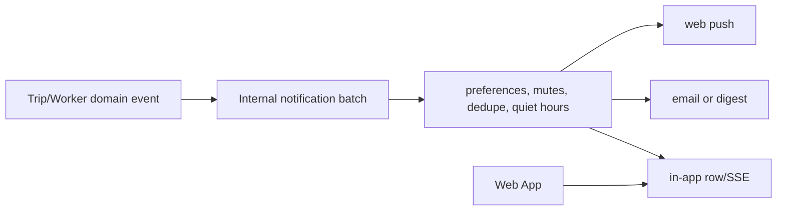

# Notifications

Notification Service owns in-app records, unread state, preferences, trip
mutes, grouping/deduplication, digests, optional email/push delivery, and SSE.
Trip/Worker and other trusted services submit batch events through the protected
internal endpoint; they do not write notification tables.

## Rules

- A type has a category, priority, preference/default channel behavior, a
  user-safe localized presentation, and a stable dedupe key where appropriate.
- Never notify the actor about their own action. Respect opt-out, trip mute,
  quiet-hours/digest and delivery failure behavior.
- Email uses a mock local default; push is disabled until VAPID is configured.
  SSE is best-effort/reconnectable—not a source of authorization truth.
- Event payloads must be minimal and action-safe: no passwords, tokens, raw
  OCR, receipt files, private notes, full prompts, or sensitive profile data.

## Testing

Test preference/mute/dedupe/no-self behavior in Notification Service, SSE and
localized rendering in Web tests, and use mock email/push in CI. See the
[notification playbook](../development/playbooks/add-notification-type.md) and
[delivery runbook](../operations/runbooks/notifications-not-sending.md).
