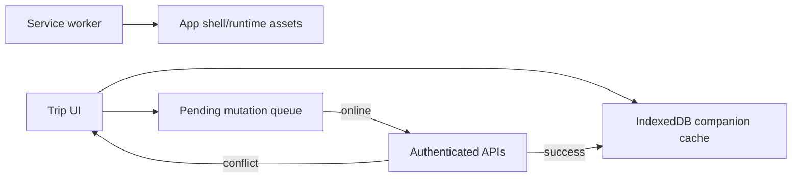

# Offline and PWA behavior

The Web App is an installable PWA with service-worker-managed application assets
and an IndexedDB trip companion cache. Offline support is intentionally scoped:
it preserves useful private trip work; it is not an offline copy of every API.

## What is stored and synced

- Cached companion data supports selected trip detail/read flows, including
  relevant route transport details.
- Pending mutations for supported itinerary, checklist, reminder, expense, and
  receipt-draft actions are queued locally and replayed when connectivity returns.
- The UI exposes offline status and conflict recovery. A replayed revision edit
  can conflict; it must be refetched/resolved rather than silently overwritten.
- Transport/provider search and other live data remain online-only. Cached
  estimates must not be represented as current availability or booking status.

## Safety and testing

Data is user-scoped. Logout/account cleanup must clear user-scoped offline data
and pending work; never transfer cached private data to another account. Avoid
queueing credentials, provider keys, unbounded files, or public-share secrets.
Test IndexedDB separation, coalescing, replay, conflicts, stale cleanup and
logout cleanup with the existing frontend suite; add a browser test only for a
critical cross-stack offline change.

## Related docs

- [Web README](../../apps/web/README.md)
- [Frontend page playbook](../development/playbooks/add-frontend-page.md)
- [Testing strategy](../testing/strategy.md)
