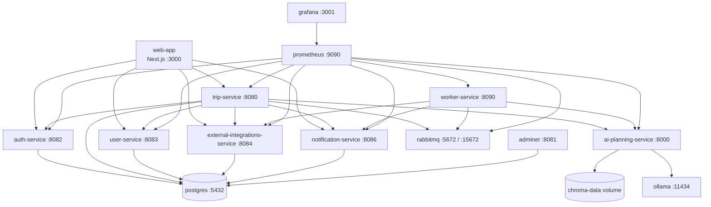
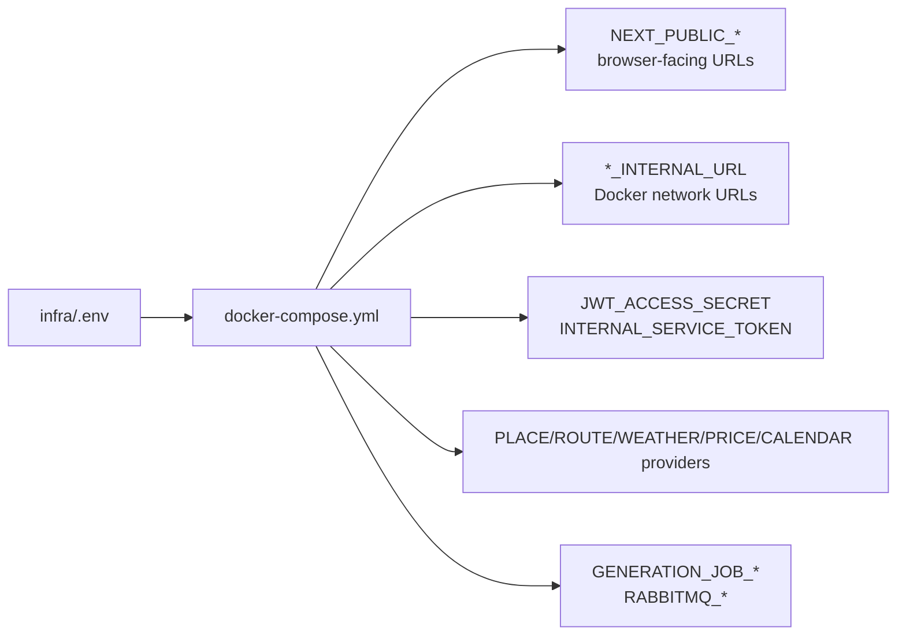

# Local Infrastructure

This directory contains the Docker Compose stack for the full Travel AI App.
The main file is [docker-compose.yml](docker-compose.yml), and local settings
come from `.env`.

## Quick Start

From the repository root:

```bash
cp infra/.env.example infra/.env
./scripts/dev-setup.sh
docker compose -f infra/docker-compose.yml --env-file infra/.env up --build
```

Open the app at `http://localhost:3000`.

Run the smoke test after the stack is healthy:

```bash
./scripts/smoke-test.sh
```

## Stack Map



## Local URLs

| Service | URL | Notes |
| ------- | --- | ----- |
| Web App | `http://localhost:3000` | Main application. |
| Web Settings | `http://localhost:3000/settings` | Profile, preferences, notifications. |
| Trip Service | `http://localhost:8080` | Trip APIs. |
| Auth Service | `http://localhost:8082` | Auth APIs. |
| User Service | `http://localhost:8083` | Profile/preferences APIs. |
| External Integrations | `http://localhost:8084` | Places, routes, weather, rates, calendar. |
| Notification Service | `http://localhost:8086` | Notifications, SSE, preferences, push. |
| AI Planning Service | `http://localhost:8000` | Generation and RAG APIs. |
| Worker Service | `http://localhost:8090` | Worker health/ready/metrics. |
| Ollama | `http://localhost:11434` | Local LLM runtime. |
| RabbitMQ UI | `http://localhost:15672` | `guest` / `guest`, local only. |
| RabbitMQ metrics | `http://localhost:15692/metrics` | Prometheus scrape target. |
| Prometheus | `http://localhost:9090` | Local metrics. |
| Grafana | `http://localhost:3001` | `admin` / `admin`, local only. |
| Adminer | `http://localhost:8081` | PostgreSQL browser. |

Adminer defaults:

- System: `PostgreSQL`
- Server: `postgres`
- Username: `postgres`
- Password: `postgres`
- Database: `trip_service`, `auth_service`, `user_service`,
  `notification_service`, or `external_integrations_service`

## Environment Model



Important local defaults:

- `JWT_ACCESS_SECRET` is shared by Auth, Trip, User, and Notification services.
- `INTERNAL_SERVICE_TOKEN` protects service-to-service internal endpoints.
- `TRIP_ITINERARY_GENERATOR_MODE=http` makes Trip Service call AI Planning.
- `AI_ITINERARY_GENERATOR_MODE=ollama` makes AI Planning call Ollama.
- `GENERATION_JOB_DISPATCH_MODE=queue` makes Trip Service publish to RabbitMQ.
- `WORKER_ENABLED=true` enables Worker Service.
- Mock providers are the default for places, routes, weather, exchange rates,
  prices, email, push, and calendar unless explicitly configured.

## Common Operations

Start or rebuild everything:

```bash
docker compose -f infra/docker-compose.yml --env-file infra/.env up --build
```

Stop containers:

```bash
docker compose -f infra/docker-compose.yml --env-file infra/.env down
```

Stop and remove local data volumes:

```bash
docker compose -f infra/docker-compose.yml --env-file infra/.env down -v
```

Pull Ollama models:

```bash
docker compose -f infra/docker-compose.yml --env-file infra/.env exec ollama ollama pull llama3.1:8b
docker compose -f infra/docker-compose.yml --env-file infra/.env exec ollama ollama pull nomic-embed-text
```

Index local knowledge for RAG:

```bash
./scripts/index-knowledge.sh
```

Inspect logs:

```bash
docker compose -f infra/docker-compose.yml --env-file infra/.env logs trip-service
docker compose -f infra/docker-compose.yml --env-file infra/.env logs worker-service
docker compose -f infra/docker-compose.yml --env-file infra/.env logs ai-planning-service
```

## Provider Switches

| Capability | Local default | Enable real provider |
| ---------- | ------------- | -------------------- |
| Places | `PLACE_PROVIDER=mock` | `PLACE_PROVIDER=foursquare` plus `FOURSQUARE_API_KEY`. |
| Routes | `ROUTE_PROVIDER=mock` | `ROUTE_PROVIDER=ors` plus `ORS_API_KEY`. |
| Weather | `WEATHER_PROVIDER=mock` | `WEATHER_PROVIDER=openweathermap` plus `OPENWEATHER_API_KEY`. |
| Calendar | `CALENDAR_PROVIDER=mock` | `CALENDAR_PROVIDER=google` plus Google OAuth credentials. |
| Email | `EMAIL_PROVIDER=mock` | `EMAIL_PROVIDER=smtp` plus `SMTP_*`. |
| Web Push | `WEB_PUSH_ENABLED=false` | Generate VAPID keys and set `WEB_PUSH_*`. |
| AI generation | `AI_ITINERARY_GENERATOR_MODE=ollama` | Use `mock` for no-LLM deterministic runs. |

Keep real provider keys in `infra/.env` or shell environment only. Do not commit
them.

## Smoke Test Coverage

`./scripts/smoke-test.sh` exercises the main service contracts:

- Auth registration, login, `/auth/me`, logout.
- User profile/preference defaults and updates.
- Trip creation, generation, listing, private access isolation.
- Mock place search, route estimate, weather forecast.
- Public share creation, status, unlock/disable behavior, and redaction.
- Itinerary revision conflicts, version history, restore, manual edits.
- Collaboration invite/accept/viewer/editor/removal behavior.
- Comments, activity feed, presence, edit locks.
- Notifications and notification preferences.
- Budget, accommodation, place/price enrichment, calendar-related contracts.

Override URLs when running against non-default ports:

```bash
TRIP_SERVICE_URL=http://localhost:8080 \
AUTH_SERVICE_URL=http://localhost:8082 \
SMOKE_USER_SERVICE_URL=http://localhost:8083 \
SMOKE_AI_PLANNING_SERVICE_URL=http://localhost:8000 \
SMOKE_EXTERNAL_INTEGRATIONS_SERVICE_URL=http://localhost:8084 \
SMOKE_NOTIFICATION_SERVICE_URL=http://localhost:8086 \
WEB_APP_URL=http://localhost:3000 \
./scripts/smoke-test.sh
```

## RabbitMQ Checks

In the RabbitMQ management UI, inspect:

- `trip.generation.jobs` for queued/running generation work.
- `trip.generation.retry` for delayed retry messages.
- `trip.generation.dead_letter` for terminally failed deliveries.

Queue messages should contain only IDs and correlation metadata, never access
tokens, prompts, preferences, or itinerary JSON.

## Troubleshooting

| Symptom | Fix |
| ------- | --- |
| Browser CORS error | Check `CORS_ALLOWED_ORIGINS=http://localhost:3000`, then rebuild affected services. |
| Trip request returns `401` | Login again and confirm `JWT_ACCESS_SECRET` matches Auth, Trip, User, and Notification. |
| Web app points at wrong service | Check `NEXT_PUBLIC_*` values and rebuild `web-app`. |
| Web proxy cannot reach service | Check `TRIP_SERVICE_INTERNAL_URL`, `NOTIFICATION_SERVICE_INTERNAL_URL`, and `EXTERNAL_INTEGRATIONS_SERVICE_INTERNAL_URL`. |
| Ollama model not found | Pull `llama3.1:8b` in the compose Ollama container. |
| RAG returns no results | Pull `nomic-embed-text`, run `./scripts/index-knowledge.sh`, and confirm `RAG_ENABLED=true`. |
| Generation timeout | Keep `TRIP_HTTP_WRITE_TIMEOUT` > `AI_PLANNING_TIMEOUT_SECONDS` > `OLLAMA_TIMEOUT_SECONDS`. |
| Queue jobs stuck | Check RabbitMQ UI, Worker Service readiness, and `GENERATION_JOB_DISPATCH_MODE=queue`. |
| Postgres database missing | Existing volumes skip init scripts; create the DB manually or run `docker compose ... down -v`. |
| Provider returns errors | Keep fallback enabled locally or configure the real API key and provider timeout. |
| Grafana empty | Confirm Prometheus is healthy and service `/metrics` endpoints are reachable. |

## Security Notes

- `infra/.env` is for local secrets and must stay out of git.
- Local defaults (`guest`/`guest`, `admin`/`admin`, dev JWT secrets) are not
  production-safe.
- Do not expose `/metrics`, RabbitMQ, Adminer, internal routes, or provider
  mock/debug endpoints publicly without network controls.
