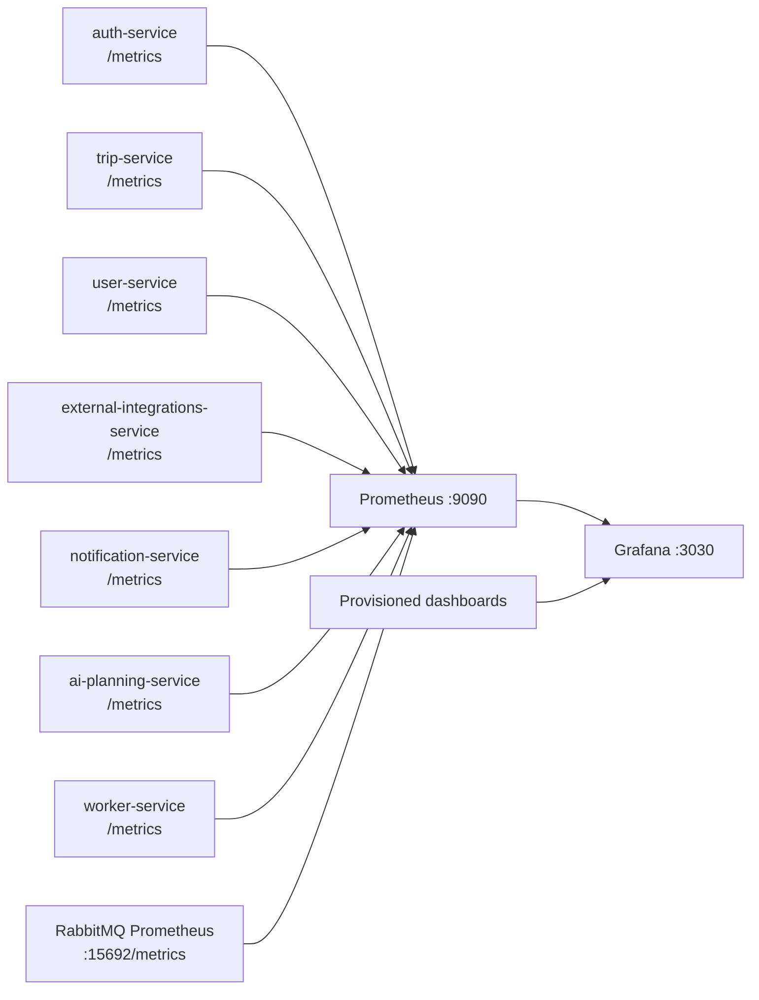
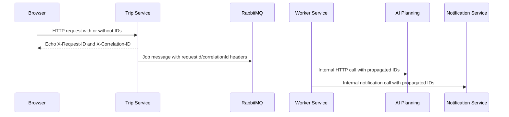
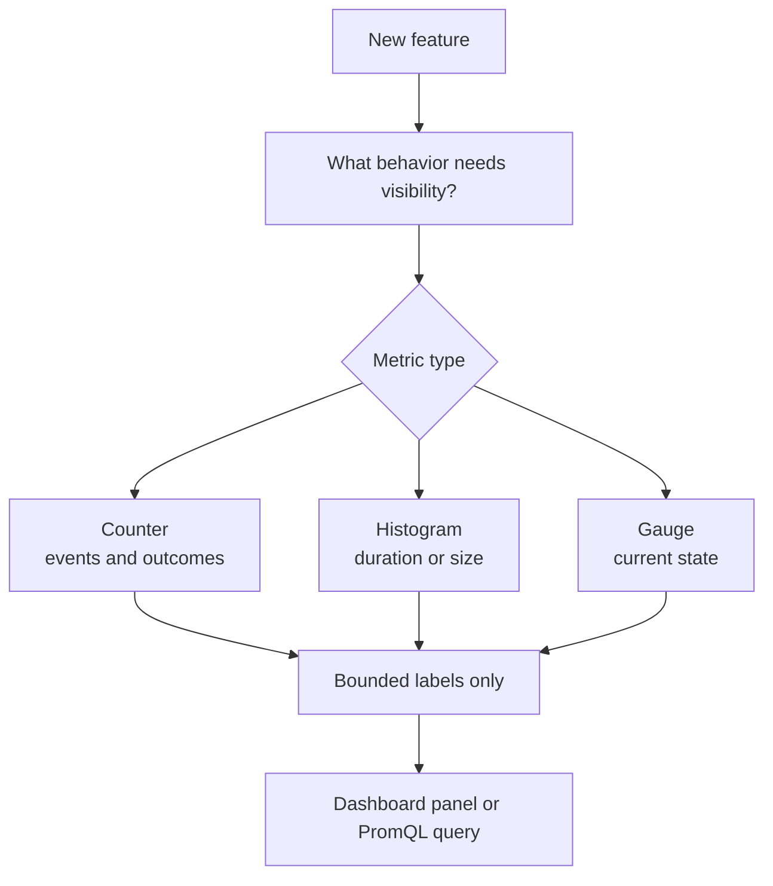

# Observability

Local Prometheus and Grafana setup for the Docker Compose environment. It is
designed for development, smoke-test verification, and debugging service flows.
It is not hardened as a public production monitoring surface.

The provisioned **Performance & Reliability** dashboard combines trip API p95, database operation p95/pool state, summary cache ratio, worker retry/DLQ rate, provider cooldowns, and top 5xx routes. Browser LCP/CLS/INP is emitted by the Web App to the optional `NEXT_PUBLIC_WEB_VITALS_ENDPOINT`; no new external telemetry vendor is required.

## Telemetry Flow



Start the stack:

```bash
docker compose -f infra/docker-compose.yml --env-file infra/.env up --build
```

## Local URLs

| Surface | URL | Notes |
| ------- | --- | ----- |
| Prometheus | `http://localhost:9090` | Scrape targets and PromQL. |
| Grafana | `http://localhost:3030` | `admin` / `admin`, local only. |
| RabbitMQ metrics | `http://localhost:15692/metrics` | Scraped by Prometheus. |
| RabbitMQ UI | `http://localhost:15672` | `guest` / `guest`, local only. |

Service metrics:

| Service | Metrics URL |
| ------- | ----------- |
| Auth | `http://localhost:8082/metrics` |
| Trip | `http://localhost:8080/metrics` |
| User | `http://localhost:8083/metrics` |
| External Integrations | `http://localhost:8084/metrics` |
| Notification | `http://localhost:8086/metrics` |
| AI Planning | `http://localhost:8000/metrics` |
| Worker | `http://localhost:8090/metrics` |

## Dashboards

Grafana provisions dashboards from
[grafana/dashboards](grafana/dashboards).

| Dashboard | What to use it for |
| --------- | ------------------ |
| API Overview | HTTP request rate, error rate, latency, in-flight requests, top routes. |
| Worker Jobs | Job starts/completions/failures, active jobs, retries, DLQ, queue delay, duration. |
| External Providers | Provider latency, failure rate, fallback use, cache hits/misses. |
| RabbitMQ Overview | Queue depth, ready/unacked messages, publish/consume rates, DLQ depth. |

## Correlation IDs



All Go HTTP services and AI Planning understand:

- `X-Request-ID`: one inbound HTTP request.
- `X-Correlation-ID`: the broader workflow across services, jobs, and messages.

If `X-Request-ID` is missing, services generate one. If `X-Correlation-ID` is
missing, it defaults to the request ID. Responses echo both headers. Internal
HTTP clients and RabbitMQ generation-job messages propagate them.

Use these IDs in logs to follow a workflow across Trip Service, RabbitMQ, Worker
Service, AI Planning Service, External Integrations Service, and Notification
Service. Do not add request IDs or correlation IDs as metric labels.

## Metric Label Rules

Use bounded, low-cardinality labels only.

Good labels:

- `service`
- `method`
- `route`
- `status`
- `result`
- `operation`
- `provider`
- `job_type`
- `error_code`
- `queue`
- `message_type`

Do not label by:

- `userId`
- `tripId`
- `jobId`
- `requestId`
- `correlationId`
- raw URL path
- destination
- place name
- email
- prompt
- raw error message
- token or key material

HTTP route labels should use route templates such as
`/trips/{tripID}/generation-jobs/{jobID}`, not raw UUID paths.

## Adding Metrics



For Go services:

- Use `github.com/prometheus/client_golang/prometheus`.
- Keep metric definitions close to the measured feature or in the existing
  observability package for that service.
- Expose through the existing `/metrics` endpoint.
- Prefer counters for events, histograms for latency/duration, and gauges for
  current state.

For AI Planning Service:

- Use `app/observability.py`.
- Keep labels bounded by operation, result, and mode.
- Never log or label full prompts, user preferences, private itinerary JSON,
  tokens, API keys, OAuth codes, or provider error bodies.

## Useful PromQL

HTTP error rate:

```promql
sum(rate(http_requests_total{status=~"5.."}[5m])) by (service)
```

P95 HTTP latency:

```promql
histogram_quantile(
  0.95,
  sum(rate(http_request_duration_seconds_bucket[5m])) by (service, route, le)
)
```

Worker failures:

```promql
sum(rate(worker_jobs_failed_total[5m])) by (job_type, error_code)
```

Provider fallback rate:

```promql
sum(rate(external_provider_fallback_total[5m])) by (provider, operation)
```

RabbitMQ queue depth:

```promql
rabbitmq_queue_messages_ready
```

## Troubleshooting

| Symptom | Check |
| ------- | ----- |
| Prometheus target down | Open `http://localhost:9090/targets`, then check service health and Docker network names. |
| Grafana has no data | Confirm Prometheus is reachable from Grafana and targets are up. |
| A route explodes cardinality | Confirm middleware reports route templates, not raw paths. |
| Worker panels are empty | Confirm Worker Service is enabled and `:8090/metrics` is scraped. |
| RabbitMQ metrics missing | Confirm `rabbitmq_prometheus` plugin is enabled and `:15692/metrics` responds. |
| Logs cannot be correlated | Search for `requestId` and `correlationId`; confirm clients propagate both headers. |

## Limitations

- No alerting rules yet.
- No OpenTelemetry Collector, tracing backend, Loki, Tempo, Jaeger, or service
  mesh in v1.
- Metrics endpoints are unauthenticated in local compose. Do not expose them
  publicly without network controls.
- Grafana and RabbitMQ credentials are local-development defaults only.
