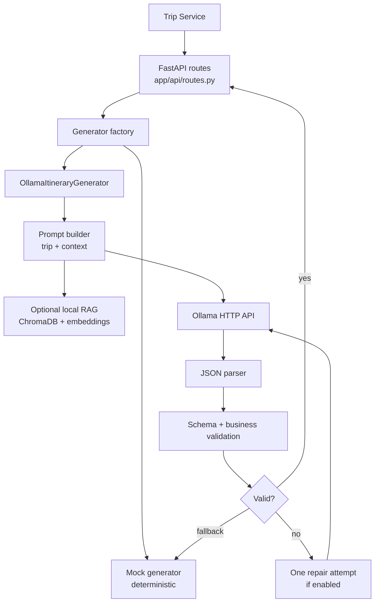
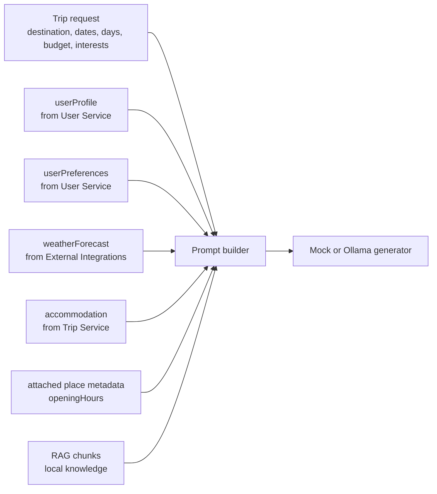
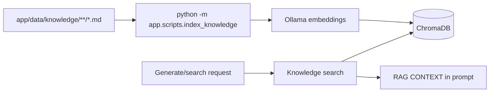

# AI Planning Service

FastAPI service for itinerary generation and budget optimization. It can run in
deterministic `mock` mode for local development or `ollama` mode for local LLM
generation, validation, and optional repair.

Trip Service is the normal caller. The AI service does not own trips, users,
jobs, notifications, or budgets in storage; it receives context, returns a
validated JSON proposal/itinerary, and leaves persistence to Trip Service.

## Output language

Generation, day/item regeneration, budget optimization, template adaptation,
and itinerary repair accept `outputLanguage` (`en`, `es`, `uk`, or `fr`) with
an English default. Prompts require user-facing string values in that language
while JSON keys, enum values, and currency codes remain stable and English.
Mock generation returns deterministic localized text for language propagation
tests. Unsupported codes fail Pydantic validation.

## Planning Constraints

AI Planning Service accepts optional `planningConstraints` on
`/generate-itinerary`, `/regenerate-day`, `/regenerate-item`,
`/optimize-budget/day`, `/adapt-template`, `/repair-itinerary`, and
`/suggest-destinations`. The shared Pydantic model lives in
`app/schemas/planning_constraints.py` and mirrors Trip Service schema version 1:
language, scope, profile, budget, dates, travelers, pace/walking, transport,
trip styles, accommodation, interests/avoid/must-have, accessibility, food,
route, workspace policy, previous-trip signals, prompt, warnings, and blockers.

Prompt builders use one shared planning-constraints section. It tells the model
to respect the normalized context, treat blockers as hard constraints outside
repair, prefer workspace policy when constraints conflict, keep JSON keys/enums
in English, localize user-facing text to `outputLanguage`, avoid claims of live
booking/availability, and keep prices/times clearly approximate. Repair prompts
describe blockers as targets to fix rather than reasons to reject the request.

Mock mode reads the same context for deterministic behavior: preferred transport
influences transfer items, avoided/disallowed modes are skipped, trip styles
shape sample activities, and language still controls localized user-facing
strings. Requests without `planningConstraints` remain supported for backward
compatibility.

## Project Structure

- `app/main.py` is the ASGI entry point and only creates the FastAPI app.
- `app/application.py` wires settings, app state, middleware, routes, and
  service implementations.
- `app/api/` contains route handlers and shared FastAPI dependency accessors.
- `app/core/` contains cross-cutting infrastructure helpers such as exception
  handling, readiness checks, and service-relative path resolution.
- `app/schemas/` contains request and response contracts.
- `app/services/` contains generator, RAG, validation, prompt, and template
  adaptation logic.
- `app/scripts/` contains operational scripts such as local knowledge indexing.
- `tests/` keeps behavior tests close to the public service surface.

## Runtime Flow



## Endpoints

| Method | Path | Purpose |
| ------ | ---- | ------- |
| `GET` | `/health` | Liveness. |
| `GET` | `/ready` | Readiness for configured dependencies such as Ollama/Chroma. |
| `GET` | `/metrics` | Prometheus metrics. |
| `POST` | `/generate-itinerary` | Full itinerary generation. |
| `POST` | `/regenerate-day` | Replace one itinerary day. |
| `POST` | `/regenerate-item` | Replace one itinerary item. |
| `POST` | `/optimize-budget/day` | Return a reviewable cheaper-day proposal. |
| `POST` | `/repair-itinerary` | Return a reviewable policy/risk repair proposal with repaired itinerary, summary, and changes. |
| `POST` | `/adapt-template` | Adapt a reusable template to a new destination/duration/budget. |
| `POST` | `/suggest-destinations` | Return 3–5 destination ideas for `prompt`, `surprise`, or `refine` mode. |
| `GET` | `/destination-context` | List curated destination context. |
| `GET` | `/destination-context/{destination}` | Read one destination context. |
| `POST` | `/destination-context/{destination}/preview-prompt` | Development prompt preview. |
| `POST` | `/knowledge/search` | Search local RAG chunks. |

Destination context and knowledge routes are development/internal routes in v1.
Protect them before exposing the service outside a private network.

## AI Trip Discovery

`POST /suggest-destinations` accepts sanitized profile/preferences, a compact
trip context, up to 20 previous-trip summaries, optional workspace policy
constraints, and `outputLanguage` (`en`, `es`, `uk`, `fr`). It returns match
scores, rough budgets, fit reasoning, downsides, a sample-day preview, concerns,
and an itinerary prompt. JSON keys and enums remain English while user-facing
values are localized.

Mock mode is deterministic: prompt keywords select known destination families,
surprise mode combines preferences with prior destinations, and refine mode
reacts to cheaper/warmer/nature/city instructions. Ollama mode requires strict
JSON and falls back to mock when configured. Estimates are not live prices or
availability; the endpoint performs no booking and gives no visa, legal,
health, or safety guarantees.

Discovery suggestions may be `suggestionType: "single_destination"` or
`"route"`. Route suggestions include a route snapshot with origin, stops, legs,
transport preferences, trip styles, rough transfer costs, fit reasons, and
downsides. They are planning proposals only; no ticket, accommodation, permit,
or transport booking is made.

## Multi-Destination Generation

`POST /generate-itinerary` accepts optional route context:

- `tripType: "multi_destination"`
- `route`: origin, ordered stops, transfer legs, and route preferences
- `transportPreferences`: preferred/avoided modes, car availability, max
  transfer hours
- `tripStyles`: route style hints such as `train_trip`, `road_trip`,
  `camping`, `hiking`, or `island_hopping`

Prompts instruct the model to plan across all stops, respect stop dates/nights,
include `type: "transfer"` items on transfer days, avoid dense sightseeing
around long transfers, respect avoided transport modes, keep costs as estimates,
and never claim tickets/bookings/schedules are confirmed. Camping/hiking prompts
stay conservative: campsite/accommodation notes require user verification,
hiking suggestions are not technical GPS routes, and ferry/boat/island-hopping
times are approximate.

Mock mode is deterministic for multi-stop routes. It assigns days to stops,
adds transfer items using route leg mode/duration/cost, fills
`primaryStopId`, `locationName`, and `transferDay`, and preserves the old
single-destination generator when no route is supplied.

## Context Inputs



The public response shape remains stable even when optional context is absent.
Full prompts and raw model responses are not logged by default.

## Validation And Repair

Generated itineraries are checked in two layers:

- Pydantic/schema validation for the public response shape.
- Business validation for exact day count, day ordering, pace-based item counts,
  item types, time format, chronological order, text quality, duplicate items,
  non-negative costs, and budget sanity.

Personalization and weather checks are soft warnings. They can flag avoided
terms, dietary mismatch, repeated long-walk language, rainy-day outdoor plans,
or risky weather scheduling without rejecting the response.

When `OLLAMA_REPAIR_ENABLED=true`, one repair request may be sent after invalid
JSON, schema failure, or business validation failure. If repair still fails and
`OLLAMA_FALLBACK_TO_MOCK=true`, the deterministic mock generator answers.

## Generator Modes

| Mode | Use case |
| ---- | -------- |
| `mock` | Fast deterministic local development and tests. No Ollama required. |
| `ollama` | Local LLM generation through Ollama HTTP API. Optional mock fallback. |

```bash
ITINERARY_GENERATOR_MODE=mock
ITINERARY_GENERATOR_MODE=ollama
```

Unknown modes fail startup.

## Template Adaptation

`POST /adapt-template` adapts a reusable trip template to a new destination,
duration, budget, pace, travelers, and interests while preserving the template's
planning structure and rhythm. It is a draft, not a confirmed plan.

Request body: `{ template, target, constraints, context? }`.
- `template` — sanitized structure `{ schemaVersion, durationDays, days[] }`
  (Trip Service strips private metadata before sending it).
- `target` — `{ destination, startDate, durationDays, budget?, travelers, pace,
  interests[], avoid[] }`.
- `constraints` — `{ preserveStructure, adaptCosts, preserveMealStructure,
  preserveActivityDensity, specialInstructions? }`.

Response body: `{ itinerary: { title, destination, startDate, days[] },
adaptationSummary: { sourceDurationDays, targetDurationDays, preservedStructure,
changedDestination, fallbackUsed, majorChanges[], warnings[] } }`.

Modes (config, defaulting to `ITINERARY_GENERATOR_MODE` when unset):

```bash
AI_TEMPLATE_ADAPTATION_ENABLED=true
AI_TEMPLATE_ADAPTATION_MODE=mock            # mock | ollama
AI_TEMPLATE_ADAPTATION_TIMEOUT_SECONDS=120
AI_TEMPLATE_ADAPTATION_FALLBACK_ENABLED=true # ollama -> mock fallback on failure
```

- **mock** — deterministic: adapts destination/title/dates, preserves day/item
  structure, renames items (`"<destination> version of <name>"`), shifts dates
  from the target start date, trims days for shorter targets, and appends
  `Flexible exploration day` placeholders for longer targets. No external calls.
- **ollama** — builds a strict-JSON prompt with preservation rules
  (day rhythm, morning/afternoon/evening structure, meal/rest structure,
  per-day density, category mix, budget level) and adaptation rules
  (local places, transport, cost estimates, duration). It parses, validates, and
  attempts one repair pass; on failure it can fall back to the mock adapter.

Validation (looser than generation — it does **not** enforce the pace-based
items-per-day rule so template density is preserved): day count must equal the
target duration, item types/times must be valid, and costs must be non-negative.
Warnings flag a probably-too-low budget, intense compression, uncertain prices,
availability that must be checked, and limited destination context.

**Limitations:** adaptation is a reviewable draft, not a booking. Costs are
estimates, availability and opening hours must be verified, substitutions may be
imperfect, and the model never claims confirmed bookings or guaranteed
availability.

## Policy-Aware Trip Repair

`POST /repair-itinerary` accepts the current itinerary, trip context, workspace
policy and policy evaluation, approval risk factors, selected repair issues,
constraints, and optional profile/preferences/weather context. It returns:

- `repairedItinerary`: a full itinerary JSON object following the existing
  itinerary schema.
- `repairSummary`: repair mode, changed/added/removed/moved counts, estimated
  cost before/after, major changes, addressed/remaining issues, and warnings.
- `changes`: structured item/day changes with before/after snippets and
  reasons.

Repair modes are `policy_compliance`, `reduce_budget_risk`,
`fix_schedule_risk`, `reduce_walking`, `add_rest_time`,
`replace_disallowed_items`, and `selected_issues`.

In `mock` mode the repair is deterministic: budget mode reduces high-cost
items, schedule mode moves late items earlier, rest mode adds rest blocks,
walking mode keeps structure stable with review notes when route data is
insufficient, and disallowed-item mode replaces affected items. No external
calls are made.

In `ollama` mode the prompt is strict JSON-only and instructs the model to
address selected issues first, minimize changes, preserve confirmed/user-edited
items, keep dates/duration/destination stable unless allowed, avoid
comments/collaborators/shares/calendar/approval metadata, keep costs as
estimates, and never claim booking or availability. The response parser
requires `repairedItinerary`, `repairSummary`, and `changes`, then validates day
count/day numbers when dates are locked and reuses itinerary schema validation
before Trip Service stores or applies anything.

Limitations: repair output is a proposal only. It does not book anything, apply
provider prices, approve a trip, guarantee policy compliance, or modify
non-itinerary trip data. Availability and prices should be checked again after
repair.

## Local Development

Poetry workflow:

```bash
cd services/ai-planning-service
make poetry-install
ITINERARY_GENERATOR_MODE=mock poetry run make run
```

Virtualenv/pip fallback:

```bash
cd services/ai-planning-service
python3 -m venv .venv
source .venv/bin/activate
make install
ITINERARY_GENERATOR_MODE=mock make run
```

Run with local Ollama:

```bash
ollama pull llama3.1:8b
ollama pull nomic-embed-text

ITINERARY_GENERATOR_MODE=ollama \
OLLAMA_BASE_URL=http://127.0.0.1:11434 \
OLLAMA_MODEL=llama3.1:8b \
OLLAMA_FALLBACK_TO_MOCK=true \
make run
```

Run with Docker Compose from the repository root:

```bash
docker compose -f infra/docker-compose.yml --env-file infra/.env up --build
docker compose -f infra/docker-compose.yml exec ollama ollama pull llama3.1:8b
docker compose -f infra/docker-compose.yml exec ollama ollama pull nomic-embed-text
```

## Important Configuration

| Variable | Default | Purpose |
| -------- | ------- | ------- |
| `HTTP_HOST`, `HTTP_PORT` | `0.0.0.0`, `8000` | Service bind address. |
| `ITINERARY_GENERATOR_MODE` | `mock` locally, `ollama` in compose | Generator backend. |
| `OLLAMA_BASE_URL` | `http://ollama:11434` | Ollama API URL in compose. |
| `OLLAMA_MODEL` | `llama3.1:8b` | Generation model. |
| `OLLAMA_TIMEOUT_SECONDS` | `60` to `90` | LLM request timeout. |
| `OLLAMA_TEMPERATURE` | `0.2` | Generation temperature. |
| `OLLAMA_NUM_PREDICT` | `2048` | Output token budget. |
| `OLLAMA_FALLBACK_TO_MOCK` | `true` | Serve mock data when Ollama fails. |
| `OLLAMA_REPAIR_ENABLED` | `true` | Attempt one repair call after invalid output. |
| `LOG_LLM_PAYLOADS` | `false` | Keep full prompts/responses out of logs. |
| `DESTINATION_CONTEXT_ENABLED` | `true` | Enable curated destination JSON context. |
| `RAG_ENABLED` | `false` locally, `true` in compose env | Enable local knowledge retrieval. |
| `RAG_KNOWLEDGE_DIR` | `app/data/knowledge` | Markdown/text knowledge source. |
| `RAG_CHROMA_DIR` | `app/data/chroma` | Persistent ChromaDB path. |
| `OLLAMA_EMBEDDING_MODEL` | `nomic-embed-text` | Embedding model for RAG indexing/search. |

Use [.env.example](.env.example) for the full template.

## Local Knowledge RAG



Index local knowledge after Ollama and the embedding model are available:

```bash
cd services/ai-planning-service
source .venv/bin/activate
RAG_CHROMA_DIR=app/data/chroma \
OLLAMA_BASE_URL=http://127.0.0.1:11434 \
python -m app.scripts.index_knowledge
```

Test search:

```bash
curl -X POST http://localhost:8000/knowledge/search \
  -H "Content-Type: application/json" \
  -d '{"destination":"Rome","interests":["food"],"query":"local food","topK":5}'
```

If RAG is disabled, embedding fails, or no collection exists, generation
continues without RAG context.

## Example Generation Call

```bash
curl -X POST http://localhost:8000/generate-itinerary \
  -H "Content-Type: application/json" \
  -d '{
    "tripId": "550e8400-e29b-41d4-a716-446655440000",
    "destination": "Rome",
    "startDate": "2026-08-10",
    "days": 4,
    "budgetAmount": 600,
    "budgetCurrency": "EUR",
    "travelers": 2,
    "interests": ["food", "history", "hidden_gems"],
    "pace": "balanced",
    "tripType": "multi_destination",
    "route": {
      "origin": {"name": "Bratislava", "country": "Slovakia"},
      "stops": [
        {"id": "stop_1", "destination": "Vienna", "nights": 2},
        {"id": "stop_2", "destination": "Salzburg", "nights": 2}
      ],
      "legs": [
        {"id": "leg_1", "fromStopId": "origin", "toStopId": "stop_1", "mode": "train"},
        {"id": "leg_2", "fromStopId": "stop_1", "toStopId": "stop_2", "mode": "train"}
      ],
      "preferences": {"preferredModes": ["train"], "tripStyles": ["train_trip"]}
    }
  }'
```

## Development Checks

```bash
make fmt-check
make lint
make test
make check
```

When using Poetry-managed dependencies, run checks through Poetry:

```bash
poetry run make check
```

## Observability And Safety

- `GET /metrics` exposes HTTP and AI-domain metrics.
- Logs and responses include request and correlation IDs.
- Do not log full prompts, full user preferences, full private itinerary JSON,
  raw model output, tokens, or API keys by default.
- `LOG_LLM_PAYLOADS=true` only logs payloads in development.

## Workspace Policy Constraints

Legacy `workspacePolicyConstraints` remains accepted where older Trip Service
payloads still send it, but new flows prefer `planningConstraints.workspacePolicy`
inside the normalized context. Trip Service remains authoritative for policy
blocking and post-generation validation.

## Troubleshooting

| Symptom | Check |
| ------- | ----- |
| Ollama connection refused | Confirm Ollama is running and `OLLAMA_BASE_URL` is correct for host vs Docker. |
| Model not found | Pull `llama3.1:8b` in the same Ollama instance the service uses. |
| Embedding model not found | Pull `nomic-embed-text`. |
| RAG returns no results | Run the indexer and confirm `RAG_ENABLED=true`. |
| Invalid JSON from model | Keep repair enabled, lower temperature, or allow mock fallback while developing. |
| Generation timeout | Keep Trip Service timeout greater than AI timeout and AI timeout greater than expected Ollama latency. |
