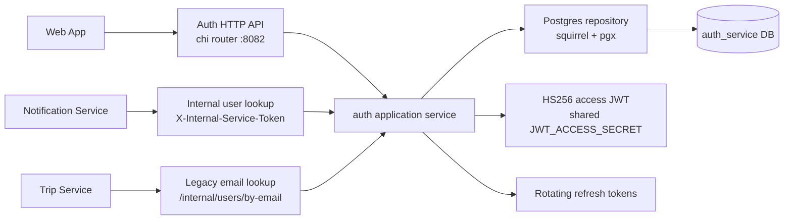

# Auth Service

Go service that owns first-party identity for the Travel AI App. It handles
email/password registration, login, refresh-token rotation, logout, JWT access
token issuing, current-user lookup, and internal user lookup for other services.

## Request Flow



Auth Service signs access tokens. Other private services validate those tokens
locally with the same `JWT_ACCESS_SECRET`; they do not call Auth Service on
every request.

## Endpoints

| Method | Path | Auth | Purpose |
| ------ | ---- | ---- | ------- |
| `GET` | `/health` | none | Liveness. |
| `GET` | `/ready` | none | PostgreSQL readiness. |
| `GET` | `/metrics` | none | Prometheus metrics. |
| `POST` | `/auth/register` | none | Create user and issue tokens. |
| `POST` | `/auth/login` | none | Verify credentials and issue tokens. |
| `POST` | `/auth/refresh` | refresh token body | Rotate refresh token and issue access token. |
| `POST` | `/auth/logout` | refresh token body | Revoke refresh token when present. |
| `GET` | `/auth/me` | bearer access token | Return current user. |
| `GET` | `/internal/users/by-email` | network-internal v1 | Legacy exact-email lookup for collaborators. |
| `POST` | `/internal/users/batch` | `X-Internal-Service-Token` | Batch user/email lookup for notifications. |

## Local Development

```bash
cd services/auth-service
cp .env.example .env
set -a; source .env; set +a
make run
```

Run with YAML config:

```bash
cp configs/config.example.yaml configs/config.yaml
make config-run
```

Migrations run automatically on startup. Manual migration commands are available
for local debugging:

```bash
make migrate-up
make migrate-down
```

## Configuration

| Variable | Default | Notes |
| -------- | ------- | ----- |
| `APP_ENV` | `development` | Production rejects weak defaults. |
| `HTTP_ADDRESS` / `HTTP_ADDR` | `:8082` | Listen address. |
| `POSTGRES_*` | local compose defaults | Database and pool settings. |
| `POSTGRES_MIG_PATH` | `./migrations` | Migration directory. |
| `JWT_ACCESS_SECRET` | `change-me-in-development` | Shared HS256 secret; production must use a strong value. |
| `ACCESS_TOKEN_TTL_MINUTES` | `15` | Access token lifetime. |
| `REFRESH_TOKEN_TTL_DAYS` | `30` | Refresh token lifetime. |
| `INTERNAL_SERVICE_TOKEN` | `dev-internal-service-token` | Required by `POST /internal/users/batch`. |
| `CORS_ALLOWED_ORIGINS` | `http://localhost:3000` | Browser origin allowlist. |

## Development Checks

```bash
make fmt
make vet
make test
make build
```

## Example Calls

```bash
curl -sS -X POST http://localhost:8082/auth/register \
  -H 'Content-Type: application/json' \
  -d '{"email":"user@example.com","password":"StrongPassword123!"}'

curl -sS -X POST http://localhost:8082/auth/login \
  -H 'Content-Type: application/json' \
  -d '{"email":"user@example.com","password":"StrongPassword123!"}'

curl -sS http://localhost:8082/auth/me \
  -H "Authorization: Bearer ${ACCESS_TOKEN}"
```

## Observability And Safety

- `GET /metrics` exposes Prometheus metrics.
- Request logs include `X-Request-ID` and `X-Correlation-ID`; responses echo
  both headers.
- Metrics use bounded labels for method, route, status, and auth result.
- Never log passwords, refresh tokens, access tokens, cookies, authorization
  headers, internal service tokens, or full request bodies.
