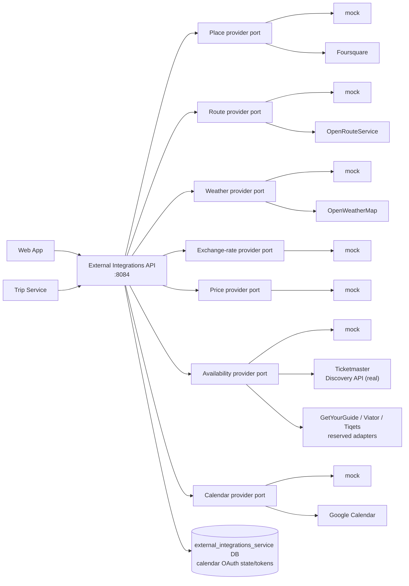
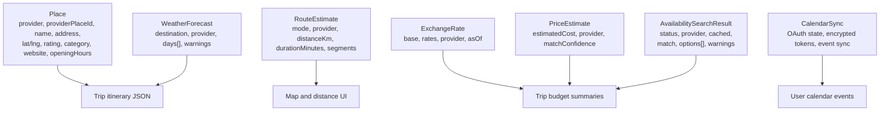

# External Integrations Service

Go service that isolates third-party integration boundaries from the Web App and
Trip Service. It exposes stable application APIs for places, routes, weather,
exchange rates, attraction/ticket price estimates, availability checks, and
Google Calendar sync.

Mock providers are the local default. Real providers are opt-in and keep API
keys server-side.

## Provider Boundary



All provider responses are normalized before they leave the service. The Web App
and Trip Service do not call Foursquare, OpenRouteService, OpenWeatherMap, or
Google Calendar directly.

## Endpoints

| Method | Path | Auth | Purpose |
| ------ | ---- | ---- | ------- |
| `GET` | `/health` | none | Liveness. |
| `GET` | `/ready` | none | Readiness. |
| `GET` | `/metrics` | none | Prometheus metrics. |
| `GET` | `/places/search?query=&destination=` | none v1 | Normalized place search. |
| `GET` | `/places/{placeId}` | none v1 | Normalized place details. |
| `POST` | `/routes/estimate` | none v1 | Ordered-stop route estimate. |
| `GET` | `/weather/forecast?destination=&startDate=&days=` | none v1 | Daily weather forecast. |
| `GET` | `/exchange-rates/latest?base=` | none v1 | Latest deterministic/real rate table. |
| `GET` | `/exchange-rates/convert?amount=&from=&to=` | none v1 | Currency conversion. |
| `POST` | `/prices/estimate` | `X-Internal-Service-Token` | Internal attraction/ticket estimate. |
| `POST` | `/availability/search` | bearer access token | User-triggered ticket/activity availability search. |
| `GET` | `/calendar/google/status` | bearer access token | Connected calendar account status. |
| `POST` | `/calendar/google/connect` | bearer access token | Start OAuth flow. |
| `GET` | `/calendar/google/callback` | OAuth state | Complete provider callback. |
| `DELETE` | `/calendar/google/disconnect` | bearer access token | Disconnect calendar. |
| `POST` | `/internal/calendar/google/events/sync` | `X-Internal-Service-Token` | Create/update app-owned calendar events. |
| `POST` | `/internal/calendar/google/events/delete` | `X-Internal-Service-Token` | Delete app-owned calendar events. |
| `GET` | `/ops/providers/status` | allowlisted bearer token | Sanitized provider health and recent failures. |
| `GET` | `/ops/providers/quotas?date=` | allowlisted bearer token | Per-provider rate-limit/quota usage for a day. |
| `GET` | `/ops/providers/quotas/{provider}` | allowlisted bearer token | Provider detail: operation breakdown + last 7 days. |
| `POST` | `/ops/providers/quotas/{provider}/reset-dev` | allowlisted bearer token | Reset today's counters (403 in production). |

## Provider Selection

| Capability | Default | Real provider option | Fallback variable |
| ---------- | ------- | -------------------- | ----------------- |
| Places | `PLACE_PROVIDER=mock` | `foursquare` | `PLACE_PROVIDER_FALLBACK_TO_MOCK` |
| Routes | `ROUTE_PROVIDER=mock` | `ors` | `ROUTE_PROVIDER_FALLBACK_TO_MOCK` |
| Weather | `WEATHER_PROVIDER=mock` | `openweathermap` | `WEATHER_PROVIDER_FALLBACK_TO_MOCK` |
| Exchange rates | `EXCHANGE_RATE_PROVIDER=mock` | reserved future adapters | `EXCHANGE_RATE_PROVIDER_FALLBACK_TO_MOCK` |
| Prices | `PRICE_PROVIDER=mock` | reserved future API adapter | `PRICE_PROVIDER_FALLBACK_TO_MOCK` |
| Availability | `AVAILABILITY_PROVIDER=mock` | `ticketmaster` (real); `getyourguide`, `viator`, `tiqets` placeholders | `AVAILABILITY_FALLBACK_TO_MOCK` |
| Calendar | `CALENDAR_PROVIDER=mock` | `google` | none; validate config |

Unsupported provider names fail startup. When fallback is enabled, missing keys
or provider failures return mock data with `fallbackUsed: true` where the
response shape supports it.

### Availability provider architecture (Advanced Availability Provider Adapters v1)

The availability port is a chain of decorators, all in `internal/availability`:
`caching → guarded (quota/rate-limit) → fallback → real/mock provider`. The
`/availability/search` contract is unchanged; real adapters only add
backward-compatible response fields.

- **Ticketmaster** (`AVAILABILITY_PROVIDER=ticketmaster`, requires
  `TICKETMASTER_API_KEY`) is the first real adapter. It uses the Discovery API
  Event Search endpoint (`GET /discovery/v2/events.json`, `apikey` query param).
  Adapter-specific code is isolated in `ticketmaster_*.go` so it is easy to
  replace or disable. Supported item types: `event`, `concert`, `sports`,
  `theatre`, `show`, `festival`, `performance` (+ synonyms). Unsupported types
  (`rest`, `walk`, `note`, `restaurant`, …) return `status: "unknown"` **without
  a network call**, so they never consume provider quota.
- **Matching / confidence**: each event is scored deterministically — title
  token overlap (≤0.35), venue (≤0.20), destination/city (≤0.15), date (≤0.15),
  category (≤0.10), coordinate proximity (≤0.05). A best score below
  `AVAILABILITY_MIN_MATCH_CONFIDENCE` (default 0.55) is never marked available
  (status becomes `unknown`, `match.matched=false`, options kept as
  low-confidence candidates). Scores below `AVAILABILITY_LOW_CONFIDENCE_THRESHOLD`
  (default 0.65) add a verify warning.
- **Prices** are never invented. A Ticketmaster `priceRanges` min becomes the
  amount with `price.qualifier="from"`; an exact single value uses `"exact"`; no
  price range yields `price: null`.
- **Cache** (`internal/availability/cache.go`) is checked *before* quota so a
  cache hit costs no quota. Ticketmaster uses `TICKETMASTER_CACHE_TTL_SECONDS`
  (default 1800), otherwise `AVAILABILITY_CACHE_TTL_SECONDS`. Cached responses
  set `cached: true`.
- **Quota/rate-limit**: real availability providers share the `AVAILABILITY_*`
  provider-limit bucket. On limit with fallback enabled, the response is mock/
  fallback data with `fallbackUsed: true` and a provider warning — it never
  claims `provider: "ticketmaster"` on a fallback.
- **Error classification** (`ticketmaster_client.go`): 401/403 → `auth_config`,
  429 → `rate_limited`, 5xx → `unavailable`, malformed body → `bad_response`,
  timeout → `timeout`. Errors are sanitized before reaching HTTP clients.

Tours/activities adapters (GetYourGuide/Viator/Tiqets) remain reserved
placeholders; their config keys exist but they return `unavailable` until a real
adapter with verified current docs is implemented. Multi-provider merging is
future work — one active provider at a time in v1.

## Main Data Shapes



Opening hours use `dayOfWeek` values `1 = Monday` through `7 = Sunday` and
local `HH:mm` strings. Missing hours mean unknown.

## Local Development

```bash
cd services/external-integrations-service
cp .env.example .env
set -a; source .env; set +a
make run
```

Run with YAML config:

```bash
cp configs/config.example.yaml configs/config.yaml
make config-run
```

Run as part of the full stack:

```bash
docker compose -f infra/docker-compose.yml --env-file infra/.env up --build
```

## Example Calls

```bash
curl "http://localhost:8084/places/search?query=Colosseum&destination=Rome"

curl -X POST "http://localhost:8084/routes/estimate" \
  -H "Content-Type: application/json" \
  -d '{"mode":"walking","stops":[
    {"name":"Colosseum","latitude":41.8902,"longitude":12.4922},
    {"name":"Trevi Fountain","latitude":41.9009,"longitude":12.4833}
  ]}'

curl "http://localhost:8084/weather/forecast?destination=Rome&startDate=2026-08-10&days=3"

curl "http://localhost:8084/exchange-rates/convert?amount=2500&from=JPY&to=EUR"
```

Internal price estimate:

```bash
curl -X POST "http://localhost:8084/prices/estimate" \
  -H "Content-Type: application/json" \
  -H "X-Internal-Service-Token: dev-internal-service-token" \
  -d '{"destination":"Rome","currency":"EUR","itemContext":{"name":"Colosseum","type":"attraction"}}'
```

Authenticated availability search:

```bash
curl -X POST "http://localhost:8084/availability/search" \
  -H "Content-Type: application/json" \
  -H "Authorization: Bearer ${ACCESS_TOKEN}" \
  -d '{
    "destination":"Rome",
    "date":"2026-08-10",
    "currency":"EUR",
    "travelers":{"adults":2},
    "item":{
      "name":"Visit the Colosseum",
      "type":"attraction",
      "startTime":"10:00",
      "place":{
        "name":"Colosseum",
        "lat":41.8902,
        "lng":12.4922,
        "provider":"mock",
        "providerPlaceId":"mock-colosseum"
      }
    }
  }'
```

Responses use `status` values `available`, `limited`, `unavailable`, or
`unknown`. The top-level object includes `provider`, `providerDisplayName`,
`fallbackUsed`, `cached`, `checkedAt`, `cacheExpiresAt`, `match`
(`matched`, `confidence`, `matchedName`, `providerEntityId`, `providerUrl`), an
`options[]` list, and `warnings[]`. Each option includes normalized `price`
(`amount`, `currency`, `qualifier` = `exact`/`from`/`estimate`/`unknown`),
`priceType`, `startTimes`, `date`, `durationMinutes`, a safe HTTPS `bookingUrl`,
`providerEntityId`, `location` (venue name/address/lat/lng), `matchConfidence`,
and per-option `warnings`. All fields are additive and backward-compatible.
The endpoint checks availability only; checkout and in-app bookings are out of
scope for v1. Results are provider availability, not booking guarantees.

To exercise the real Ticketmaster adapter locally, set
`AVAILABILITY_PROVIDER=ticketmaster` and `TICKETMASTER_API_KEY=...`, then search
for an event-shaped item (`"type":"concert"`). Provider data changes, so assert
on the response shape and `provider` value rather than specific event names or
prices.

## Important Configuration

| Variable | Purpose |
| -------- | ------- |
| `HTTP_ADDR` | Listen address, default `:8084`. |
| `POSTGRES_*`, `POSTGRES_MIG_PATH` | Calendar OAuth state/token storage. |
| `JWT_ACCESS_SECRET`, `AUTH_HEADER_NAME` | User JWT validation for calendar OAuth routes. |
| `INTERNAL_SERVICE_TOKEN` | Protects internal price and calendar event routes. |
| `PLACE_PROVIDER`, `FOURSQUARE_API_KEY` | Place provider selection and key. |
| `ROUTE_PROVIDER`, `ORS_API_KEY` | Route provider selection and key. |
| `WEATHER_PROVIDER`, `OPENWEATHER_API_KEY` | Weather provider selection and key. |
| `EXCHANGE_RATE_*`, `PRICE_*` | Currency and attraction price settings. |
| `AVAILABILITY_*`, `TICKETMASTER_*`, `GETYOURGUIDE_*`, `VIATOR_*`, `TIQETS_*` | Availability provider selection, matching thresholds, cache, fallback, the real Ticketmaster adapter, and reserved real-provider settings. |
| `GOOGLE_CALENDAR_ENABLED`, `CALENDAR_PROVIDER` | Calendar sync provider mode. |
| `GOOGLE_OAUTH_CLIENT_ID`, `GOOGLE_OAUTH_CLIENT_SECRET`, `GOOGLE_OAUTH_REDIRECT_URL` | Real Google OAuth settings. |
| `CALENDAR_TOKEN_ENCRYPTION_KEY` | AES-GCM key for stored calendar tokens. |
| `PUBLIC_WEB_BASE_URL` | Allowed OAuth callback redirect base. |
| `*_CACHE_ENABLED`, `*_CACHE_TTL_SECONDS` | In-memory provider cache controls. |
| `OPS_DASHBOARD_ENABLED`, `OPS_ADMIN_EMAILS` | Allowlisted provider health route. |

API keys and OAuth secrets must stay server-side and out of committed files.

## Development Checks

```bash
make fmt
make vet
make test
make build
```

## Provider Quota & Rate-Limit Management (v1)

External Integrations Service is the central enforcement point for per-provider
rate limits and daily quotas. All outbound real provider calls pass through one
guard (`internal/providerlimits`) so limit logic is never scattered across
handlers.

**Flow** (per operation): `cache lookup -> guard.CheckAndReserve -> real provider`.
The guard sits *below* each provider's cache decorator, so cache hits never reach
it and therefore never consume provider quota (only cache-hit metrics are
recorded). On a limit the caller either falls back to mock/cache (when valid) or
returns a controlled error.

**Rate limiting** is an in-memory per-minute token bucket, keyed by provider
category (one active provider per category). It is process-local and resets on
restart. `*_RATE_LIMIT_PER_MINUTE=0` means unlimited; `*_RATE_LIMIT_BURST`
controls the instantaneous burst.

**Daily quotas** are Postgres-backed so restarts do not reset daily usage.
Reservations are atomic: a `provider_daily_totals` row is locked `FOR UPDATE`,
checked against the quota, and incremented in one transaction, so concurrent
reservations can never exceed the quota. Per provider+operation rows in
`provider_daily_usage` power the Ops operation breakdown. `*_DAILY_QUOTA=0` means
unlimited. Usage is counted in UTC days (`PROVIDER_LIMITS_TIMEZONE`, default UTC).
A reservation consumes a unit up-front; a real call that then errors and falls
back still counts (conservative v1 behavior). Each call costs 1 unit.

**Fallback / controlled errors.** When a real provider is limited:
- places/routes/weather/exchange/price fall back to mock when
  `*_PROVIDER_FALLBACK_TO_MOCK=true` (response carries `fallbackUsed: true`);
  otherwise the handler returns a controlled error.
- availability falls back to mock when `AVAILABILITY_FALLBACK_TO_MOCK=true`
  and returns a warning that the result is estimated fallback availability.
- Google Calendar writes never fall back to mock — a limited write is reported as
  a controlled failure and no fake event is created.

Controlled error codes (HTTP 429 for the first two, 503 for the last):
`provider_rate_limited`, `provider_quota_exceeded`, `provider_limits_unavailable`.
Responses are safe: `{ "error", "message", "provider", "operation",
"retryAfterSeconds" }` with no account/quota internals.

**Configuration.** `PROVIDER_LIMITS_ENABLED` (default `false` — permissive local
dev), `PROVIDER_LIMITS_FAIL_OPEN` (on quota-store failure: `false` blocks and
returns `provider_limits_unavailable`, `true` allows — production should be
`false`), plus per-provider `*_RATE_LIMIT_PER_MINUTE`, `*_RATE_LIMIT_BURST`, and
`*_DAILY_QUOTA`. Negative limits are rejected at startup. See `.env.example`.

**Metrics** (bounded labels only): `provider_limit_requests_total`,
`provider_quota_used_total`, `provider_quota_blocked_total`,
`provider_quota_remaining`, `provider_rate_limit_tokens_available`,
`provider_fallback_due_to_limit_total`, `provider_limit_check_duration_seconds`.
Existing `external_provider_*` metrics are unchanged.
Availability also exposes `availability_search_requests_total`,
`availability_search_duration_seconds`, `availability_options_returned_total`,
`availability_cache_hits_total`, `availability_cache_misses_total`,
`availability_fallback_total`, `availability_errors_total`, and
`availability_match_confidence_total` (bucketed `high`/`medium`/`low`/`none`).

**Ops** endpoints (`/ops/providers/quotas*`, admin-only) expose usage, blocked,
fallback counts, remaining quota, and status
(`healthy` / `nearing_quota` / `quota_exceeded` / `rate_limited_recently` /
`disabled` / `unknown`). `reset-dev` clears today's counters and is 403 in
production.

## Limitations

- Provider rate limits are in-memory per replica and reset on restart; there is
  no distributed limiter across replicas in v1 (each replica enforces its own
  per-minute budget). Daily quota counters are shared via Postgres.
- No provider billing/cost integration; quotas protect against bursts and
  runaway usage, they do not charge or meter money.
- Caches are process-local and cleared on restart.
- Mock routing is an estimate, not turn-by-turn navigation.
- OpenWeatherMap free-tier forecast coverage is limited; out-of-range dates
  should use mock fallback in local development.
- Price estimates are approximate hints, not booking, checkout, inventory, or
  guaranteed live pricing.
- Availability checks are external-link handoffs only. They do not reserve
  inventory, process payment, or guarantee that a quoted price remains available.
  Caches are in-memory and can be stale until the TTL expires.
- Calendar sync is Google-only, primary-calendar-only, one-way, and app-owned
  event oriented.

## Observability And Safety

- `GET /metrics` exposes HTTP and provider metrics.
- Provider metrics use bounded labels: provider, operation, result, error, and
  fallback state.
- Request and correlation IDs are generated/propagated on first-party calls.
- Do not log provider API keys, OAuth codes, OAuth tokens, encryption keys,
  full provider error bodies, browser credentials, or raw destination/place names
  as metric labels.
