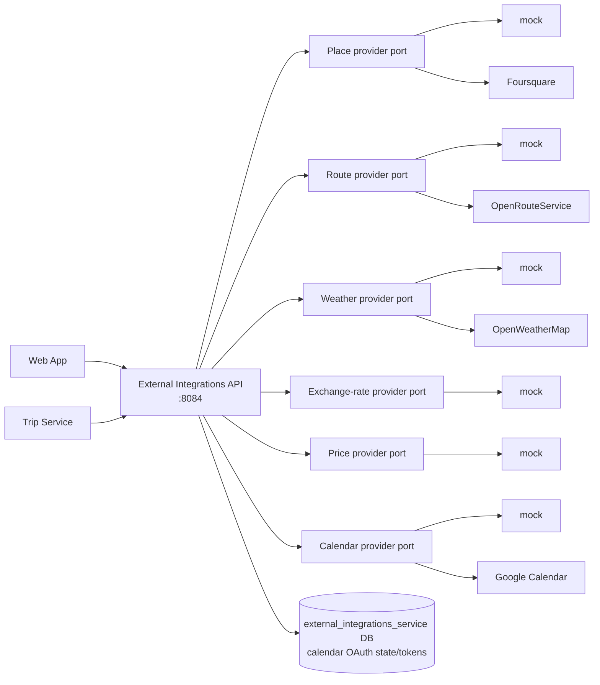
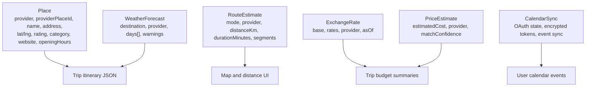

# External Integrations Service

Go service that isolates third-party integration boundaries from the Web App and
Trip Service. It exposes stable application APIs for places, routes, weather,
exchange rates, attraction/ticket price estimates, and Google Calendar sync.

Mock providers are the local default. Real providers are opt-in and keep API
keys server-side.

## Provider Boundary



All provider responses are normalized before they leave the service. The Web App
and Trip Service do not call Foursquare, OpenRouteService, OpenWeatherMap, or
Google Calendar directly.

## Endpoints

| Method | Path | Auth | Purpose |
| ------ | ---- | ---- | ------- |
| `GET` | `/health` | none | Liveness. |
| `GET` | `/ready` | none | Readiness. |
| `GET` | `/metrics` | none | Prometheus metrics. |
| `GET` | `/places/search?query=&destination=` | none v1 | Normalized place search. |
| `GET` | `/places/{placeId}` | none v1 | Normalized place details. |
| `POST` | `/routes/estimate` | none v1 | Ordered-stop route estimate. |
| `GET` | `/weather/forecast?destination=&startDate=&days=` | none v1 | Daily weather forecast. |
| `GET` | `/exchange-rates/latest?base=` | none v1 | Latest deterministic/real rate table. |
| `GET` | `/exchange-rates/convert?amount=&from=&to=` | none v1 | Currency conversion. |
| `POST` | `/prices/estimate` | `X-Internal-Service-Token` | Internal attraction/ticket estimate. |
| `GET` | `/calendar/google/status` | bearer access token | Connected calendar account status. |
| `POST` | `/calendar/google/connect` | bearer access token | Start OAuth flow. |
| `GET` | `/calendar/google/callback` | OAuth state | Complete provider callback. |
| `DELETE` | `/calendar/google/disconnect` | bearer access token | Disconnect calendar. |
| `POST` | `/internal/calendar/google/events/sync` | `X-Internal-Service-Token` | Create/update app-owned calendar events. |
| `POST` | `/internal/calendar/google/events/delete` | `X-Internal-Service-Token` | Delete app-owned calendar events. |

## Provider Selection

| Capability | Default | Real provider option | Fallback variable |
| ---------- | ------- | -------------------- | ----------------- |
| Places | `PLACE_PROVIDER=mock` | `foursquare` | `PLACE_PROVIDER_FALLBACK_TO_MOCK` |
| Routes | `ROUTE_PROVIDER=mock` | `ors` | `ROUTE_PROVIDER_FALLBACK_TO_MOCK` |
| Weather | `WEATHER_PROVIDER=mock` | `openweathermap` | `WEATHER_PROVIDER_FALLBACK_TO_MOCK` |
| Exchange rates | `EXCHANGE_RATE_PROVIDER=mock` | reserved future adapters | `EXCHANGE_RATE_PROVIDER_FALLBACK_TO_MOCK` |
| Prices | `PRICE_PROVIDER=mock` | reserved future API adapter | `PRICE_PROVIDER_FALLBACK_TO_MOCK` |
| Calendar | `CALENDAR_PROVIDER=mock` | `google` | none; validate config |

Unsupported provider names fail startup. When fallback is enabled, missing keys
or provider failures return mock data with `fallbackUsed: true` where the
response shape supports it.

## Main Data Shapes



Opening hours use `dayOfWeek` values `1 = Monday` through `7 = Sunday` and
local `HH:mm` strings. Missing hours mean unknown.

## Local Development

```bash
cd services/external-integrations-service
cp .env.example .env
set -a; source .env; set +a
make run
```

Run with YAML config:

```bash
cp configs/config.example.yaml configs/config.yaml
make config-run
```

Run as part of the full stack:

```bash
docker compose -f infra/docker-compose.yml --env-file infra/.env up --build
```

## Example Calls

```bash
curl "http://localhost:8084/places/search?query=Colosseum&destination=Rome"

curl -X POST "http://localhost:8084/routes/estimate" \
  -H "Content-Type: application/json" \
  -d '{"mode":"walking","stops":[
    {"name":"Colosseum","latitude":41.8902,"longitude":12.4922},
    {"name":"Trevi Fountain","latitude":41.9009,"longitude":12.4833}
  ]}'

curl "http://localhost:8084/weather/forecast?destination=Rome&startDate=2026-08-10&days=3"

curl "http://localhost:8084/exchange-rates/convert?amount=2500&from=JPY&to=EUR"
```

Internal price estimate:

```bash
curl -X POST "http://localhost:8084/prices/estimate" \
  -H "Content-Type: application/json" \
  -H "X-Internal-Service-Token: dev-internal-service-token" \
  -d '{"destination":"Rome","currency":"EUR","itemContext":{"name":"Colosseum","type":"attraction"}}'
```

## Important Configuration

| Variable | Purpose |
| -------- | ------- |
| `HTTP_ADDR` | Listen address, default `:8084`. |
| `POSTGRES_*`, `POSTGRES_MIG_PATH` | Calendar OAuth state/token storage. |
| `JWT_ACCESS_SECRET`, `AUTH_HEADER_NAME` | User JWT validation for calendar OAuth routes. |
| `INTERNAL_SERVICE_TOKEN` | Protects internal price and calendar event routes. |
| `PLACE_PROVIDER`, `FOURSQUARE_API_KEY` | Place provider selection and key. |
| `ROUTE_PROVIDER`, `ORS_API_KEY` | Route provider selection and key. |
| `WEATHER_PROVIDER`, `OPENWEATHER_API_KEY` | Weather provider selection and key. |
| `EXCHANGE_RATE_*`, `PRICE_*` | Currency and attraction price settings. |
| `GOOGLE_CALENDAR_ENABLED`, `CALENDAR_PROVIDER` | Calendar sync provider mode. |
| `GOOGLE_OAUTH_CLIENT_ID`, `GOOGLE_OAUTH_CLIENT_SECRET`, `GOOGLE_OAUTH_REDIRECT_URL` | Real Google OAuth settings. |
| `CALENDAR_TOKEN_ENCRYPTION_KEY` | AES-GCM key for stored calendar tokens. |
| `PUBLIC_WEB_BASE_URL` | Allowed OAuth callback redirect base. |
| `*_CACHE_ENABLED`, `*_CACHE_TTL_SECONDS` | In-memory provider cache controls. |

API keys and OAuth secrets must stay server-side and out of committed files.

## Development Checks

```bash
make fmt
make vet
make test
make build
```

## Limitations

- Caches are process-local and cleared on restart.
- Mock routing is an estimate, not turn-by-turn navigation.
- OpenWeatherMap free-tier forecast coverage is limited; out-of-range dates
  should use mock fallback in local development.
- Price estimates are approximate hints, not booking, checkout, inventory, or
  guaranteed live pricing.
- Calendar sync is Google-only, primary-calendar-only, one-way, and app-owned
  event oriented.

## Observability And Safety

- `GET /metrics` exposes HTTP and provider metrics.
- Provider metrics use bounded labels: provider, operation, result, error, and
  fallback state.
- Request and correlation IDs are generated/propagated on first-party calls.
- Do not log provider API keys, OAuth codes, OAuth tokens, encryption keys,
  full provider error bodies, browser credentials, or raw destination/place names
  as metric labels.
