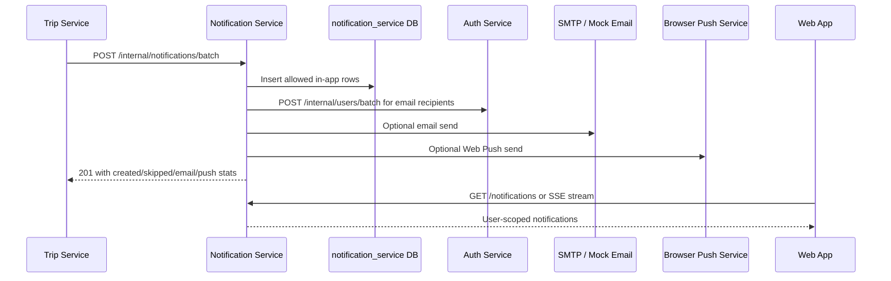
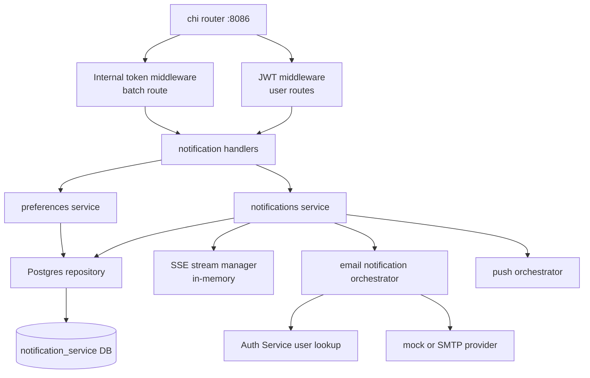
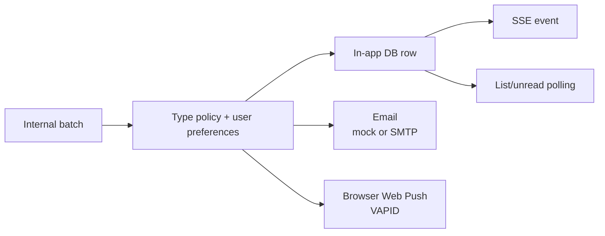

# Notification Service

Go service for private, per-user notifications. Trip Service and User Service
call it after successful collaboration, workspace, comment, generation, version,
and budget events. It stores in-app rows first, then optionally fans out email
and browser Web Push notifications according to server policy and user
preferences.

The v1 design is synchronous HTTP and intentionally replaceable by a future
event bus or worker.

## Delivery Flow



In-app rows are never rolled back because email or push fails. Email and push can
be fail-open locally so Trip Service actions remain successful.

## Architecture



## Endpoints

### User-Facing

All user-facing routes require a valid Auth Service access token except the
public VAPID key route. The user ID always comes from the JWT `sub`.

| Method | Path | Purpose |
| ------ | ---- | ------- |
| `GET` | `/health` | Liveness. |
| `GET` | `/ready` | PostgreSQL readiness. |
| `GET` | `/metrics` | Prometheus metrics. |
| `GET` | `/notifications?limit=&cursor=` | Current user's notifications, newest first. |
| `GET` | `/notifications/unread-count` | Current unread count. |
| `GET` | `/notifications/stream` | Authenticated Server-Sent Events stream. |
| `PATCH` | `/notifications/{id}/read` | Mark one notification read. |
| `PATCH` | `/notifications/read-all` | Mark all current user's notifications read. |
| `GET` | `/notifications/preferences` | Effective in-app/email/push preference matrix. |
| `PUT` | `/notifications/preferences` | Upsert preference rows. |
| `GET` | `/notifications/push/public-key` | VAPID public key and enabled state. |
| `POST` | `/notifications/push/subscribe` | Store or refresh a browser subscription. |
| `DELETE` | `/notifications/push/unsubscribe` | Disable a browser subscription endpoint. |
| `GET` | `/notifications/push/status` | Push enabled state and active subscription count. |

### Internal

| Method | Path | Auth | Purpose |
| ------ | ---- | ---- | ------- |
| `POST` | `/internal/notifications/batch` | `X-Internal-Service-Token` | Create up to 100 notifications and optional channel fanout. |

Internal routes are for the private service network only and must not be exposed
to browsers.

## Notification Channels



Supported preference channels:

- `in_app`
- `email`
- `push`

Preference categories:

- `collaboration`
- `comments`
- `role_changes`
- `trip_updates`

Default behavior enables in-app and push for all categories, enables email for
collaboration/comments/role changes plus key workspace invitations/member
changes, and disables email for trip updates.

## Notification Types

Current known types include:

- `collaboration_invited`
- `collaboration_accepted`
- `collaborator_role_changed`
- `collaborator_removed`
- `comment_created`
- `itinerary_updated`
- `itinerary_generated`
- `day_regenerated`
- `item_regenerated`
- `version_restored`
- `generation_job_failed`
- `budget_optimization_ready`
- `budget_optimization_failed`
- `workspace_budget_created`
- `workspace_budget_updated`
- `workspace_budget_archived`
- `workspace_budget_exceeded`
- `workspace_budget_nearing_limit`
- `workspace_invited`
- `workspace_invitation_accepted`
- `workspace_invitation_declined`
- `workspace_member_removed`
- `workspace_role_changed`
- `workspace_trip_created`

Workspace invitations and accepted/declined events use the `collaboration`
category, role/removal events use `role_changes`, and optional workspace trip
created plus workspace budget events use `trip_updates`. Email templates link
workspace invites to `/workspace-invitations`, role changes to
`/workspaces/{workspaceId}`, and never include secrets or full metadata.

Unknown types are accepted for forward compatibility. They are allowed in-app by
default, but are not emailed or pushed unless policy explicitly allows them.

## Local Development

```bash
cd services/notification-service
cp .env.example .env
set -a; source .env; set +a
make run
```

Run with YAML config:

```bash
cp configs/config.example.yaml configs/config.yaml
make config-run
```

Run as part of the full stack:

```bash
docker compose -f infra/docker-compose.yml --env-file infra/.env up --build
```

Migrations run automatically on startup. Manual migration commands:

```bash
make migrate-up
make migrate-down
```

## Important Configuration

| Variable | Purpose |
| -------- | ------- |
| `HTTP_ADDRESS` | Listen address, default `:8086`. |
| `JWT_ACCESS_SECRET`, `AUTH_HEADER_NAME` | Auth Service JWT validation. |
| `INTERNAL_SERVICE_TOKEN` | Internal batch auth and outgoing Auth Service lookup auth. |
| `POSTGRES_*`, `POSTGRES_MIG_PATH` | Database and migration settings. |
| `AUTH_SERVICE_URL` | Recipient email lookup via `POST /internal/users/batch`. |
| `EMAIL_NOTIFICATIONS_ENABLED` | Global email fanout toggle. |
| `EMAIL_NOTIFICATIONS_FAIL_OPEN` | Keep batch successful when email fails. |
| `EMAIL_PROVIDER` | `mock` or `smtp`. |
| `EMAIL_NOTIFICATION_TYPES` | Allowlist for email-enabled notification types. |
| `SMTP_*` | SMTP provider settings. |
| `WEB_PUSH_ENABLED` | Global browser Web Push toggle. |
| `WEB_PUSH_VAPID_PUBLIC_KEY` | Browser-visible VAPID key. |
| `WEB_PUSH_VAPID_PRIVATE_KEY` | Secret VAPID key. |
| `NOTIFICATION_SSE_*` | In-memory SSE connection behavior. |
| `PUBLIC_WEB_BASE_URL` | Safe app link base for notifications. |

Production rejects the default JWT secret and internal service token.

## Email

`EMAIL_PROVIDER=mock` is the local default and sends no external mail. It logs a
masked recipient and subject only.

For real SMTP:

```bash
EMAIL_PROVIDER=smtp
SMTP_HOST=smtp.example.com
SMTP_PORT=587
SMTP_USERNAME=apikey
SMTP_PASSWORD=...
SMTP_FROM_EMAIL=no-reply@example.com
SMTP_FROM_NAME=AI Travel Planner
```

SMTP uses STARTTLS when the server advertises it. Implicit TLS on port 465 is
not supported in v1.

## Browser Web Push

Generate local VAPID keys:

```bash
npx web-push generate-vapid-keys
```

Then set:

```bash
WEB_PUSH_ENABLED=true
WEB_PUSH_VAPID_PUBLIC_KEY=...
WEB_PUSH_VAPID_PRIVATE_KEY=...
WEB_PUSH_SUBJECT=mailto:dev@example.com
```

The public key is safe for the browser. The private key is a secret.

## Development Checks

```bash
make fmt
make vet
make test
make build
```

## Limitations

- Email and push are synchronous inside the internal batch request.
- SSE delivery is in-memory and instance-local, with polling as recovery.
- No cross-instance fanout, replay stream, WebSockets, event bus, quiet hours,
  per-trip preferences, unsubscribe links, or email digests in v1.
- Browser Web Push only; no native mobile push, FCM, APNS, SMS, or push vendor.

## Observability And Safety

- `GET /metrics` exposes HTTP, notification, email, push, and SSE metrics.
- Request and correlation IDs are generated/propagated where available.
- Do not log access tokens, internal service tokens, SMTP credentials, VAPID
  private keys, push subscription secrets, full notification metadata, or full
  recipient payloads.
