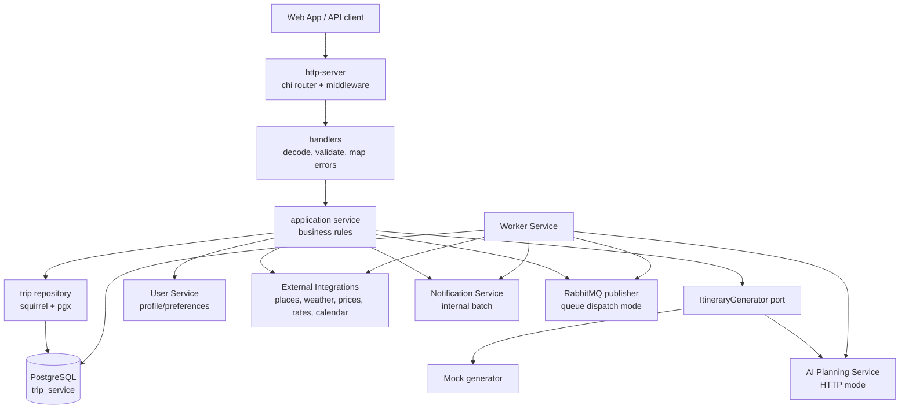
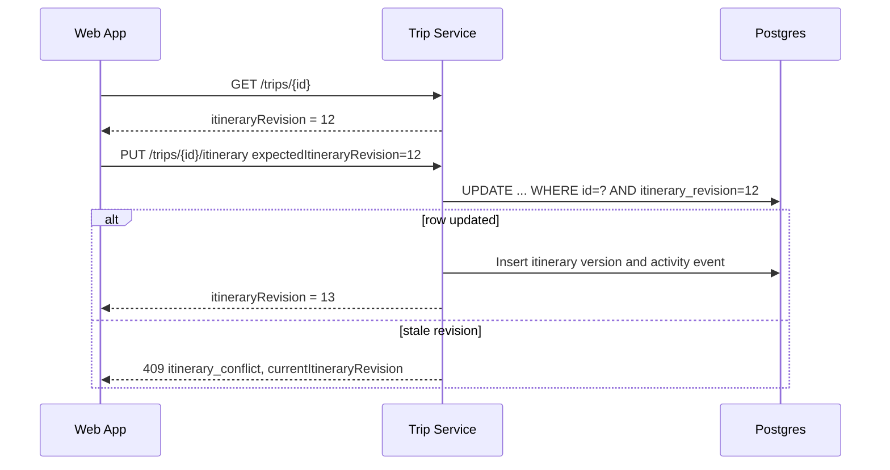
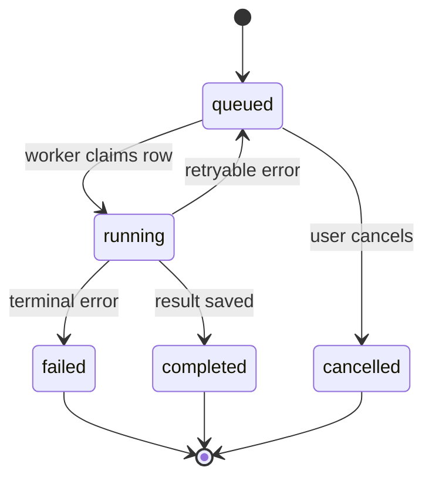

# Trip Service

Go service that owns trip planning state and the main domain workflow for the
Travel AI App. It stores trips, itineraries, revision history, collaborators,
comments, public shares, activity events, generation jobs, budget proposals,
private packing checklists, calendar sync mappings, accommodation data, and
enrichment metadata.

Trip Service is the orchestration point between user-facing APIs, AI generation,
external provider data, notifications, and background workers.

## AI output language

Direct generate/regenerate requests may provide `outputLanguage` with one of
`en`, `es`, `uk`, or `fr`. Trip Service otherwise uses the trusted User Service
profile language and finally English. The selected language is forwarded for
full generation, day/item regeneration, budget optimization, template
adaptation, and repair. Stored itinerary text is never translated in place.

Trip language is not stored as separate trip metadata in this v1 slice, so
background regeneration follows the current profile preference unless an
explicit language is supplied.

## Smart Packing Checklist

Smart Packing & Preparation Checklist v1 uses migration
`000028_create_trip_checklists`:

- `trip_checklists`: one active private checklist per trip, generation source
  revision metadata, summary text, and safe JSON metadata.
- `trip_checklist_items`: ordered item rows with category, type, priority,
  optional quantity, assignee, due date, related itinerary references, checked
  state, source (`ai`/`manual`/`regenerated`), and soft-delete metadata.

Routes:

- `GET /trips/{id}/checklist`
- `POST /trips/{id}/checklist/generate`
- `POST /trips/{id}/checklist/items`
- `PATCH /trips/{id}/checklist/items/{itemId}`
- `DELETE /trips/{id}/checklist/items/{itemId}`
- `POST /trips/{id}/checklist/items/{itemId}/check`
- `POST /trips/{id}/checklist/items/{itemId}/uncheck`
- `POST /trips/{id}/checklist/reorder`

Owners and editors can generate/regenerate, create, update, delete, assign, and
reorder checklist items. Accepted viewers can read the checklist and check or
uncheck unassigned items or items assigned to them. Pending/removed
collaborators and public share viewers cannot access checklist routes.

Generation calls the configured itinerary generator port in mock or HTTP mode.
Trip Service sends the current trip, itinerary, route, weather forecast,
planning constraints, profile/preferences, workspace policy context, existing
checklist, generation mode (`full`, `add_missing`, or `category`), selected
categories, and output language. Regeneration can preserve manual items,
preserve checked items, replace only AI-generated items, and deduplicate by
normalized title plus category. Checklist output is a planning aid only; users
must verify official documents, transport rules, health/safety requirements,
weather, tickets, and bookings themselves.

Checklist assignment records activity and can notify the assigned collaborator.
Private exports include a compact checklist summary and unchecked/high-priority
items; public shares and public exports omit checklist data.

## Smart Trip Constraints

Trip Service owns Smart Trip Constraints & Preference Engine v1 in
`internal/planningconstraints`. The module derives a sanitized
`PlanningConstraints` JSON object from request overrides, existing trip state,
user profile/preferences, route data, budget, language, workspace policy, and a
compact previous-trip summary.

Merge precedence is:

1. Explicit request fields.
2. Current trip fields.
3. User profile/preferences.
4. Workspace defaults and policy.
5. App defaults.

Workspace blocking policy always overrides user or request preferences. Existing
trip regeneration and repair use the trip's stored language metadata when
available; new discovery/generation/adaptation requests may override with
`outputLanguage`.

`POST /planning-constraints/preview` returns:

- `constraints`: schema version 1, source, scope, profile, budget, dates,
  travelers, pace/walking, transport, styles, accommodation, food,
  accessibility, route, workspace policy, previous-trip signals, prompt,
  warnings, and blockers.
- `summary`: localized-ish display strings/counts for UI preview.
- `warnings` and `blockers`: flattened issue lists with suggested actions.

Preview requires normal private auth. A `tripId` requires trip view access; a
workspace-only preview requires workspace create access. Public share tokens
cannot use it.

The conflict detector is deterministic and intentionally small. It flags
transport contradictions, disallowed route modes, too many stops for duration,
long transfers, missing route estimates, high transfer cost share, invalid
dates, hiking/low-walking conflicts, camping/accommodation conflicts, and
budget-policy violations. Warnings are advisory; blockers prevent normal
generation/discovery/adaptation/optimization, while `policy_repair` accepts
blockers as repair targets.

AI request builders now attach `planningConstraints` to trip discovery,
full-generation, day/item regeneration, budget optimization, template
adaptation, and policy repair payloads. Logs record only source, language, trip
id/workspace id, and warning/blocker counts. The constraints object is
sanitized: comments, collaborator emails, share tokens, calendar sync IDs, raw
provider metadata/secrets, notification data, and full previous itineraries are
not included. Route provider metadata and private stop notes are stripped.

Constraints guide AI output, but deterministic Trip Service validation,
workspace-policy evaluation, revision checks, and approval rules remain
authoritative. Costs, transfer times, route feasibility, and budget fit are
planning estimates only; there is no booking, legal/medical/accessibility
guarantee, or live availability promise.

## AI Trip Discovery

Trip Service persists private discovery sessions and exposes:

- `POST /trip-discovery/suggestions`
- `POST /trip-discovery/surprise-me`
- `POST /trip-discovery/{sessionId}/refine`
- `POST /trip-discovery/{sessionId}/suggestions/{suggestionId}/create-trip`
- `GET /trip-discovery/sessions`
- `GET /trip-discovery/sessions/{sessionId}`
- `POST /trip-discovery/sessions/{sessionId}/suggestions/{suggestionId}/vote`
- `GET /trip-discovery/sessions/{sessionId}/votes`

The service builds AI context from the trusted user profile/preferences, at
most 15 compact previous-trip summaries, requested budget/dates/origin, output
language, and active workspace policy. It never forwards itineraries, comments,
collaborators, share tokens, calendar IDs, or provider payloads. Sessions are
owner-scoped. Workspace discovery and creation require an active
owner/admin/member role; viewers are rejected.

Surprise and refine only create suggestion sessions. A trip is created after an
explicit suggestion confirmation, receives `creationMetadata` identifying the
session/suggestion, and can optionally queue a normal `full_generation` job.
Budgets are estimates, no booking is performed, and changing a discovery
session between personal and workspace scope is rejected so policy context
cannot be bypassed.

Route-style discovery suggestions set `suggestionType: "route"` and may carry a
sanitized `route` object. Creating a trip from such a suggestion stores the route
as a `multi_destination` trip and can queue normal itinerary generation.

Trip-linked discovery sessions can collect `favorite`, `like`, `dislike`, or
`not_interested` votes. Personal unlinked sessions remain owner-only; when a
session has `createdTripId`, collaborators who can view that trip can read and
update suggestion votes. Vote metadata is limited to safe suggestion fields used
for aggregate group preference scoring.

## Collaborative Trip Decisions

Collaborative Trip Decision & Voting v1 lives in Trip Service and uses migration
`000026_add_trip_decisions`:

- `trip_polls`: poll title/type/status, creator, close metadata, and optional
  JSON metadata.
- `trip_poll_options`: ordered option labels with stable option keys and
  metadata.
- `trip_poll_votes`: editable user votes or ratings. Service logic enforces
  single-choice/date/yes-no replacement, multiple-choice selected sets, and
  rating range validation.
- `itinerary_item_reactions`: one reaction per user per trip/day/item
  (`must_have`, `want_to_do`, `neutral`, `skip`).
- `trip_discovery_suggestion_votes`: one vote per user per discovery
  session/suggestion, optionally linked to a created trip.

Routes:

- `POST /trips/{id}/polls`
- `GET /trips/{id}/polls`
- `GET /trips/{id}/polls/{pollId}`
- `POST /trips/{id}/polls/{pollId}/vote`
- `POST /trips/{id}/polls/{pollId}/close`
- `POST /trips/{id}/polls/{pollId}/archive`
- `POST /trips/{id}/itinerary/reactions`
- `GET /trips/{id}/itinerary/reactions`
- `GET /trips/{id}/itinerary/days/{dayNumber}/items/{itemIndex}/reactions`
- `DELETE /trips/{id}/itinerary/days/{dayNumber}/items/{itemIndex}/reactions/me`
- `GET /trips/{id}/group-preferences`

Permissions follow normal private trip access. Owners and editors can create and
archive polls. Poll creators and users with edit access can close their polls.
Owners, editors, and accepted viewers can vote and react. Pending/removed
collaborators and public share viewers cannot vote, react, or access private
decision data in v1.

The group preference summary is computed live from poll winners, item reaction
scores, and trip-linked discovery votes. It returns top poll choices,
must-have/skip/controversial itinerary items, preferred destination/transport/date
signals when poll metadata provides them, and a concise `aiConstraintSummary`.
Raw comments, private collaborator details, share tokens, and full vote lists are
not exposed.

Planning constraints include `groupPreferences` for generation, day/item
regeneration, budget optimization, policy repair, route planning, template
adaptation when a target trip exists, and trip-linked discovery. These are soft
AI preferences: preserve must-have items where possible, avoid or replace
high-skip items, prefer voted destinations/transport/dates, and let workspace
policy win conflicts. Votes and reactions do not increment
`itineraryRevision`, reset approval, or automatically apply winning options.

Activity and notifications are intentionally sparse: `trip_poll_created`,
`trip_poll_closed`, and `trip_poll_archived` are recorded as activity; new and
closed polls can notify collaborators. Individual votes and reactions do not
create activity or notification spam.

Limitations: voting is advisory, not legal approval; no anonymous or public-share
voting; no ranked-choice surveys; no automatic itinerary mutation; no payment,
booking, or expense-settlement decision workflow.

## Multi-Destination Routes

Trips are backward-compatible: existing rows remain `trip_type =
single_destination` with `route_json = null`, while route trips store a nullable
`route_json` JSONB document and set `trip_type = multi_destination`.

`route_json` contains:

- `origin`: optional `{ name, country, coordinates }`.
- `stops`: 1-20 ordered stops with `id`, `destination`, optional city/country,
  arrival/departure dates, nights, coordinates, accommodation hint, and notes.
- `legs`: optional transfer legs joining `origin` or stop IDs with a transport
  mode, date, duration/distance estimates, and an estimated transport cost.
- `preferences`: preferred/avoided modes, car availability, max transfer hours
  per day, and trip styles.

Supported transport modes: `walk`, `car`, `rental_car`, `train`, `bus`,
`flight`, `boat`, `ferry`, `bike`, `public_transport`, `hiking`, `other`.
Supported trip styles include `city_break`, `road_trip`, `train_trip`,
`backpacking`, `camping`, `hiking`, `island_hopping`, `nature`, `beach`, `food`,
`culture`, `adventure`, `family`, `romantic`, `low_budget`, `luxury`, and
`hidden_gem`. Accommodation hints are `hotel`, `hostel`, `apartment`,
`guesthouse`, `campsite`, `cabin`, `campervan`, `home`, `other`, and `unknown`.

Create accepts either a normal `destination` or `{ tripType:
"multi_destination", route: ... }`. Route endpoints:

- `GET /trips/{id}/route`
- `PUT /trips/{id}/route` with `{ expectedItineraryRevision, route }`

Viewers can read the route; owners/editors can update it. Updating a route after
an itinerary exists requires the current itinerary revision, records
`route_updated`, and resets an approved workspace trip back to draft. Route
updates do not rewrite the itinerary automatically; editors should regenerate
affected days or a full itinerary when needed.

Itinerary JSON now accepts transfer days/items. Days may include
`primaryStopId`, `locationName`, and `transferDay`. A transfer item uses
`type: "transfer"` plus `transfer: { legId, from, to, mode,
estimatedDurationMinutes, estimatedDistanceKm, estimatedCost, bookingRequired,
notes, warnings }`; `estimatedCost.category = "transport"` is accepted.

Budget summaries, cost analytics, and cost splitting count transfer item costs
from the itinerary. Route-leg costs are route-display/prefill data and are not
counted separately, avoiding double counting when the transfer item mirrors a
leg. Workspace policies can evaluate `maxTransferHoursPerDay` and
`disallowedTransportModes`; approval risk scoring adds route factors such as
too many stops, long transfers, missing estimates, high transport cost,
hiking-day density, and missing camping accommodation hints.

Public shares include a sanitized route snapshot: origin/stops/legs, modes,
durations, and costs, but no private stop notes, provider metadata, user IDs, or
workspace policy internals.

Limitations: route durations/costs are planning estimates; no live train, bus,
flight, ferry, car-rental, campsite, permit, or ticket booking is performed.
Hiking/camping guidance is conservative planning text, not technical GPS
navigation or a safety guarantee. Map lines may be approximate.

## Route Alternatives & Comparison

Route Alternatives v1 persists AI-generated route comparison sessions in
`route_alternative_sessions` (migration `000027_add_route_alternative_sessions`).
Each row stores owner, optional trip/workspace, source (`pre_trip`,
`existing_trip`, `discovery_refinement`, `route_refinement`), output language,
status (`completed`, `failed`, `created_trip`, `applied`, `archived`), request
JSON, response JSON, selected alternative, created/applied trip IDs, optional
parent session, and timestamps. Indexes cover user, trip, workspace, and parent
session history.

Routes:

- `POST /route-alternatives/suggest` creates pre-trip route alternatives.
- `GET /route-alternatives/sessions` lists personal or trip-filtered sessions.
- `GET /route-alternatives/sessions/{sessionId}` reads an authorized session.
- `POST /route-alternatives/sessions/{sessionId}/refine` creates a child
  session using previous alternatives plus an instruction.
- `POST /route-alternatives/sessions/{sessionId}/alternatives/{alternativeId}/create-trip`
  creates an explicit `multi_destination` trip from a selected alternative and
  can queue a normal `full_generation` job.
- `POST /trips/{id}/route-alternatives` generates alternatives for an existing
  trip and can include the current route as a baseline.
- `POST /trips/{id}/route-alternatives/{sessionId}/alternatives/{alternativeId}/apply`
  applies a selected route through the normal route update path, with
  edit-permission and itinerary-revision checks when an itinerary exists.
- `POST /trips/{id}/route-alternatives/{sessionId}/create-poll` creates a
  regular trip poll with route alternative option metadata.

Trip Service normalizes alternatives after AI returns: missing legs/durations,
distances, and transfer costs are filled with deterministic fallback estimates;
scores are clamped and recomputed for budget fit, time efficiency, relaxation,
nature/culture, transport simplicity, policy compliance, and overall fit; and
difficulty is derived from stops per day and transfer minutes. The comparison
summary identifies cheapest, most relaxed, best nature, and best overall
alternatives.

Planning constraints use new sources `route_alternatives`,
`route_alternative_refinement`, and `route_alternative_apply_preview`. Pre-trip
suggestion blockers stop normal suggestions; existing-trip route alternatives
can still be used to explore fixes when appropriate. Group preferences now
recognize poll option metadata with `category = route_alternative` and expose
`preferredRouteAlternativeId`, `preferredRouteSessionId`, and
`routeAlternativeVotes` to downstream AI constraints.

Permissions follow private trip rules: pre-trip sessions are owner-only unless
used to create a trip; trip-linked sessions require trip view access to read and
edit access to refine/apply/create polls. Public share visitors cannot access
route alternative sessions. No route is applied automatically, winning votes do
not mutate trips, and all estimates remain advisory with no booking behavior.

## Architecture



The service follows a layered structure: `http-server` -> `application` ->
`domain`, with adapters in `infrastructure`. The composition root in
`internal/app` wires config, logger, Postgres, providers, HTTP server, workers,
and graceful shutdown.

## Responsibilities

| Area | Owned by Trip Service |
| ---- | --------------------- |
| Trip access | Owner/collaborator access checks, role capabilities, public share redaction. |
| Itinerary safety | `itineraryRevision`, revision-aware writes, version snapshots, restore. |
| Generation | Job creation, sync compatibility routes, AI context assembly, result validation. |
| Collaboration | Invites, roles, accepted/shared trips, presence, soft edit locks. |
| Workspaces | Personal vs workspace trips, workspace role checks via User Service, combined effective access. |
| Activity | Persistent audit feed plus in-memory SSE best-effort updates. |
| Comments | Private item comments, counts, edit/delete permissions. |
| Checklists | Private packing/preparation checklist generation, manual items, assignees, checked state, summary export. |
| Budget | Trip budget, workspace shared budgets, item/accommodation costs, multi-currency summaries, cost splitting, analytics, proposals. |
| Accommodation | One private structured stay per trip, included in AI/budget/route context. |
| Sharing | One public read-only link per trip, optional expiry/password unlock. |
| Calendar | Per-trip/user sync state; provider operations delegated to External Integrations. |
| Trip templates | Private/workspace reusable itinerary structures with sanitized JSON, shifted-date instantiation, and workspace role enforcement. |

## Revision-Safe Writes



Every private itinerary-changing request must include
`expectedItineraryRevision`. Stale writes fail with `409 itinerary_conflict`.
Comments, collaborators, shares, presence, notifications, budget settings,
accommodation settings, exports, and public views do not increment the itinerary
revision.

## Background Jobs



Generation job types:

- `full_generation`
- `day_regeneration`
- `item_regeneration`
- `quality_improvement_day`
- `quality_improvement_item`
- `budget_optimization_day`
- `policy_repair`
- `template_adaptation`

Dispatch modes:

- `GENERATION_JOB_DISPATCH_MODE=queue`: publish a small RabbitMQ message and let
  Worker Service process the existing DB job row.
- `GENERATION_JOB_DISPATCH_MODE=in_process`: use the Trip Service local poller
  for fallback and tests.

Queue messages intentionally contain only IDs, type, timestamps, and
correlation metadata. They do not contain access tokens, prompts, preferences,
or itinerary JSON.

## Endpoint Groups

| Group | Routes |
| ----- | ------ |
| Health | `GET /health`, `GET /ready`, `GET /metrics` |
| Trips | `POST /trips`, `GET /trips`, `GET /trips/shared-with-me`, `GET /trips/{id}`, `GET/PUT /trips/{id}/route`, `GET /trips/{id}/approval-risk` |
| Generation jobs | `POST /trips/{id}/generation-jobs`, `GET /trips/{id}/generation-jobs`, `GET /trips/{id}/generation-jobs/{jobId}`, `POST /trips/{id}/generation-jobs/{jobId}/cancel` |
| Sync generation compatibility | `POST /trips/{id}/generate`, day regeneration, item regeneration |
| Itinerary | `PUT /trips/{id}/itinerary`, version list/detail/restore routes |
| Checklist | `GET/POST /trips/{id}/checklist*`, checklist item create/update/delete/check/uncheck/reorder routes |
| Budget | `GET /trips/{id}/budget-summary`, `PUT /trips/{id}/budget`, budget optimization job/proposal routes |
| Policy-aware repair | `POST /trips/{id}/repair-jobs`, `GET /trips/{id}/repair-jobs/{jobId}`, `GET /trips/{id}/repair-proposals`, `GET /trips/{id}/repair-proposals/{proposalId}`, apply/discard routes |
| Workspace budgets | `GET/POST /workspaces/{workspaceId}/budgets`, `GET/PATCH /workspaces/{workspaceId}/budgets/{budgetId}`, `POST /archive`, `POST /make-primary`, summary routes |
| Cost splitting | `/trips/{id}/travelers`, `GET /trips/{id}/cost-splitting/summary`, item/accommodation cost-split update routes |
| Cost analytics | `GET /trips/{id}/analytics/costs`, `GET /workspaces/{workspaceId}/analytics/costs` |
| Accommodation | `GET /trips/{id}/accommodation`, `PUT /trips/{id}/accommodation`, `DELETE /trips/{id}/accommodation` |
| Collaboration | collaborator CRUD/accept/decline, `GET /collaboration/invitations` |
| Presence and locks | `/trips/{id}/presence*`, `/trips/{id}/edit-lock` |
| Comments | `/trips/{id}/comments`, `/trips/{id}/comments/counts`, comment update/delete |
| Decisions | `/trips/{id}/polls*`, `/trips/{id}/itinerary/reactions*`, `GET /trips/{id}/group-preferences`, trip-linked discovery suggestion vote routes |
| Activity | `GET /trips/{id}/activity`, `GET /trips/{id}/activity/stream` |
| Sharing | `GET/POST/PATCH/DELETE /trips/{id}/share`, public share status/unlock/read routes |
| Calendar | `GET/POST/DELETE /trips/{id}/calendar-sync/google*` |
| Trip templates | `GET /trip-templates`, `POST /trips/{id}/templates`, `GET/PATCH /trip-templates/{templateId}`, archive/duplicate/create-trip routes, `POST /trip-templates/{templateId}/adaptation-jobs`, `GET /workspaces/{workspaceId}/templates` |

## Trip Templates

Trip Templates v1 lives in Trip Service and stores reusable private or
workspace-scoped itinerary structure in `trip_templates`. Templates include
metadata, destination hints, duration, tags, approximate item costs, and a
versioned `template_json` payload with `schemaVersion=1` and per-day
`dayOffset` values.

Visibility:

- `private`: visible, editable, usable, duplicable, and archivable only by the
  creator.
- `workspace`: visible to active workspace members. Owner/admin can edit or
  archive any workspace template; members can edit/archive their own; viewers
  can view only and cannot create trips from templates.

Saving a trip as a template requires edit access to the source trip. The
sanitizer keeps reusable day/item structure, place display data, and approximate
estimated costs, but removes comments, collaborators, activity/version history,
public share state, calendar sync IDs, booking/availability snapshots, provider
raw metadata, presence/edit locks, job metadata, exact dates, and notification
data.

Creating a trip from a template does not call AI and does not refresh providers.
It creates a personal or workspace trip, shifts day offsets from the requested
start date, writes a completed itinerary snapshot with
`CREATED_FROM_TEMPLATE`, records `trip_created_from_template`, and leaves
availability unchecked. Template prices are copied as approximate manual costs
with a verification note.

Limitations: templates are private/workspace only in v1; no marketplace,
ratings, comments, visual content editor, bookings, or availability refresh is
included.

### AI Template Adaptation

`POST /trip-templates/{templateId}/adaptation-jobs` re-targets a template to a
new destination, duration, budget, pace, travelers, and interests using AI. It
reuses the `trip_generation_jobs` table with the `template_adaptation` job type:

1. Validates the request (title 2–120, destination 2–120, `durationDays` 1–30,
   optional budget `amount >= 0`/3-letter currency, travelers 1–50, pace
   relaxed/balanced/intensive, ≤20 interests/avoid, ≤1000-char instructions).
2. Enforces permissions: the caller must be able to use the template
   (owner for private; owner/admin/member for workspace templates — viewers
   cannot adapt), and must have create access to the target workspace when a
   `workspaceId` is provided.
3. Creates a **draft** trip up front (so the existing
   `GET /trips/{id}/generation-jobs/{jobId}` status endpoint works) and queues a
   job whose `payload` holds the target/constraints (the template body is never
   stored in the job — the worker re-loads it by id and re-checks access).

The worker builds a sanitized AI request (day/item structure only — no template
metadata or provider ids reach the prompt), calls AI Planning Service
`/adapt-template`, validates/normalizes the result through the same path as
deterministic template instantiation, saves a first itinerary version with
source `CREATED_FROM_TEMPLATE_AI` (metadata `source: ai_template_adaptation`,
`templateId`, `templateTitle`, `fallbackUsed`), runs fail-open place/price
enrichment, records `trip_created_from_ai_template_adaptation`, and stores the
adaptation summary in the job's `result_payload`.

Fallback: when the AI call fails and `fallbackToDeterministic=true` (default),
the worker creates a deterministic template copy instead and marks
`adaptationSummary.fallbackUsed=true`; with fallback disabled the job fails with
`ai_adaptation_failed`. Failure error codes: `template_not_found`,
`template_access_denied`, `target_workspace_access_denied`,
`ai_adaptation_failed`, `validation_failed`, `deterministic_fallback_failed`,
`provider_enrichment_failed`.

Workspace-adapted trips are created as `draft` approval status and are **not**
auto-submitted; availability stays unchecked; costs are copied as estimates.

Private routes require `Authorization: Bearer <accessToken>` when
`AUTH_REQUIRED=true`. Public share routes use opaque share tokens and optional
short-lived public share unlock tokens.

## Workspace Trips

Trips now have nullable `workspace_id`. Existing rows remain personal trips with
`workspace_id=NULL`; workspace trips keep `user_id` as creator/audit owner while
access is granted through User Service workspace roles.

`POST /trips` accepts optional `workspaceId`. If present, Trip Service calls
User Service `POST /internal/workspaces/access-check` and requires workspace
`owner`, `admin`, or `member`; `viewer` can view but cannot create/edit.

`GET /trips` accepts:

- `scope=all|personal|workspace`
- `workspaceId=<uuid>` for a single workspace

For workspace listings, Trip Service calls
`POST /internal/workspaces/list-for-user` and returns only trips from active
memberships. Trip responses include `workspaceId`, `scope`, and access metadata
with `source=owner|workspace|collaborator|public`.

Effective access is the strongest safe permission from personal owner,
workspace role, direct trip collaborator, or public share. Workspace owner/admin
map to owner-level trip management, member maps to editor, and viewer maps to
viewer. Direct trip collaborators still work for workspace trips, including
non-workspace exceptions. Public share links remain separate anonymous read-only
access and never expose workspace member data.

## Cost Analytics

Cost Analytics Dashboard v1 is read-only and computed from existing Trip Service
data at request time. It does not add accounting records or booking/payment
data.

- `GET /trips/{id}/analytics/costs?currency=EUR` returns trip-level estimated
  totals, budget remaining/overage, cost by day/category/source/confidence,
  original currency totals, expensive items, missing/uncertain estimate counts,
  conversion warnings, and actionable planning insights.
- `GET /workspaces/{workspaceId}/analytics/costs?currency=EUR&from=2026-01-01&to=2026-12-31`
  aggregates accessible workspace trips by trip/category/source/month and
  includes top trips/items plus incomplete budget warnings. When an active
  primary workspace budget exists, the response includes `activeBudget` usage
  and budget limit insights.
- Trip analytics requires private trip access. Owners, editors, and viewers can
  read analytics; public share tokens do not expose analytics in v1.
- Workspace analytics requires an active workspace role through User Service.
  Owner, admin, member, and viewer roles can read the dashboard.

Calculations reuse the budget conversion rules used by `budget-summary`.
Accommodation cost is included once in total/category rollups and not forced
into daily totals. Currency conversion failures are returned as warnings and the
affected costs remain visible in original-currency totals.

Limitations: costs are estimates for planning only; exchange rates may be
approximate; provider prices and availability may change; missing estimates can
make totals incomplete; reports are not accounting, tax, invoice, payment, or
financial-advice features.

## Cost Splitting

Cost Splitting Between Travelers v1 is a planning-only allocation layer over
existing itinerary and accommodation estimates. It does not create payment,
settlement, reimbursement, debt, invoice, accounting, or booking records.

Data lives in `trip_travelers` for the roster. Individual split rules are stored
inline on `estimatedCost.split` for itinerary items and accommodation costs.
Supported rule types are:

- `all_equal`: split the cost evenly across active trip travelers.
- `selected_equal`: split evenly across the selected active traveler IDs.
- `custom_percentages`: allocate by traveler ID percentages that must total
  100 for saved rules.

Routes:

- `GET /trips/{id}/travelers`
- `POST /trips/{id}/travelers`
- `PATCH /trips/{id}/travelers/{travelerId}`
- `DELETE /trips/{id}/travelers/{travelerId}` soft-removes a traveler.
- `GET /trips/{id}/cost-splitting/summary?currency=EUR`
- `PATCH /trips/{id}/itinerary/days/{dayNumber}/items/{itemIndex}/cost-split`
- `PATCH /trips/{id}/accommodation/cost-split`

Owners and editors can manage travelers and split rules. Viewers can read the
roster and summary. Item split updates are revision-safe and increment
`itineraryRevision`; accommodation split updates do not. The summary is computed
at request time, defaults unconfigured costs to `all_equal`, includes
accommodation once, applies existing budget currency conversion rules, and
reports missing estimates, invalid references, and unassigned costs.

Limitations: v1 has no balances owed, payments, invitations from traveler rows,
group chat, receipt images, tax/tip handling, recurring expenses, booking
checkout, or settlement workflow. Removed travelers are retained for audit
visibility but are excluded from active allocations unless a stale rule still
references them, in which case the summary reports an invalid split.

## Workspace Shared Budgets

Workspace Shared Budgets v1 is owned by Trip Service because Trip Service owns
workspace trip costs, budget summaries, analytics, and currency conversion.

Data lives in `workspace_budgets`:

- `workspace_id`, `name`, optional `description`, `amount`, `currency`
- optional `period_start` / `period_end`; null dates mean open-ended
- `status=active|archived`, `is_primary`, creator/archive audit columns
- a partial unique index allows at most one active primary budget per workspace

Routes:

- `GET /workspaces/{workspaceId}/budgets?status=active|archived`
- `POST /workspaces/{workspaceId}/budgets`
- `GET /workspaces/{workspaceId}/budgets/{budgetId}`
- `PATCH /workspaces/{workspaceId}/budgets/{budgetId}`
- `POST /workspaces/{workspaceId}/budgets/{budgetId}/archive`
- `POST /workspaces/{workspaceId}/budgets/{budgetId}/make-primary`
- `GET /workspaces/{workspaceId}/budgets/{budgetId}/summary`
- `GET /workspaces/{workspaceId}/budgets/primary/summary`

Permissions use User Service workspace access checks. Owner/admin can create,
update, archive, and make primary; member/viewer can list and read summaries;
non-members are denied. Archived workspaces are read-only for budgets.

Successful create/update/archive actions emit best-effort in-app notifications
to active workspace owners/admins except the actor. Primary changes are sent as
`workspace_budget_updated`. Budget-threshold notifications are not emitted from
analytics reads in v1 to avoid repeated alerts.

Summary calculation is read-only and approximate. It includes workspace trips
whose `startDate` falls inside the budget period. If both dates are null, all
workspace trips are included, including trips without a start date. For dated
budgets, trips without a start date are excluded and reported as warnings.
Totals are converted into the budget currency using the existing budget
conversion provider and warnings are returned for unconverted costs.

Limitations: workspace budgets do not block trip edits, do not represent actual
payments, do not split costs between members, and are not accounting, tax,
invoice, reimbursement, or billing records.

## Workspace Approval Workflow

A lightweight review/approval flow for **workspace** trips. Personal trips are
always `not_required` and expose no approval actions.

### Storage

Approval state lives on the `trips` table (added in migration `000020`):

`approval_status`, `approval_submitted_at/_by_user_id`,
`approval_approved_at/_by_user_id`, `approval_changes_requested_at/_by_user_id`,
`approval_cancelled_at/_by_user_id`, `approval_note`, `approval_decision_note`,
and `approval_last_status_changed_at/_by_user_id`. Indexes cover
`(workspace_id, approval_status)`, `approval_submitted_at`, and
`approval_approved_at`.

Approval history is kept separately in `trip_approval_events`
(`event_type`, `from_status`, `to_status`, `note`, `checklist_snapshot` JSONB)
so decisions have a durable trail independent of the generic activity feed.

### Statuses and transitions

- `not_required` — personal trip; approval does not apply.
- `draft` — default for new/backfilled workspace trips; submittable.
- `pending_approval` — submitted, awaiting owner/admin review.
- `changes_requested` — owner/admin asked for changes; editable and resubmittable.
- `approved` — owner/admin approved.
- `cancelled` — a pending submission was withdrawn; resubmittable.

Submit is allowed from `draft`, `changes_requested`, or `cancelled`.
Approve / request-changes / cancel are only allowed from `pending_approval`.

### Endpoints

| Method | Path | Who |
| --- | --- | --- |
| `GET` | `/trips/{id}/approval` | any user with trip view access |
| `POST` | `/trips/{id}/approval/submit` | trip editor/owner (workspace trip) |
| `POST` | `/trips/{id}/approval/approve` | workspace owner/admin |
| `POST` | `/trips/{id}/approval/request-changes` | workspace owner/admin (note required) |
| `POST` | `/trips/{id}/approval/cancel` | submitter or workspace owner/admin |
| `GET` | `/trips/{id}/approval/events` | any user with trip view access |
| `GET` | `/workspaces/{workspaceId}/approvals` | any active workspace member |
| `GET` | `/trips/{id}/approval-risk` | any user with trip view access |

`GET /approval` returns the state, a freshly computed checklist, and per-caller
`canSubmit/canApprove/canRequestChanges/canCancel` flags. The workspace queue
returns rows (with checklist status, warning/critical counts, estimated total),
per-status `counts`, risk summary, top risk reasons, and a `nextCursor`; it
defaults to the active review set (pending, changes requested, draft) and accepts
`status=pending_approval|changes_requested|approved|draft|cancelled|all`.

### Risk scoring

`internal/approvalrisk` is a pure deterministic scorer for workspace approval
review. It returns a 0-100 score, `low|medium|high|critical` level, factor list,
top reasons, affected day/item hints, and suggested actions. Personal trips
return `not_applicable`; recoverable signal lookup failures return a scored
response with a low-weight `risk_signal_unavailable` factor instead of failing
the approval page.

Inputs are gathered by the application service from the existing checklist,
workspace policy evaluation, trip/workspace budget summaries, itinerary cost
and availability metadata, accommodation, and latest itinerary-version metadata
for template adaptation or repair fallbacks. Blocking policy failures force at
least `high` risk; multiple blockers force `critical`. The workspace approvals
queue uses the same scorer with lightweight signals so queue badges stay
consistent with the detailed trip endpoint.

### Checklist

The pure calculator (`internal/approvals`) evaluates: `itinerary_exists`
(the only **blocker**), `budget_exists`, `workspace_budget_status`,
`trip_budget_status`, `cost_splitting_configured`, `availability_checked`, and
`missing_cost_estimates` (all warnings). Submission is blocked only by a failing
blocker (a missing itinerary), a missing permission, or a non-workspace trip;
warnings never block and can be acknowledged (stored in the submit event's
checklist snapshot). To keep the checklist lightweight, `workspace_budget_status`
is an existence check rather than a full cross-trip budget evaluation.

**Availability signals (Advanced Availability Provider Adapters v1).** When a
user applies a provider availability result to an item, the Web App persists a
lightweight `availabilityCheck` snapshot on the itinerary item
(`aggregate.AvailabilityCheckMeta`: `provider`, `status`, `checkedAt`,
`matchConfidence`, `selectedOptionId`, `fallbackUsed`, `priceChanged` — never the
raw provider response, option lists, or secrets). It round-trips through the
existing itinerary update path (`expectedItineraryRevision` conflict detection
preserved) and is validated/bounded in `validateAndNormalizeAvailabilityCheck`.
The checklist reads these to append richer **warning/info** checks only when
present: `availability_low_confidence`, `availability_unavailable`,
`availability_price_changed` (warnings) and `availability_fallback` (info). None
block submission in v1. An item counts as availability-checked once it has either
a price-enrichment or an applied `availabilityCheck`.

### Reset on edit

After a **successful** material change to an approved or pending workspace trip,
`ResetApprovalIfApproved` atomically moves it back to `draft`, records a
`reset_to_draft` event and activity, and notifies the previous submitter/approver.
It is best-effort and post-commit, so it never fails or rolls back the edit.
Material triggers: itinerary writes (manual edit, day/item regeneration, version
restore, generation completion, budget-optimization apply — all via the single
itinerary save path), plus budget, accommodation, cost-split, and traveler
changes. Comments, activity, notifications, presence, sharing, calendar sync,
export, and analytics are **not** material.

### Notifications and activity

Each action records a generic activity event (`trip_submitted_for_approval`,
`trip_approved`, `trip_changes_requested`, `trip_approval_cancelled`,
`trip_approval_reset_to_draft`) with `fromStatus`/`toStatus`/`noteSnippet`, and
sends matching notifications (submit → owners/admins; approve/request-changes →
submitter + trip editors; cancel → the other party; reset → previous
submitter/approver), always excluding the actor. Notification metadata is limited
to `tripId`, `workspaceId`, and `approvalStatus`.

Limitations: approval is lightweight planning approval, not a legal/compliance
workflow. It does not lock a trip from edits (editing an approved trip resets it
to draft), has no multi-step chains, delegation, due dates, or SLA escalation.

## AI Policy-Aware Trip Repair

Policy-aware repair is a proposal workflow for workspace trips. Editors and
owners can create a `policy_repair` generation job with
`expectedItineraryRevision`, a repair mode, optional selected policy/risk issue
types, preservation constraints, and special instructions. Viewers, public
share users, and personal trips are rejected in v1.

The worker/service path loads the current itinerary, evaluates workspace
policy, calculates approval risk, builds repairable issues, calls AI Planning
Service `/repair-itinerary`, validates the repaired itinerary, builds a bounded
diff, recalculates proposed policy/risk best-effort in memory, and stores a
pending row in `trip_repair_proposals`. The job completes with `proposalId` in
its result payload. It never writes the trip itinerary directly.

Storage added by migration `000023`:

- `trip_repair_proposals` with `status=pending|applied|discarded|expired|failed`
  and repair modes matching the AI service.
- `issues_json` stores the selected repairable issues.
- `proposal_json` stores `repairedItinerary`, `repairSummary`, `changes`,
  backend `diff`, and validation warnings.

Routes:

- `POST /trips/{id}/repair-jobs`
- `GET /trips/{id}/repair-jobs/{jobId}`
- `GET /trips/{id}/repair-proposals?status=pending`
- `GET /trips/{id}/repair-proposals/{proposalId}`
- `POST /trips/{id}/repair-proposals/{proposalId}/apply`
- `POST /trips/{id}/repair-proposals/{proposalId}/discard`

Applying a proposal requires edit permission and matching
`expectedItineraryRevision`. The proposal base revision and current trip
revision must still match; otherwise Trip Service returns
`409 itinerary_conflict` and pending stale proposals are expired. A successful
apply saves the full repaired itinerary through the same versioned itinerary
save path with source `AI_POLICY_REPAIR`, marks the proposal applied, expires
other pending repair proposals for older revisions, records activity, and uses
the existing approval reset helper so approved or pending workspace trips return
to draft.

Limitations: repair does not auto-apply, auto-approve, book, pay, modify
comments/collaborators/shares/calendar sync, or guarantee policy compliance.
Costs remain estimates and availability/prices must be checked again after
repair.

## Important Configuration

| Variable | Purpose |
| -------- | ------- |
| `HTTP_ADDRESS`, `HTTP_WRITE_TIMEOUT` | HTTP bind address and long generation response timeout. |
| `AUTH_REQUIRED`, `JWT_ACCESS_SECRET`, `AUTH_HEADER_NAME` | Auth Service JWT validation. |
| `ITINERARY_GENERATOR_MODE` | `mock` or `http` AI generator adapter. |
| `AI_PLANNING_SERVICE_URL`, `AI_PLANNING_TIMEOUT_SECONDS` | AI Planning Service client. |
| `USER_SERVICE_URL`, `USER_CONTEXT_*` | Profile/preference lookup for personalization. |
| `WORKSPACES_ENABLED`, `USER_SERVICE_URL`, `WORKSPACE_ACCESS_TIMEOUT_SECONDS`, `INTERNAL_SERVICE_TOKEN` | Workspace access checks and trip list scoping. |
| `EXTERNAL_INTEGRATIONS_SERVICE_URL` | Weather, places, prices, rates, and calendar calls. |
| `WEATHER_CONTEXT_*` | Optional weather context for AI prompts. |
| `PLACE_ENRICHMENT_*`, `PRICE_ENRICHMENT_*` | Auto-enrichment after generation. |
| `BUDGET_CONVERSION_*` | Exchange-rate conversion for budget summaries. |
| `PUBLIC_SHARING_*`, `PUBLIC_SHARE_ACCESS_*` | Public share link controls. |
| `TRIP_PRESENCE_*`, `TRIP_ACTIVITY_STREAM_*`, `TRIP_EDIT_LOCK_*` | In-memory SSE/advisory collaboration features. |
| `GENERATION_JOB_*`, `RABBITMQ_*` | Job queue, retry, DLQ, and worker behavior. |
| `OPS_DASHBOARD_ENABLED`, `OPS_ADMIN_EMAILS`, `OPS_STALE_RUNNING_JOB_SECONDS` | Allowlisted admin job monitor and safe job actions. |
| `NOTIFICATIONS_*`, `NOTIFICATION_SERVICE_*` | Synchronous fail-open notification fanout. |
| `CALENDAR_SYNC_*`, `DEFAULT_CALENDAR_TIMEZONE` | Calendar sync behavior. |
| `POSTGRES_*`, `POSTGRES_MIG_PATH` | Database and auto-migration settings. |

## Ops Dashboard Endpoints

When `OPS_DASHBOARD_ENABLED=true`, allowlisted users can inspect generation jobs
with `GET /ops/jobs`, `GET /ops/jobs/summary`, and `GET /ops/jobs/{jobId}`.
Safe mutations require a non-empty `reason`: retry creates a new queued job,
cancel only affects queued jobs, and mark-failed only affects stale running jobs.

See [configs/config.example.yaml](configs/config.example.yaml) and
[.env.example](.env.example) for the full local template.

## Run Locally

From this service directory:

```bash
cp .env.example .env
set -a; source .env; set +a
make run
```

Run with YAML config:

```bash
cp configs/config.example.yaml configs/config.yaml
make config-run
```

Run the full application stack from the repository root:

```bash
docker compose -f infra/docker-compose.yml --env-file infra/.env up --build
```

Migrations run automatically on startup. Manual migration commands:

```bash
make migrate-up
make migrate-down
```

## Development Checks

```bash
make fmt
make vet
make test
make build
```

## Operational Notes

- `queue` dispatch requires RabbitMQ and Worker Service. Keep `in_process` as a
  local fallback only.
- Notification calls are synchronous but fail-open by default; a notification
  outage must not break the originating trip action.
- Weather, place, price, and budget conversion provider calls are fail-open by
  default in local development and produce warnings or partial context.
- Presence, activity SSE, and edit locks are process-local v1 features. They do
  not provide cross-instance guarantees.
- Public share responses are sanitized and omit private collaborator,
  notification, activity, version-management, accommodation, and budget proposal
  surfaces.

## Observability And Safety

- `GET /metrics` exposes HTTP, job, notification, activity, provider, and domain
  metrics.
- Logs and internal calls propagate `X-Request-ID` and `X-Correlation-ID`.
- Do not log access tokens, internal service tokens, share passwords, public
  share access tokens, full prompts, full preference payloads, full private
  itinerary JSON, OAuth tokens, or provider API keys.

## Workspace Policy Rules v1

Trip Service owns one optional active policy per workspace in
`workspace_policies`. The versioned `rules_json` document supports
trip/daily/item/accommodation limits, cost splitting, ticketed-item
availability, walking, late activities, rest time, preferred transport, and
disallowed activity types. Severities are `info`, `warning`, or `blocking`.

Endpoints:

- `GET|PUT /workspaces/{workspaceId}/policy`
- `POST /workspaces/{workspaceId}/policy/archive`
- `GET /trips/{tripId}/policy/evaluation`
- `POST /trips/{tripId}/policy/evaluate`

Members can view policies and evaluate accessible trips; only owners/admins can
write or archive a policy. Evaluations are live, deterministic, explainable,
and are not persisted. The approval checklist includes the policy result.
Only a violated `blocking` rule prevents approval submission, returning
`workspace_policy_blocking_violation` with the evaluation payload. Editing and
generation remain allowed.

Active rules are converted to `workspacePolicyConstraints` for generation,
partial regeneration, budget optimization, and template adaptation. This is
guidance only: Trip Service evaluation remains authoritative. Policies are
planning guidance, not legal/compliance or expense enforcement; v1 has no
custom rule DSL.
