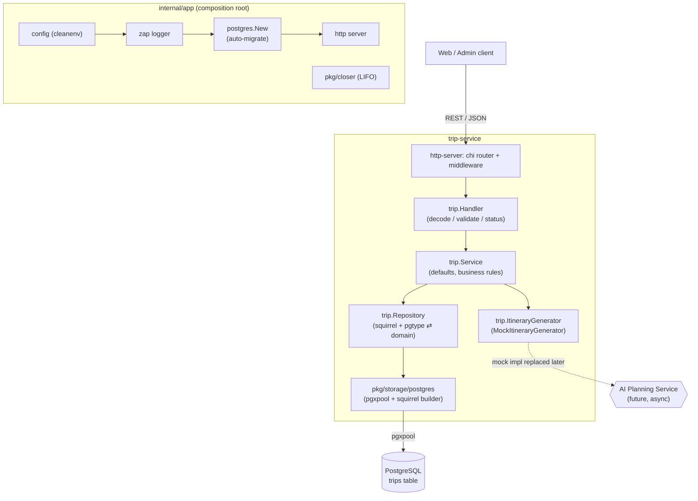

# Trip Service

A Go microservice for an AI travel planning web app. It manages **trip requests**
(destination, dates, budget, travelers, interests, pace) and generates a **mock
itinerary** locally. The planning step is isolated behind the service layer so it
can later be replaced with an async AI Planning Service integration.

## Tech stack

| Concern           | Choice                                                        |
| ----------------- | ------------------------------------------------------------ |
| Language          | Go                                                           |
| Composition / DI  | Hand-wired composition root (`internal/app`) — no framework  |
| Lifecycle         | `pkg/closer` (LIFO graceful shutdown)                        |
| Logging           | [Uber Zap](https://github.com/uber-go/zap) (`pkg/logger`)   |
| HTTP              | `net/http` + [chi](https://github.com/go-chi/chi) router    |
| Database          | PostgreSQL via [pgx](https://github.com/jackc/pgx) (`pgxpool`) |
| Query building    | [squirrel](https://github.com/Masterminds/squirrel)         |
| Migrations        | [golang-migrate](https://github.com/golang-migrate/migrate) — **applied automatically on startup** |
| Config            | YAML + env via [cleanenv](https://github.com/ilyakaznacheev/cleanenv) |
| Validation        | [go-playground/validator](https://github.com/go-playground/validator) (`pkg/validation`) |
| Container         | Docker / Docker Compose                                     |

> This service lives at `services/trip-service/` within the monorepo. All commands
> below assume that directory as the working directory. The Go module path is
> `github.com/KovalenkoDima236961/Travel_Ai_App`.

## Project layout

The code follows a layered / hexagonal (DDD-flavoured) structure under `internal/`:

```
trip-service/
├── cmd/server/main.go                 # entrypoint: app.New(configPath).Run()
├── internal/
│   ├── app/                           # composition root (app.go) + wiring (di.go)
│   ├── config/                        # cleanenv config + validation
│   ├── domain/                        # enterprise core (no outward deps)
│   │   ├── entity/                    #   Trip, Status
│   │   ├── aggregate/                 #   Itinerary, ItineraryDay, ItineraryItem
│   │   └── errs/                      #   ErrNotFound (domain sentinel)
│   ├── application/                   # use cases + ports
│   │   ├── service/                   #   Service (business logic, tripRepository port)
│   │   ├── dto/                       #   CreateTripInput (use-case input)
│   │   ├── errs/                      #   InvalidInputError
│   │   └── generator.go               #   ItineraryGenerator (port interface)
│   ├── infrastructure/                # adapters (implement ports)
│   │   ├── repository/postgres/       #   Repository (squirrel) + dto/ (pgtype ⇄ entity)
│   │   └── generator/                 #   MockItineraryGenerator (port adapter)
│   └── http-server/                   # delivery: chi router + http.Server
│       ├── handler/                   #   Handler (decode/validate/status mapping)
│       └── dto/{request,response}/    #   CreateTrip / Trip + ListTrips payloads
├── pkg/
│   ├── closer/                        # global LIFO shutdown registry
│   ├── logger/                        # zap logger
│   ├── storage/postgres/              # pgxpool + squirrel builder + auto-migrate
│   ├── cache/redis/                   # redis client (available, not wired)
│   ├── tls/                           # autocert TLS manager (available, not wired)
│   └── validation/                    # validator wrapper + custom tags
├── configs/config.example.yaml
├── migrations/                        # golang-migrate up/down SQL
├── Dockerfile
├── docker-compose.yml
└── Makefile
```

### Layering

Dependencies point inward: `http-server` → `application` → `domain`, with
`infrastructure` adapters implementing the application's ports. `domain` imports
nothing else in the project.

```
HTTP request → http-server/handler          (decode + validate + status mapping)
             → application/service           (defaults, business rules, transitions)
             → application ports:
                 • tripRepository  → infrastructure/repository/postgres (squirrel)
                 • ItineraryGenerator → infrastructure/generator (mock by default)
             → pkg/storage/postgres (pgxpool) → PostgreSQL
```

## Architecture (Mermaid)



`internal/app` is a small, explicit composition root (no DI framework). On startup
it loads + validates config, builds the logger, opens the pool (running migrations
automatically), wires the trip feature, and starts the HTTP server. Long-lived
resources register with `pkg/closer`; on `SIGINT`/`SIGTERM` they are closed LIFO
(HTTP server drained first, then the DB pool).

## Configuration

Config is read from a YAML file (via the `-config` flag) **and/or** environment
variables (env overrides file). When no `-config` is passed, it is loaded from the
environment only. It is then validated with `pkg/validation`.

Key environment variables:

| Variable             | Default        | Description                          |
| -------------------- | -------------- | ------------------------------------ |
| `APP_ENV`            | `development`  | `development` or `production`.       |
| `HTTP_ADDRESS`       | `:8080`        | HTTP listen address.                 |
| `POSTGRES_HOST`      | —              | Database host.                       |
| `POSTGRES_PORT`      | —              | Database port.                       |
| `POSTGRES_DB`        | —              | Database name.                       |
| `POSTGRES_USER`      | —              | Database user.                       |
| `POSTGRES_PASSWORD`  | —              | Database password.                   |
| `POSTGRES_MIN_CONNS` | —              | Pool minimum connections (≥ 1).      |
| `POSTGRES_MAX_CONNS` | —              | Pool maximum connections (≥ 1).      |
| `POSTGRES_MIG_PATH`  | —              | Path to the `migrations/` directory. |

See [configs/config.example.yaml](configs/config.example.yaml) for the file form.

## Run with Docker Compose

```bash
docker compose up --build
```

Brings up PostgreSQL and the service (configured via env). The service applies
migrations itself on startup, so there is no separate migrate step. The API is
available at `http://localhost:8080`.

Tear down (and wipe the DB volume):

```bash
docker compose down -v
```

## Run locally (without Docker)

```bash
# 1. Start Postgres
docker run --rm -d --name trip-pg \
  -e POSTGRES_USER=postgres -e POSTGRES_PASSWORD=postgres -e POSTGRES_DB=trip_service \
  -p 5432:5432 postgres:16-alpine

# 2a. Run with env config
export APP_ENV=development HTTP_ADDRESS=":8080" \
  POSTGRES_DB=trip_service POSTGRES_USER=postgres POSTGRES_PASSWORD=postgres \
  POSTGRES_HOST=localhost POSTGRES_PORT=5432 \
  POSTGRES_MIN_CONNS=2 POSTGRES_MAX_CONNS=10 POSTGRES_MIG_PATH=./migrations
go run ./cmd/server

# 2b. …or run with a YAML config file
cp configs/config.example.yaml configs/config.yaml
go run ./cmd/server -config ./configs/config.yaml
```

Common tasks are also available via the Makefile (`make help`).

## Migrations

Migrations are applied **automatically** on startup by `pkg/storage/postgres`
(golang-migrate). To apply them manually instead (e.g. in CI) with the
[migrate](https://github.com/golang-migrate/migrate) CLI:

```bash
make migrate-up      # or: migrate -path ./migrations -database "$DB_URL" up
make migrate-down    # roll back the last migration
```

## API

| Method | Path                    | Description                                  |
| ------ | ----------------------- | -------------------------------------------- |
| GET    | `/health`               | Liveness probe.                              |
| POST   | `/trips`                | Create a trip (status `DRAFT`).              |
| GET    | `/trips`                | List trips (paginated, newest first).        |
| GET    | `/trips/{id}`           | Fetch a trip by UUID.                        |
| POST   | `/trips/{id}/generate`  | Generate the mock itinerary; status `COMPLETED`. |

Trip statuses: `DRAFT` → `PROCESSING` → `COMPLETED` (or `FAILED`).

### Itinerary generation

Itinerary generation is abstracted behind a `trip.ItineraryGenerator` interface, so
the service layer does not depend on any particular planning strategy. The service
currently wires `trip.MockItineraryGenerator`, which returns a deterministic,
interest-aware sample plan locally. When the async AI Planning Service exists, swap
the implementation injected in `internal/app/di.go` — no service or handler changes
are required. Generated plans use typed `Itinerary` / `ItineraryDay` /
`ItineraryItem` structs and are stored as JSONB.

Errors use a uniform envelope; validation failures add a `fields` map:

```json
{ "error": "validation failed", "fields": { "Days": "'Days' must be <= 30" } }
```

### Example curl requests

```bash
# Create
curl -s -X POST http://localhost:8080/trips \
  -H 'Content-Type: application/json' \
  -d '{
    "destination": "Rome",
    "startDate": "2026-08-10",
    "days": 4,
    "budgetAmount": 600,
    "budgetCurrency": "EUR",
    "travelers": 2,
    "interests": ["food", "history", "hidden_gems"],
    "pace": "balanced"
  }'

# List (paginated, newest first)
curl -s "http://localhost:8080/trips?limit=20&offset=0"

# Fetch
curl -s http://localhost:8080/trips/<TRIP_ID>

# Generate the itinerary
curl -s -X POST http://localhost:8080/trips/<TRIP_ID>/generate

# Health
curl -s http://localhost:8080/health   # {"status":"ok"}
```

The list endpoint returns a paginated envelope:

```json
{
  "items": [ { "id": "…", "destination": "Rome", "status": "COMPLETED", "itinerary": { } } ],
  "limit": 20,
  "offset": 0
}
```

## Validation rules

- `destination` is required.
- `days` is required and must be between 1 and 30.
- `travelers` is required and must be ≥ 1.
- `budgetCurrency`, when present, must be 3 characters (defaults to `EUR` when empty).
- `pace`, when present, must be one of `relaxed | balanced | packed` (defaults to `balanced`).
- `startDate`, when present, must be `YYYY-MM-DD`.
- `interests`, when omitted, defaults to an empty array.

For `GET /trips`:

- `limit` defaults to `20`, and must be between `1` and `100`.
- `offset` defaults to `0`, and must be `>= 0`.

## Tests

Service-level business logic is covered by unit tests that mock the repository and
the itinerary generator (no database required):

```bash
make test          # go test ./... -race -count=1
# or directly:
go test ./... -race -count=1
```

## Notes & extension points

- The `id` column uses `gen_random_uuid()` (PostgreSQL 13+) so IDs are generated
  by the database.
- The mock itinerary is produced by `trip.MockItineraryGenerator` (behind the
  `trip.ItineraryGenerator` interface). To integrate the real AI Planning Service,
  provide an implementation that publishes a message and returns the plan — or move
  the `PROCESSING → COMPLETED` transition into the consumer that receives it — and
  swap the implementation wired in `internal/app/di.go`.
- `pkg/cache/redis` and `pkg/tls` are wired-ready platform utilities included for
  future use; the trip feature does not depend on them yet.
