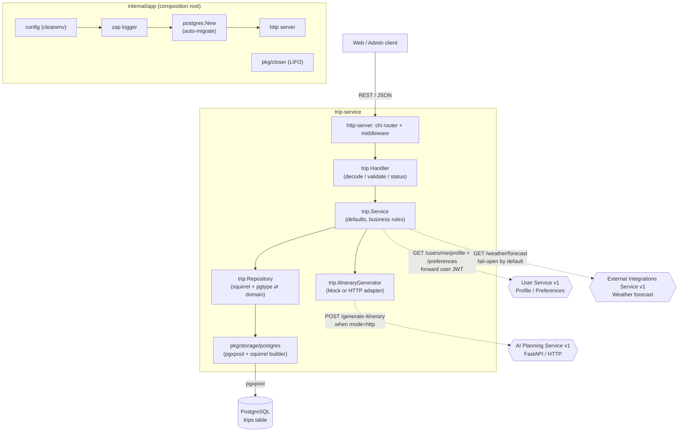

# Trip Service

A Go microservice for an AI travel planning web app. It manages **trip requests**
(destination, dates, budget, travelers, interests, pace) and generates an
**itinerary** through a configurable generator: either a deterministic local mock
or AI Planning Service v1 over HTTP.

Trip endpoints require Auth Service JWT access tokens by default. The service
validates tokens locally with the shared `JWT_ACCESS_SECRET`, reads the user ID
from the `sub` claim, and scopes trip create/list/get/generate/edit operations to
that user. It also stores itinerary version snapshots for successful itinerary
changes so users can preview and restore earlier plans.

## Tech stack

| Concern           | Choice                                                        |
| ----------------- | ------------------------------------------------------------ |
| Language          | Go                                                           |
| Composition / DI  | Hand-wired composition root (`internal/app`) — no framework  |
| Lifecycle         | `pkg/closer` (LIFO graceful shutdown)                        |
| Logging           | [Uber Zap](https://github.com/uber-go/zap) (`pkg/logger`)   |
| HTTP              | `net/http` + [chi](https://github.com/go-chi/chi) router    |
| Database          | PostgreSQL via [pgx](https://github.com/jackc/pgx) (`pgxpool`) |
| Query building    | [squirrel](https://github.com/Masterminds/squirrel)         |
| Migrations        | [golang-migrate](https://github.com/golang-migrate/migrate) — **applied automatically on startup** |
| Config            | YAML + env via [cleanenv](https://github.com/ilyakaznacheev/cleanenv) |
| Validation        | [go-playground/validator](https://github.com/go-playground/validator) (`pkg/validation`) |
| Container         | Docker / Docker Compose                                     |

> This service lives at `services/trip-service/` within the monorepo. All commands
> below assume that directory as the working directory. The Go module path is
> `github.com/KovalenkoDima236961/Travel_Ai_App`.

## Project layout

The code follows a layered / hexagonal (DDD-flavoured) structure under `internal/`:

```
trip-service/
├── cmd/server/main.go                 # entrypoint: app.New(configPath).Run()
├── internal/
│   ├── app/                           # composition root (app.go) + wiring (di.go)
│   ├── config/                        # cleanenv config + validation
│   ├── domain/                        # enterprise core (no outward deps)
│   │   ├── entity/                    #   Trip, Status, ItineraryVersion
│   │   ├── aggregate/                 #   Itinerary, ItineraryDay, ItineraryItem
│   │   └── errs/                      #   ErrNotFound (domain sentinel)
│   ├── application/                   # use cases + ports
│   │   ├── service/                   #   Service (business logic, tripRepository port)
│   │   ├── dto/                       #   CreateTripInput (use-case input)
│   │   ├── errs/                      #   InvalidInputError
│   │   └── generator.go               #   ItineraryGenerator (port interface)
│   ├── infrastructure/                # adapters (implement ports)
│   │   ├── repository/postgres/       #   Repository (squirrel) + dto/ (pgtype ⇄ entity)
│   │   └── generator/                 #   Mock + AI Planning HTTP generator adapters
│   └── http-server/                   # delivery: chi router + http.Server
│       ├── handler/                   #   Handler (decode/validate/status mapping)
│       └── dto/{request,response}/    #   CreateTrip / Trip + ListTrips payloads
├── pkg/
│   ├── closer/                        # global LIFO shutdown registry
│   ├── logger/                        # zap logger
│   ├── storage/postgres/              # pgxpool + squirrel builder + auto-migrate
│   ├── cache/redis/                   # redis client (available, not wired)
│   ├── tls/                           # autocert TLS manager (available, not wired)
│   └── validation/                    # validator wrapper + custom tags
├── configs/config.example.yaml
├── migrations/                        # golang-migrate up/down SQL
├── Dockerfile
├── docker-compose.yml
└── Makefile
```

### Layering

Dependencies point inward: `http-server` → `application` → `domain`, with
`infrastructure` adapters implementing the application's ports. `domain` imports
nothing else in the project.

```
HTTP request → http-server/handler          (decode + validate + status mapping)
             → application/service           (defaults, business rules, transitions)
             → application ports:
                 • tripRepository  → infrastructure/repository/postgres (squirrel)
                 • ItineraryGenerator → infrastructure/generator (mock/http)
             → pkg/storage/postgres (pgxpool) → PostgreSQL
```

## Architecture (Mermaid)



`internal/app` is a small, explicit composition root (no DI framework). On startup
it loads + validates config, builds the logger, opens the pool (running migrations
automatically), wires the trip feature, and starts the HTTP server. Long-lived
resources register with `pkg/closer`; on `SIGINT`/`SIGTERM` they are closed LIFO
(HTTP server drained first, then the DB pool).

## Configuration

Config is read from a YAML file (via the `-config` flag) **and/or** environment
variables (env overrides file). When no `-config` is passed, it is loaded from the
environment only. It is then validated with `pkg/validation`.

Use [.env.example](.env.example) as the local env template:

```bash
cp .env.example .env
set -a; source .env; set +a
```

Key environment variables:

| Variable             | Default        | Description                          |
| -------------------- | -------------- | ------------------------------------ |
| `APP_ENV`            | `development`  | `development` or `production`.       |
| `HTTP_ADDRESS`       | `:8080`        | HTTP listen address.                 |
| `HTTP_WRITE_TIMEOUT` | `150s`         | Maximum duration for writing an HTTP response. |
| `AUTH_REQUIRED`      | `true`         | Requires a valid bearer token for `/trips` routes when true. |
| `JWT_ACCESS_SECRET`  | `change-me-in-development` | Shared HS256 secret used to validate Auth Service access tokens locally. |
| `AUTH_HEADER_NAME`   | `Authorization` | Header read for bearer tokens. |
| `DEV_USER_ID`        | `00000000-0000-0000-0000-000000000001` | Owner used when `AUTH_REQUIRED=false` and no valid token is present. |
| `CORS_ALLOWED_ORIGINS` | `http://localhost:3000` in development | Comma-separated browser origins allowed to call the API. |
| `CORS_ALLOWED_METHODS` | `GET,POST,PUT,PATCH,DELETE,OPTIONS` | Methods returned for CORS preflight responses. |
| `CORS_ALLOWED_HEADERS` | `Content-Type,Authorization` | Headers returned for CORS preflight responses. |
| `POSTGRES_HOST`      | —              | Database host.                       |
| `POSTGRES_PORT`      | —              | Database port.                       |
| `POSTGRES_DB`        | —              | Database name.                       |
| `POSTGRES_USER`      | —              | Database user.                       |
| `POSTGRES_PASSWORD`  | —              | Database password.                   |
| `POSTGRES_MIN_CONNS` | —              | Pool minimum connections (≥ 1).      |
| `POSTGRES_MAX_CONNS` | —              | Pool maximum connections (≥ 1).      |
| `POSTGRES_MIG_PATH`  | —              | Path to the `migrations/` directory. |
| `ITINERARY_GENERATOR_MODE` | `mock` | `mock` for local generation, `http` for AI Planning Service. |
| `AI_PLANNING_SERVICE_URL` | `http://ai-planning-service:8000` | Base URL used when generator mode is `http`. |
| `AI_PLANNING_TIMEOUT_SECONDS` | `120` | HTTP client timeout for AI Planning Service calls. |
| `USER_SERVICE_URL` | `http://user-service:8083` | Base URL for trusted profile/preferences lookup during generation. |
| `USER_CONTEXT_ENABLED` | `true` | Fetch user profile/preferences before generating itineraries. |
| `USER_CONTEXT_TIMEOUT_SECONDS` | `5` | HTTP client timeout for User Service context calls. |
| `USER_CONTEXT_FAIL_OPEN` | `true` | Continue generation without personalization when User Service fails. Set `false` to return `502` with `{"error":"failed to load user preferences"}`. |
| `EXTERNAL_INTEGRATIONS_SERVICE_URL` | `http://external-integrations-service:8084` | Base URL for weather forecast and place enrichment lookups during generation. |
| `WEATHER_CONTEXT_ENABLED` | `true` | Fetch weather before full and partial itinerary generation when the trip has a start date. |
| `WEATHER_CONTEXT_TIMEOUT_SECONDS` | `5` | HTTP client timeout for weather forecast calls. |
| `WEATHER_CONTEXT_FAIL_OPEN` | `true` | Continue generation without weather when External Integrations Service fails. Set `false` to return `502` with `{"error":"failed to load weather forecast"}`. |
| `PLACE_ENRICHMENT_ENABLED` | `true` | Try to auto-attach place metadata after generated itinerary payloads. |
| `PLACE_ENRICHMENT_FAIL_OPEN` | `true` | Continue generation without place matches when External Integrations Service fails. Set `false` to return `502` with `{"error":"failed to enrich itinerary places"}`. |
| `PLACE_ENRICHMENT_TIMEOUT_SECONDS` | `5` | HTTP client timeout for each place search request. |
| `PLACE_ENRICHMENT_MIN_CONFIDENCE` | `0.75` | Minimum deterministic match score required before attaching a place. |
| `PLACE_ENRICHMENT_MAX_ITEMS` | `20` | Maximum generated itinerary items to search per enrichment run. |
| `PLACE_ENRICHMENT_OVERWRITE_EXISTING` | `false` | Preserve existing item `place` metadata by default. |
| `PUBLIC_WEB_BASE_URL` | `http://localhost:3000` | Base URL used to build owner-facing `/share/{token}` links. |
| `PUBLIC_SHARING_ENABLED` | `true` | Enables owner-managed public read-only trip share links. |
| `SHARE_TOKEN_BYTES` | `32` | Number of cryptographically random bytes used before base64url encoding share tokens. Minimum 32. |

See [configs/config.example.yaml](configs/config.example.yaml) for the file form.

Unknown generator modes fail startup. In `http` mode, startup also fails if
`AI_PLANNING_SERVICE_URL` is missing or invalid.

Weather context is optional and not persisted in Trip Service. When enabled and
the trip has `destination`, `startDate`, and `days`, Trip Service requests
`GET /weather/forecast` from External Integrations Service before full
generation and before day/item regeneration, then forwards the optional
`weatherForecast` payload to AI Planning Service. Missing start dates skip
weather context.

Place enrichment is optional and fail-open by default. After full generation and
partial day/item regeneration, Trip Service searches External Integrations
Service for suitable item types (`place`, `food`, `activity`, `museum`,
`landmark`, `restaurant`, `cafe`, `market`, `park`, `attraction`, `viewpoint`).
It skips transport/rest/free-time/accommodation-style items, empty names, and
existing `place` metadata unless overwrite is enabled. The scorer compares
normalized item and place names, then adds small bonuses for destination/address
fit, category fit, valid coordinates, and rating. Generated version history
stores the final enriched itinerary snapshot; no separate enrichment version is
created.

## Run with Docker Compose

```bash
docker compose up --build
```

Brings up PostgreSQL, AI Planning Service, and Trip Service (configured via env).
Trip Service runs with `ITINERARY_GENERATOR_MODE=http` and calls
`http://ai-planning-service:8000/generate-itinerary`. The service applies
migrations itself on startup, so there is no separate migrate step. The Trip API
is available at `http://localhost:8080`; AI Planning Service is exposed at
`http://localhost:8000`.

Tear down (and wipe the DB volume):

```bash
docker compose down -v
```

## Run locally (without Docker)

```bash
# 1. Start Postgres
docker run --rm -d --name trip-pg \
  -e POSTGRES_USER=postgres -e POSTGRES_PASSWORD=postgres -e POSTGRES_DB=trip_service \
  -p 5432:5432 postgres:16-alpine

# 2a. Run with env config and the local mock generator
export APP_ENV=development HTTP_ADDRESS=":8080" \
  AUTH_REQUIRED=true JWT_ACCESS_SECRET=change-me-in-development \
  CORS_ALLOWED_ORIGINS=http://localhost:3000 \
  POSTGRES_DB=trip_service POSTGRES_USER=postgres POSTGRES_PASSWORD=postgres \
  POSTGRES_HOST=localhost POSTGRES_PORT=5432 \
  POSTGRES_MIN_CONNS=2 POSTGRES_MAX_CONNS=10 POSTGRES_MIG_PATH=./migrations \
  ITINERARY_GENERATOR_MODE=mock
go run ./cmd/server

# 2b. Or keep the database env vars above and switch to AI Planning Service over HTTP.
# In another shell from services/ai-planning-service:
#   uvicorn app.main:app --host 0.0.0.0 --port 8000 --reload
export ITINERARY_GENERATOR_MODE=http \
  AI_PLANNING_SERVICE_URL=http://localhost:8000 \
  AI_PLANNING_TIMEOUT_SECONDS=120 \
  HTTP_WRITE_TIMEOUT=150s
go run ./cmd/server

# 2c. …or run with a YAML config file
cp configs/config.example.yaml configs/config.yaml
go run ./cmd/server -config ./configs/config.yaml
```

Common tasks are also available via the Makefile (`make help`).

## Migrations

Migrations are applied **automatically** on startup by `pkg/storage/postgres`
(golang-migrate). To apply them manually instead (e.g. in CI) with the
[migrate](https://github.com/golang-migrate/migrate) CLI:

```bash
make migrate-up      # or: migrate -path ./migrations -database "$DB_URL" up
make migrate-down    # roll back the last migration
```

## API

| Method | Path                    | Description                                  |
| ------ | ----------------------- | -------------------------------------------- |
| GET    | `/health`               | Liveness probe.                              |
| GET    | `/ready`                | Readiness probe for PostgreSQL and AI service dependencies. |
| POST   | `/trips`                | Create a trip for the authenticated user (status `DRAFT`). |
| GET    | `/trips`                | List authenticated user's trips (paginated, newest first). |
| GET    | `/trips/{id}`           | Fetch an authenticated user's trip by UUID.  |
| POST   | `/trips/{id}/generate`  | Generate the itinerary for an authenticated user's trip; status `COMPLETED`. |
| PUT    | `/trips/{id}/itinerary` | Replace the full itinerary JSON for an authenticated user's trip; status `COMPLETED`. |
| POST   | `/trips/{id}/itinerary/days/{dayNumber}/regenerate` | Regenerate one itinerary day with AI and preserve all other days. |
| POST   | `/trips/{id}/itinerary/days/{dayNumber}/items/{itemIndex}/regenerate` | Regenerate one itinerary item with AI and preserve all other items. |
| GET    | `/trips/{id}/share` | Fetch current share-link status for an authenticated owner's trip. |
| POST   | `/trips/{id}/share` | Create or re-enable a public read-only share link for an authenticated owner's trip. |
| DELETE | `/trips/{id}/share` | Disable the public share link for an authenticated owner's trip. |
| GET    | `/trips/{id}/itinerary/versions` | List itinerary version summaries for an authenticated user's trip. |
| GET    | `/trips/{id}/itinerary/versions/{versionId}` | Fetch one itinerary version detail with snapshot JSON. |
| POST   | `/trips/{id}/itinerary/versions/{versionId}/restore` | Restore an older itinerary snapshot and create a new `RESTORED` version. |
| GET    | `/public/trips/{shareToken}` | Public read-only shared trip payload; no JWT required. |

Partial itinerary regeneration uses `dayNumber` as a one-based value matching
the itinerary `day` field. `itemIndex` is zero-based and matches the selected
day's `items` array index. Both endpoints accept an optional body:

```json
{ "instruction": "Make this cheaper and avoid museums" }
```

The instruction is trimmed, may be omitted or empty, and must be at most 500
characters.

Trip statuses: `DRAFT` → `PROCESSING` → `COMPLETED` (or `FAILED`).

All `/trips` routes expect:

```http
Authorization: Bearer <accessToken>
```

Missing or invalid tokens return:

```json
{ "error": "unauthorized" }
```

For local debugging only, set `AUTH_REQUIRED=false`. In that mode requests
without a valid token are allowed and new trips are owned by `DEV_USER_ID`.

### Public trip sharing

Public sharing v1 stores one row per trip in `trip_shares`. Share tokens are
generated from at least 32 cryptographically random bytes and encoded as
base64url without padding; UUIDs are not used as public tokens.

Owner management endpoints are protected and use the same ownership rules as
the rest of `/trips`: non-owners receive `404`.

```http
GET /trips/{id}/share
POST /trips/{id}/share
DELETE /trips/{id}/share
```

`POST /trips/{id}/share` returns an existing enabled link, re-enables a disabled
link with the same token, or creates a new token:

```json
{
  "shareToken": "base64url-token",
  "shareUrl": "http://localhost:3000/share/base64url-token",
  "enabled": true,
  "createdAt": "2026-06-24T12:00:00Z"
}
```

`DELETE /trips/{id}/share` is idempotent after ownership is verified and returns
`{ "success": true }`. A disabled share immediately makes the public endpoint
return `404`.

```http
GET /public/trips/{shareToken}
```

The public endpoint does not require JWT and only returns enabled shares. Its
response is sanitized: it omits `userId`, owner email, preferences, version
history, tokens, generation logs, and private service metadata. It includes only
basic trip summary fields plus the current itinerary JSON needed for read-only
rendering.

Limitations: no expiration, password protection, analytics, collaboration,
public editing, or multiple links per trip yet.

### Itinerary generation

Itinerary generation is abstracted behind a `trip.ItineraryGenerator` interface, so
the service layer does not depend on any particular planning strategy. The
configured adapter is selected at startup:

| Mode | Behavior |
| ---- | -------- |
| `mock` | Uses `MockItineraryGenerator` locally. This is the default when mode is empty. |
| `http` | Uses `AIPlanningHTTPGenerator` to call `POST {AI_PLANNING_SERVICE_URL}/generate-itinerary`. |

The HTTP adapter sends the Trip fields as JSON, uses the configured client
timeout, decodes the AI Planning Service response into typed `Itinerary` /
`ItineraryDay` / `ItineraryItem` structs, and returns an error for non-2xx,
invalid JSON, request failures, or empty `days`. Generated plans are stored as
JSONB by the service layer.

When `USER_CONTEXT_ENABLED=true`, Trip Service fetches `/users/me/profile` and
`/users/me/preferences` from User Service before generation by forwarding the
authenticated user's bearer token. The frontend does not send profile or
preference data to `/trips/{id}/generate`; Trip Service loads trusted context
itself and forwards optional `userProfile` / `userPreferences` to AI Planning
Service. Access tokens and full preference payloads must not be logged.

When the AI Planning Service runs in Ollama mode with fallback enabled, set
`AI_PLANNING_TIMEOUT_SECONDS` higher than the AI service's
`OLLAMA_TIMEOUT_SECONDS`, and keep `HTTP_WRITE_TIMEOUT` higher than
`AI_PLANNING_TIMEOUT_SECONDS`. Otherwise the trip-service can time out before
the AI service returns its fallback itinerary.

### Itinerary editing

`PUT /trips/{id}/itinerary` replaces the full itinerary JSON for the
authenticated owner. It never calls AI Planning Service. On success, Trip Service
stores the new itinerary JSONB value, sets status to `COMPLETED`, updates
`updated_at`, and returns the same Trip response shape as `GET /trips/{id}`.

Request body:

```json
{
  "itinerary": {
    "days": [
      {
        "day": 1,
        "title": "Historic Rome and local food",
        "items": [
          {
            "time": "09:00",
            "type": "place",
            "name": "Colosseum",
            "note": "Start early to avoid crowds.",
            "estimatedCost": 18,
            "place": {
              "provider": "mock",
              "providerPlaceId": "mock-colosseum-rome",
              "name": "Colosseum",
              "address": "Piazza del Colosseo, 1, 00184 Roma RM, Italy",
              "latitude": 41.8902,
              "longitude": 12.4922,
              "rating": 4.7,
              "ratingCount": 120000,
              "mapUrl": "https://maps.example.com/mock-colosseum-rome",
              "category": "landmark",
              "website": "https://example.com/colosseum",
              "openingHours": [
                { "dayOfWeek": 1, "open": "08:30", "close": "19:15" },
                { "dayOfWeek": 2, "open": "08:30", "close": "19:15" }
              ]
            }
          }
        ]
      }
    ]
  }
}
```

Validation rules:

- `itinerary` is required.
- `itinerary.days` must contain between 1 and 60 days.
- Each day needs `day >= 1`, a non-empty `title`, and 1 to 30 items.
- Each item needs non-empty `time`, `type`, and `name`.
- `note` is optional.
- `estimatedCost` is optional/null and must be `>= 0` when present.
- `place` is optional and is preserved in the itinerary JSONB when present.
- `place.provider`, `place.providerPlaceId`, `place.name`, and `place.address`
  are required when `place` is present.
- `place.latitude` must be between `-90` and `90` when present.
- `place.longitude` must be between `-180` and `180` when present.
- `place.rating` must be between `0` and `5` when present.
- `place.ratingCount` must be `>= 0` when present.
- `place.mapUrl` and `place.website` are optional and capped at 2048
  characters.
- `place.openingHours` is optional. When present, each interval must use
  `dayOfWeek` from `1` Monday through `7` Sunday and `open`/`close` in local
  `HH:mm` 24-hour time with `open` before `close`. Multiple intervals per day
  are allowed, and no interval for a day means closed or unknown.
- `placeEnrichment` is optional and is preserved when present.
- `placeEnrichment.status` must be one of `matched`, `no_match`, `skipped`, or
  `failed`.
- `placeEnrichment.reviewStatus` is optional. When present it must be one of
  `pending`, `accepted`, `changed`, or `removed`.
- `placeEnrichment.confidence` must be between `0` and `1` when present.
- `placeEnrichment.query`, `provider`, and `reason` are optional and capped at
  300, 50, and 200 characters respectively. `matchedAt` is stored as a string.
- String fields are trimmed before saving.

Missing/invalid tokens return `401`. Missing trips and trips owned by another
user both return `404` so ownership is not leaked. Invalid itinerary shapes
return `400` with `{ "error": "message" }`.

External place lookup is owned by External Integrations Service. Trip Service
does not call Google Places or other third-party place APIs directly. For
generated itineraries it calls `GET /places/search` on External Integrations
Service, attaches only high-confidence matches, and stores `placeEnrichment`
metadata such as confidence, provider, query, reason, and review status. New
auto-matched and no-match enrichment results start with `reviewStatus:
"pending"`. Manual
`PUT /trips/{id}/itinerary` saves do not trigger auto-enrichment; the submitted
`place` and `placeEnrichment` values are only validated and preserved. Older
saved itineraries without `place`, `openingHours`, or `placeEnrichment` remain
valid.

Limitations: v1 uses simple string/category scoring, no background worker, no
RabbitMQ, and no user confirmation before auto-attach. Real provider quality
depends on External Integrations Service provider configuration.

### Itinerary version history

Every successful itinerary-changing action writes a full JSONB snapshot to
`itinerary_versions` in the same transaction as the current `trips.itinerary`
update. If version creation fails, the itinerary update rolls back. Version
history starts after this feature is deployed; existing itineraries are not
backfilled.

Version source values:

- `GENERATED`
- `MANUAL_EDIT`
- `REGENERATE_DAY`
- `REGENERATE_ITEM`
- `RESTORED`

List versions:

```http
GET /trips/{id}/itinerary/versions?limit=20&offset=0
```

The list response is newest first and omits the full itinerary payload:

```json
{
  "items": [
    {
      "id": "uuid",
      "tripId": "uuid",
      "versionNumber": 2,
      "source": "MANUAL_EDIT",
      "metadata": {},
      "createdAt": "2026-06-23T12:00:00Z"
    }
  ],
  "limit": 20,
  "offset": 0
}
```

Fetch version detail:

```http
GET /trips/{id}/itinerary/versions/{versionId}
```

The detail response includes `itinerary` for previewing:

```json
{
  "id": "uuid",
  "tripId": "uuid",
  "versionNumber": 1,
  "source": "GENERATED",
  "itinerary": { "days": [] },
  "metadata": { "generator": "full" },
  "createdAt": "2026-06-23T12:00:00Z"
}
```

Restore a version:

```http
POST /trips/{id}/itinerary/versions/{versionId}/restore
```

Restore validates the selected snapshot, updates the current trip itinerary,
sets trip status to `COMPLETED`, and appends a new version with source
`RESTORED` and metadata containing `restoredFromVersionId` and
`restoredFromVersionNumber`. Restoring version 1 does not delete versions 2 or
3; the restore becomes the next version number.

Version endpoints are protected by the same ownership rules as trip endpoints:
the `user_id` comes only from the JWT `sub` claim, non-owners receive `404`, and
metadata must not contain access tokens or sensitive payloads.

Version history v1 intentionally does not include diff view, branching, named
versions, or version comparison.

Errors use a uniform envelope; validation failures add a `fields` map:

```json
{ "error": "validation failed", "fields": { "Days": "'Days' must be <= 30" } }
```

### Example curl requests

```bash
AUTH_EMAIL="you@example.com"
AUTH_PASSWORD="StrongPassword123!"
ACCESS_TOKEN=$(curl -s -X POST http://localhost:8082/auth/login \
  -H 'Content-Type: application/json' \
  -d "{\"email\":\"${AUTH_EMAIL}\",\"password\":\"${AUTH_PASSWORD}\"}" | jq -r '.accessToken')

TRIP_ID=$(curl -s -X POST http://localhost:8080/trips \
  -H 'Content-Type: application/json' \
  -H "Authorization: Bearer ${ACCESS_TOKEN}" \
  -d '{
    "destination": "Rome",
    "startDate": "2026-08-10",
    "days": 4,
    "budgetAmount": 600,
    "budgetCurrency": "EUR",
    "travelers": 2,
    "interests": ["food", "history", "hidden_gems"],
    "pace": "balanced"
  }' | jq -r '.id')

# Generate the itinerary
curl -s -X POST "http://localhost:8080/trips/${TRIP_ID}/generate" \
  -H "Authorization: Bearer ${ACCESS_TOKEN}"

# Fetch the completed trip
curl -s "http://localhost:8080/trips/${TRIP_ID}" \
  -H "Authorization: Bearer ${ACCESS_TOKEN}"

# Replace the itinerary
curl -s -X PUT "http://localhost:8080/trips/${TRIP_ID}/itinerary" \
  -H "Authorization: Bearer ${ACCESS_TOKEN}" \
  -H "Content-Type: application/json" \
  -d '{
    "itinerary": {
      "days": [
        {
          "day": 1,
          "title": "Edited Day",
          "items": [
            {
              "time": "10:00",
              "type": "activity",
              "name": "Edited Activity",
              "note": "Updated note",
              "estimatedCost": 12
            }
          ]
        }
      ]
    }
  }'

# List itinerary version summaries
curl -s "http://localhost:8080/trips/${TRIP_ID}/itinerary/versions" \
  -H "Authorization: Bearer ${ACCESS_TOKEN}"

# Fetch and restore a version
VERSION_ID="..."
curl -s "http://localhost:8080/trips/${TRIP_ID}/itinerary/versions/${VERSION_ID}" \
  -H "Authorization: Bearer ${ACCESS_TOKEN}"

curl -s -X POST "http://localhost:8080/trips/${TRIP_ID}/itinerary/versions/${VERSION_ID}/restore" \
  -H "Authorization: Bearer ${ACCESS_TOKEN}"

# Create a public read-only share link
SHARE_TOKEN=$(curl -s -X POST "http://localhost:8080/trips/${TRIP_ID}/share" \
  -H "Authorization: Bearer ${ACCESS_TOKEN}" | jq -r '.shareToken')

# Fetch the public shared trip without Authorization
curl -s "http://localhost:8080/public/trips/${SHARE_TOKEN}"

# Disable the share link
curl -s -X DELETE "http://localhost:8080/trips/${TRIP_ID}/share" \
  -H "Authorization: Bearer ${ACCESS_TOKEN}"

# List (paginated, newest first)
curl -s "http://localhost:8080/trips?limit=20&offset=0" \
  -H "Authorization: Bearer ${ACCESS_TOKEN}"

# Health
curl -s http://localhost:8080/health
```

The list endpoint returns a paginated envelope:

```json
{
  "items": [ { "id": "…", "destination": "Rome", "status": "COMPLETED", "itinerary": { } } ],
  "limit": 20,
  "offset": 0
}
```

## Validation rules

- `destination` is required.
- `days` is required and must be between 1 and 30.
- `travelers` is required and must be ≥ 1.
- `budgetCurrency`, when present, must be 3 characters (defaults to `EUR` when empty).
- `pace`, when present, must be one of `relaxed | balanced | packed` (defaults to `balanced`).
- `startDate`, when present, must be `YYYY-MM-DD`.
- `interests`, when omitted, defaults to an empty array.

For `GET /trips`:

- `limit` defaults to `20`, and must be between `1` and `100`.
- `offset` defaults to `0`, and must be `>= 0`.

## Tests

Service-level business logic is covered by unit tests that mock the repository and
the itinerary generator (no database required):

```bash
make test          # go test ./... -race -count=1
# or directly:
go test ./... -race -count=1
```

## Notes & extension points

- The `id` column uses `gen_random_uuid()` (PostgreSQL 13+) so IDs are generated
  by the database.
- Itinerary generation is selected by `ITINERARY_GENERATOR_MODE`. Use `mock` for
  local deterministic output or `http` for AI Planning Service v1. RabbitMQ, real
  LLM calls, and RAG are intentionally not part of this version.
- Auth Service remains the source of issued tokens. Trip Service validates access
  tokens locally for v1; a future production setup should move to asymmetric keys
  or JWKS validation.
- `pkg/cache/redis` and `pkg/tls` are wired-ready platform utilities included for
  future use; the trip feature does not depend on them yet.
