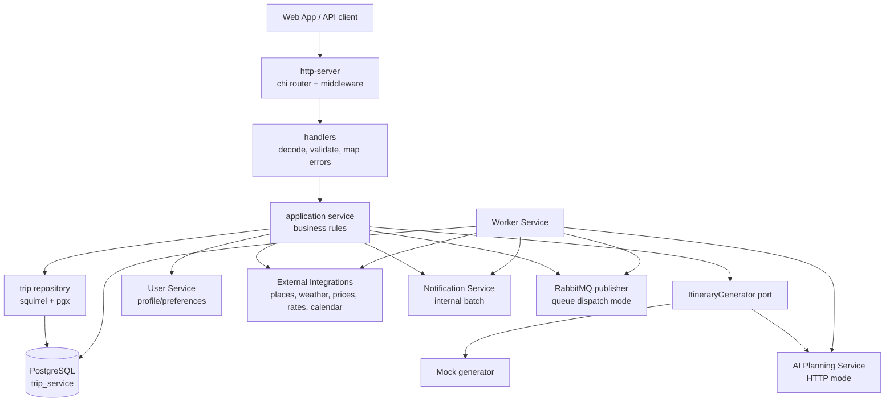
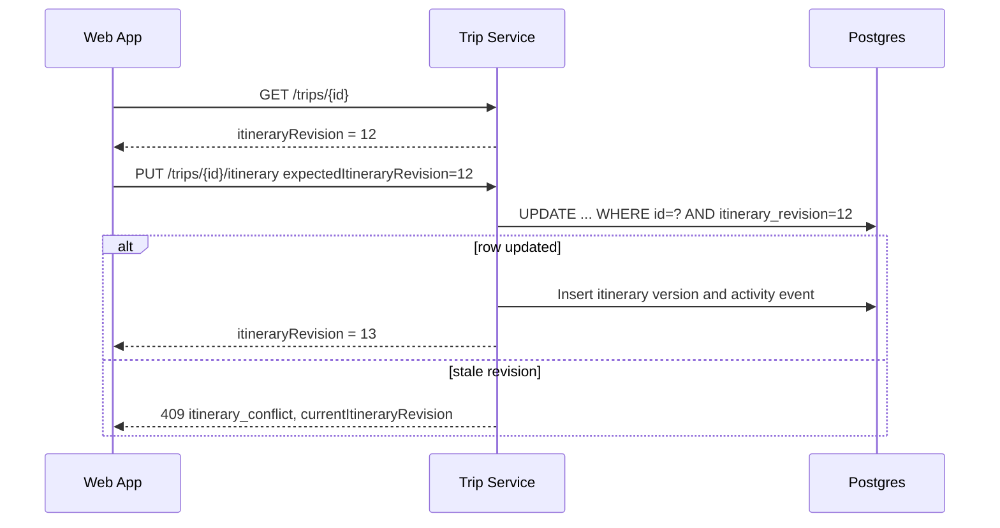
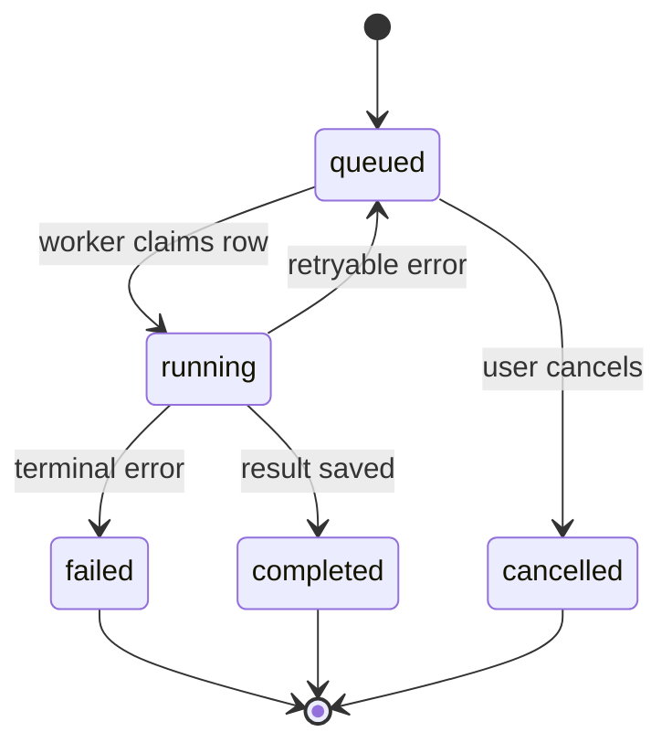

# Trip Service

Go service that owns trip planning state and the main domain workflow for the
Travel AI App. It stores trips, itineraries, revision history, collaborators,
comments, public shares, activity events, generation jobs, budget proposals,
calendar sync mappings, accommodation data, and enrichment metadata.

Trip Service is the orchestration point between user-facing APIs, AI generation,
external provider data, notifications, and background workers.

## Architecture



The service follows a layered structure: `http-server` -> `application` ->
`domain`, with adapters in `infrastructure`. The composition root in
`internal/app` wires config, logger, Postgres, providers, HTTP server, workers,
and graceful shutdown.

## Responsibilities

| Area | Owned by Trip Service |
| ---- | --------------------- |
| Trip access | Owner/collaborator access checks, role capabilities, public share redaction. |
| Itinerary safety | `itineraryRevision`, revision-aware writes, version snapshots, restore. |
| Generation | Job creation, sync compatibility routes, AI context assembly, result validation. |
| Collaboration | Invites, roles, accepted/shared trips, presence, soft edit locks. |
| Activity | Persistent audit feed plus in-memory SSE best-effort updates. |
| Comments | Private item comments, counts, edit/delete permissions. |
| Budget | Trip budget, item/accommodation costs, multi-currency summaries, proposals. |
| Accommodation | One private structured stay per trip, included in AI/budget/route context. |
| Sharing | One public read-only link per trip, optional expiry/password unlock. |
| Calendar | Per-trip/user sync state; provider operations delegated to External Integrations. |

## Revision-Safe Writes



Every private itinerary-changing request must include
`expectedItineraryRevision`. Stale writes fail with `409 itinerary_conflict`.
Comments, collaborators, shares, presence, notifications, budget settings,
accommodation settings, exports, and public views do not increment the itinerary
revision.

## Background Jobs



Generation job types:

- `full_generation`
- `day_regeneration`
- `item_regeneration`
- `quality_improvement_day`
- `quality_improvement_item`
- `budget_optimization_day`

Dispatch modes:

- `GENERATION_JOB_DISPATCH_MODE=queue`: publish a small RabbitMQ message and let
  Worker Service process the existing DB job row.
- `GENERATION_JOB_DISPATCH_MODE=in_process`: use the Trip Service local poller
  for fallback and tests.

Queue messages intentionally contain only IDs, type, timestamps, and
correlation metadata. They do not contain access tokens, prompts, preferences,
or itinerary JSON.

## Endpoint Groups

| Group | Routes |
| ----- | ------ |
| Health | `GET /health`, `GET /ready`, `GET /metrics` |
| Trips | `POST /trips`, `GET /trips`, `GET /trips/shared-with-me`, `GET /trips/{id}` |
| Generation jobs | `POST /trips/{id}/generation-jobs`, `GET /trips/{id}/generation-jobs`, `GET /trips/{id}/generation-jobs/{jobId}`, `POST /trips/{id}/generation-jobs/{jobId}/cancel` |
| Sync generation compatibility | `POST /trips/{id}/generate`, day regeneration, item regeneration |
| Itinerary | `PUT /trips/{id}/itinerary`, version list/detail/restore routes |
| Budget | `GET /trips/{id}/budget-summary`, `PUT /trips/{id}/budget`, budget optimization job/proposal routes |
| Accommodation | `GET /trips/{id}/accommodation`, `PUT /trips/{id}/accommodation`, `DELETE /trips/{id}/accommodation` |
| Collaboration | collaborator CRUD/accept/decline, `GET /collaboration/invitations` |
| Presence and locks | `/trips/{id}/presence*`, `/trips/{id}/edit-lock` |
| Comments | `/trips/{id}/comments`, `/trips/{id}/comments/counts`, comment update/delete |
| Activity | `GET /trips/{id}/activity`, `GET /trips/{id}/activity/stream` |
| Sharing | `GET/POST/PATCH/DELETE /trips/{id}/share`, public share status/unlock/read routes |
| Calendar | `GET/POST/DELETE /trips/{id}/calendar-sync/google*` |

Private routes require `Authorization: Bearer <accessToken>` when
`AUTH_REQUIRED=true`. Public share routes use opaque share tokens and optional
short-lived public share unlock tokens.

## Important Configuration

| Variable | Purpose |
| -------- | ------- |
| `HTTP_ADDRESS`, `HTTP_WRITE_TIMEOUT` | HTTP bind address and long generation response timeout. |
| `AUTH_REQUIRED`, `JWT_ACCESS_SECRET`, `AUTH_HEADER_NAME` | Auth Service JWT validation. |
| `ITINERARY_GENERATOR_MODE` | `mock` or `http` AI generator adapter. |
| `AI_PLANNING_SERVICE_URL`, `AI_PLANNING_TIMEOUT_SECONDS` | AI Planning Service client. |
| `USER_SERVICE_URL`, `USER_CONTEXT_*` | Profile/preference lookup for personalization. |
| `EXTERNAL_INTEGRATIONS_SERVICE_URL` | Weather, places, prices, rates, and calendar calls. |
| `WEATHER_CONTEXT_*` | Optional weather context for AI prompts. |
| `PLACE_ENRICHMENT_*`, `PRICE_ENRICHMENT_*` | Auto-enrichment after generation. |
| `BUDGET_CONVERSION_*` | Exchange-rate conversion for budget summaries. |
| `PUBLIC_SHARING_*`, `PUBLIC_SHARE_ACCESS_*` | Public share link controls. |
| `TRIP_PRESENCE_*`, `TRIP_ACTIVITY_STREAM_*`, `TRIP_EDIT_LOCK_*` | In-memory SSE/advisory collaboration features. |
| `GENERATION_JOB_*`, `RABBITMQ_*` | Job queue, retry, DLQ, and worker behavior. |
| `OPS_DASHBOARD_ENABLED`, `OPS_ADMIN_EMAILS`, `OPS_STALE_RUNNING_JOB_SECONDS` | Allowlisted admin job monitor and safe job actions. |
| `NOTIFICATIONS_*`, `NOTIFICATION_SERVICE_*` | Synchronous fail-open notification fanout. |
| `CALENDAR_SYNC_*`, `DEFAULT_CALENDAR_TIMEZONE` | Calendar sync behavior. |
| `POSTGRES_*`, `POSTGRES_MIG_PATH` | Database and auto-migration settings. |

## Ops Dashboard Endpoints

When `OPS_DASHBOARD_ENABLED=true`, allowlisted users can inspect generation jobs
with `GET /ops/jobs`, `GET /ops/jobs/summary`, and `GET /ops/jobs/{jobId}`.
Safe mutations require a non-empty `reason`: retry creates a new queued job,
cancel only affects queued jobs, and mark-failed only affects stale running jobs.

See [configs/config.example.yaml](configs/config.example.yaml) and
[.env.example](.env.example) for the full local template.

## Run Locally

From this service directory:

```bash
cp .env.example .env
set -a; source .env; set +a
make run
```

Run with YAML config:

```bash
cp configs/config.example.yaml configs/config.yaml
make config-run
```

Run the full application stack from the repository root:

```bash
docker compose -f infra/docker-compose.yml --env-file infra/.env up --build
```

Migrations run automatically on startup. Manual migration commands:

```bash
make migrate-up
make migrate-down
```

## Development Checks

```bash
make fmt
make vet
make test
make build
```

## Operational Notes

- `queue` dispatch requires RabbitMQ and Worker Service. Keep `in_process` as a
  local fallback only.
- Notification calls are synchronous but fail-open by default; a notification
  outage must not break the originating trip action.
- Weather, place, price, and budget conversion provider calls are fail-open by
  default in local development and produce warnings or partial context.
- Presence, activity SSE, and edit locks are process-local v1 features. They do
  not provide cross-instance guarantees.
- Public share responses are sanitized and omit private collaborator,
  notification, activity, version-management, accommodation, and budget proposal
  surfaces.

## Observability And Safety

- `GET /metrics` exposes HTTP, job, notification, activity, provider, and domain
  metrics.
- Logs and internal calls propagate `X-Request-ID` and `X-Correlation-ID`.
- Do not log access tokens, internal service tokens, share passwords, public
  share access tokens, full prompts, full preference payloads, full private
  itinerary JSON, OAuth tokens, or provider API keys.
