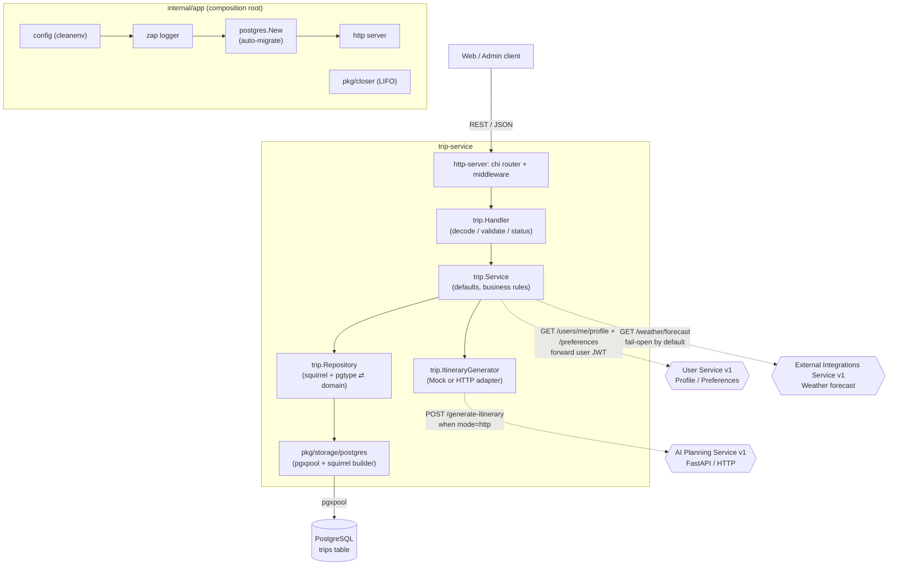

# Trip Service

A Go microservice for an AI travel planning web app. It manages **trip requests**
(destination, dates, budget, travelers, interests, pace) and generates an
**itinerary** through a configurable generator: either a deterministic local mock
or AI Planning Service v1 over HTTP.

Trip endpoints require Auth Service JWT access tokens by default. The service
validates tokens locally with the shared `JWT_ACCESS_SECRET`, reads the user ID
from the `sub` claim, and scopes trip create/list/get/generate/edit operations to
that user or an accepted collaborator. It also stores itinerary version
snapshots for successful itinerary changes so users can preview and restore
earlier plans.

## Conflict Detection v1

Trips have an `itinerary_revision INT NOT NULL DEFAULT 0` column. Private trip
responses include it as `itineraryRevision`; public share responses omit it
because public trips are read-only.

Every private itinerary-changing request must include `expectedItineraryRevision`:

- `POST /trips/{id}/generate`
- `PUT /trips/{id}/itinerary`
- `POST /trips/{id}/itinerary/days/{dayNumber}/regenerate`
- `POST /trips/{id}/itinerary/days/{dayNumber}/items/{itemIndex}/regenerate`
- `POST /trips/{id}/itinerary/versions/{versionId}/restore`

Missing revisions return:

```json
{
  "error": "expected_itinerary_revision_required",
  "message": "expectedItineraryRevision is required."
}
```

Stale revisions return HTTP `409`:

```json
{
  "error": "itinerary_conflict",
  "message": "This itinerary was changed by someone else.",
  "currentItineraryRevision": 8
}
```

Successful itinerary changes atomically check the expected revision in SQL,
increment `itinerary_revision` exactly once, and then create the itinerary
version. Conflicts do not create versions, activity events, or notifications.
Trip metadata, comments, collaborators, shares, presence, notifications, public
views, and exports do not increment the revision.

Limitations: v1 does not merge edits, show diffs, lock trips, or provide
real-time document synchronization.

## Calendar Sync v1

Trip Service owns per-trip/user event mappings in `trip_calendar_syncs` and
delegates provider calls to External Integrations Service. Calendar sync is a
personal integration: owners and accepted editors may sync their own Google
Calendar; accepted viewers and public share viewers cannot sync. If an owner
and editor both sync the same trip, each user gets separate Google events and
separate sync rows.

Endpoints:

- `GET /trips/{id}/calendar-sync/google/status`
- `POST /trips/{id}/calendar-sync/google/sync`
- `DELETE /trips/{id}/calendar-sync/google`

Sync requests must include `expectedItineraryRevision`. A stale value returns
HTTP `409` with `error: "itinerary_conflict"` and does not mutate the itinerary
or calendar mapping rows. Sync creates events for timed itinerary items only,
updates existing mapped events by `sync_key = day-{dayNumber}-item-{itemIndex}`,
and deletes mapped events for items that are no longer timed/present. Event
descriptions include item notes, map URL, estimated cost, and the app trip URL;
they do not include comments, private preferences, version history, tokens, or
place-enrichment debug metadata.

Limitations: Google only, primary calendar only, one-way sync, no background
queue, and heavy itinerary reordering may update events according to the current
day/item index mapping.

## Background Jobs v1

AI full generation and day/item regeneration can run through PostgreSQL-backed
`trip_generation_jobs` rows. The new asynchronous endpoints validate private
owner/editor access and `expectedItineraryRevision`, insert a queued job, and
return `202 Accepted` with a `job` payload immediately. The in-process worker
claims queued jobs with `FOR UPDATE SKIP LOCKED`, runs the existing generation
service methods, and saves only through the existing revision-aware itinerary
update path.

Job types are `full_generation`, `day_regeneration`, `item_regeneration`,
`quality_improvement_day`, and `quality_improvement_item`. Statuses are
`queued`, `running`, `completed`, `failed`, and `cancelled`. If the itinerary
changes while a job is queued or running, the job fails with
`itinerary_conflict` and does not overwrite the newer itinerary. Failed jobs are
visible through the job API; Trip Service also records a `generation_job_failed`
activity event and sends a requester-only in-app notification.

The legacy synchronous endpoints remain available for compatibility:
`POST /trips/{id}/generate`,
`POST /trips/{id}/itinerary/days/{dayNumber}/regenerate`, and
`POST /trips/{id}/itinerary/days/{dayNumber}/items/{itemIndex}/regenerate`.

Limitations: v1 uses no RabbitMQ/Kafka/Redis queue, no distributed locks, no
separate worker service, and no progress streaming. Jobs stop when the Trip
Service process stops; stale running jobs older than
`GENERATION_JOB_MAX_RUNNING_SECONDS` are marked failed on startup with
`worker_restarted`. `GENERATION_JOB_WORKER_MAX_CONCURRENT` is documented for
future use; the v1 worker processes sequentially.

## Tech stack

| Concern           | Choice                                                        |
| ----------------- | ------------------------------------------------------------ |
| Language          | Go                                                           |
| Composition / DI  | Hand-wired composition root (`internal/app`) — no framework  |
| Lifecycle         | `pkg/closer` (LIFO graceful shutdown)                        |
| Logging           | [Uber Zap](https://github.com/uber-go/zap) (`pkg/logger`)   |
| HTTP              | `net/http` + [chi](https://github.com/go-chi/chi) router    |
| Database          | PostgreSQL via [pgx](https://github.com/jackc/pgx) (`pgxpool`) |
| Query building    | [squirrel](https://github.com/Masterminds/squirrel)         |
| Migrations        | [golang-migrate](https://github.com/golang-migrate/migrate) — **applied automatically on startup** |
| Config            | YAML + env via [cleanenv](https://github.com/ilyakaznacheev/cleanenv) |
| Validation        | [go-playground/validator](https://github.com/go-playground/validator) (`pkg/validation`) |
| Container         | Docker / Docker Compose                                     |

> This service lives at `services/trip-service/` within the monorepo. All commands
> below assume that directory as the working directory. The Go module path is
> `github.com/KovalenkoDima236961/Travel_Ai_App`.

## Project layout

The code follows a layered / hexagonal (DDD-flavoured) structure under `internal/`:

```
trip-service/
├── cmd/server/main.go                 # entrypoint: app.New(configPath).Run()
├── internal/
│   ├── app/                           # composition root (app.go) + wiring (di.go)
│   ├── config/                        # cleanenv config + validation
│   ├── domain/                        # enterprise core (no outward deps)
│   │   ├── entity/                    #   Trip, Status, ItineraryVersion
│   │   ├── aggregate/                 #   Itinerary, ItineraryDay, ItineraryItem
│   │   └── errs/                      #   ErrNotFound (domain sentinel)
│   ├── application/                   # use cases + ports
│   │   ├── service/                   #   Service (business logic, tripRepository port)
│   │   ├── dto/                       #   CreateTripInput (use-case input)
│   │   ├── errs/                      #   InvalidInputError
│   │   └── generator.go               #   ItineraryGenerator (port interface)
│   ├── infrastructure/                # adapters (implement ports)
│   │   ├── repository/postgres/       #   Repository (squirrel) + dto/ (pgtype ⇄ entity)
│   │   └── generator/                 #   Mock + AI Planning HTTP generator adapters
│   └── http-server/                   # delivery: chi router + http.Server
│       ├── handler/                   #   Handler (decode/validate/status mapping)
│       └── dto/{request,response}/    #   CreateTrip / Trip + ListTrips payloads
├── pkg/
│   ├── closer/                        # global LIFO shutdown registry
│   ├── logger/                        # zap logger
│   ├── storage/postgres/              # pgxpool + squirrel builder + auto-migrate
│   ├── cache/redis/                   # redis client (available, not wired)
│   ├── tls/                           # autocert TLS manager (available, not wired)
│   └── validation/                    # validator wrapper + custom tags
├── configs/config.example.yaml
├── migrations/                        # golang-migrate up/down SQL
├── Dockerfile
├── docker-compose.yml
└── Makefile
```

### Layering

Dependencies point inward: `http-server` → `application` → `domain`, with
`infrastructure` adapters implementing the application's ports. `domain` imports
nothing else in the project.

```
HTTP request → http-server/handler          (decode + validate + status mapping)
             → application/service           (defaults, business rules, transitions)
             → application ports:
                 • tripRepository  → infrastructure/repository/postgres (squirrel)
                 • ItineraryGenerator → infrastructure/generator (mock/http)
             → pkg/storage/postgres (pgxpool) → PostgreSQL
```

## Architecture (Mermaid)



`internal/app` is a small, explicit composition root (no DI framework). On startup
it loads + validates config, builds the logger, opens the pool (running migrations
automatically), wires the trip feature, and starts the HTTP server. Long-lived
resources register with `pkg/closer`; on `SIGINT`/`SIGTERM` they are closed LIFO
(HTTP server drained first, then the DB pool).

## Configuration

Config is read from a YAML file (via the `-config` flag) **and/or** environment
variables (env overrides file). When no `-config` is passed, it is loaded from the
environment only. It is then validated with `pkg/validation`.

Use [.env.example](.env.example) as the local env template:

```bash
cp .env.example .env
set -a; source .env; set +a
```

Key environment variables:

| Variable             | Default        | Description                          |
| -------------------- | -------------- | ------------------------------------ |
| `APP_ENV`            | `development`  | `development` or `production`.       |
| `HTTP_ADDRESS`       | `:8080`        | HTTP listen address.                 |
| `HTTP_WRITE_TIMEOUT` | `150s`         | Maximum duration for writing an HTTP response. |
| `AUTH_REQUIRED`      | `true`         | Requires a valid bearer token for `/trips` routes when true. |
| `JWT_ACCESS_SECRET`  | `change-me-in-development` | Shared HS256 secret used to validate Auth Service access tokens locally. |
| `AUTH_HEADER_NAME`   | `Authorization` | Header read for bearer tokens. |
| `DEV_USER_ID`        | `00000000-0000-0000-0000-000000000001` | Owner used when `AUTH_REQUIRED=false` and no valid token is present. |
| `CORS_ALLOWED_ORIGINS` | `http://localhost:3000` in development | Comma-separated browser origins allowed to call the API. |
| `CORS_ALLOWED_METHODS` | `GET,POST,PUT,PATCH,DELETE,OPTIONS` | Methods returned for CORS preflight responses. |
| `CORS_ALLOWED_HEADERS` | `Content-Type,Authorization` | Headers returned for CORS preflight responses. |
| `POSTGRES_HOST`      | —              | Database host.                       |
| `POSTGRES_PORT`      | —              | Database port.                       |
| `POSTGRES_DB`        | —              | Database name.                       |
| `POSTGRES_USER`      | —              | Database user.                       |
| `POSTGRES_PASSWORD`  | —              | Database password.                   |
| `POSTGRES_MIN_CONNS` | —              | Pool minimum connections (≥ 1).      |
| `POSTGRES_MAX_CONNS` | —              | Pool maximum connections (≥ 1).      |
| `POSTGRES_MIG_PATH`  | —              | Path to the `migrations/` directory. |
| `ITINERARY_GENERATOR_MODE` | `mock` | `mock` for local generation, `http` for AI Planning Service. |
| `AI_PLANNING_SERVICE_URL` | `http://ai-planning-service:8000` | Base URL used when generator mode is `http`. |
| `AI_PLANNING_TIMEOUT_SECONDS` | `120` | HTTP client timeout for AI Planning Service calls. |
| `USER_SERVICE_URL` | `http://user-service:8083` | Base URL for trusted profile/preferences lookup during generation. |
| `AUTH_SERVICE_URL` | `http://auth-service:8082` | Internal Auth Service base URL used for exact-email collaborator invite lookup. |
| `USER_CONTEXT_ENABLED` | `true` | Fetch user profile/preferences before generating itineraries. |
| `USER_CONTEXT_TIMEOUT_SECONDS` | `5` | HTTP client timeout for User Service context calls. |
| `USER_CONTEXT_FAIL_OPEN` | `true` | Continue generation without personalization when User Service fails. Set `false` to return `502` with `{"error":"failed to load user preferences"}`. |
| `EXTERNAL_INTEGRATIONS_SERVICE_URL` | `http://external-integrations-service:8084` | Base URL for weather forecast and place enrichment lookups during generation. |
| `WEATHER_CONTEXT_ENABLED` | `true` | Fetch weather before full and partial itinerary generation when the trip has a start date. |
| `WEATHER_CONTEXT_TIMEOUT_SECONDS` | `5` | HTTP client timeout for weather forecast calls. |
| `NOTIFICATIONS_ENABLED` | `true` | Fan out in-app notifications to the Notification Service after successful actions. Set `false` to make no calls. |
| `NOTIFICATIONS_FAIL_OPEN` | `true` | Keep a notification failure from breaking the originating action (logged and swallowed). |
| `NOTIFICATION_SERVICE_URL` | `http://notification-service:8086` | Base URL for the Notification Service internal batch endpoint. |
| `NOTIFICATION_SERVICE_TOKEN` | `dev-internal-service-token` | Shared `X-Internal-Service-Token` value. Never logged. |
| `NOTIFICATION_SERVICE_TIMEOUT_SECONDS` | `3` | HTTP client timeout for the synchronous notification call. |
| `WEATHER_CONTEXT_FAIL_OPEN` | `true` | Continue generation without weather when External Integrations Service fails. Set `false` to return `502` with `{"error":"failed to load weather forecast"}`. |
| `PLACE_ENRICHMENT_ENABLED` | `true` | Try to auto-attach place metadata after generated itinerary payloads. |
| `PLACE_ENRICHMENT_FAIL_OPEN` | `true` | Continue generation without place matches when External Integrations Service fails. Set `false` to return `502` with `{"error":"failed to enrich itinerary places"}`. |
| `PLACE_ENRICHMENT_TIMEOUT_SECONDS` | `5` | HTTP client timeout for each place search request. |
| `PLACE_ENRICHMENT_MIN_CONFIDENCE` | `0.75` | Minimum deterministic match score required before attaching a place. |
| `PLACE_ENRICHMENT_MAX_ITEMS` | `20` | Maximum generated itinerary items to search per enrichment run. |
| `PLACE_ENRICHMENT_OVERWRITE_EXISTING` | `false` | Preserve existing item `place` metadata by default. |
| `PUBLIC_WEB_BASE_URL` | `http://localhost:3000` | Base URL used to build owner-facing `/share/{token}` links. |
| `PUBLIC_SHARING_ENABLED` | `true` | Enables owner-managed public read-only trip share links. |
| `SHARE_TOKEN_BYTES` | `32` | Number of cryptographically random bytes used before base64url encoding share tokens. Minimum 32. |
| `PUBLIC_SHARE_ACCESS_SECRET` | `dev-public-share-secret-change-me` | Dev-only HS256 secret for short-lived public share unlock tokens. Use a different value than `JWT_ACCESS_SECRET`. |
| `PUBLIC_SHARE_ACCESS_TTL_MINUTES` | `60` | Lifetime for public share unlock tokens. |
| `TRIP_PRESENCE_ENABLED` | `true` | Enables private-trip presence endpoints and SSE stream. |
| `TRIP_PRESENCE_HEARTBEAT_SECONDS` | `25` | Heartbeat interval for presence SSE connections. |
| `TRIP_PRESENCE_STALE_AFTER_SECONDS` | `60` | In-memory sessions older than this are removed by cleanup. |
| `TRIP_PRESENCE_MAX_CONNECTIONS_PER_USER_PER_TRIP` | `5` | Active presence streams allowed per user per trip on this instance. |
| `TRIP_PRESENCE_SEND_FULL_SNAPSHOT` | `true` | Sends full `presence.snapshot` payloads for v1 clients. |
| `TRIP_EDIT_LOCKS_ENABLED` | `true` | Enables advisory in-memory itinerary edit locks. When disabled, acquire returns success with `disabled:true`. |
| `TRIP_EDIT_LOCK_TTL_SECONDS` | `180` | Lifetime for one itinerary edit lock after acquire/renew. |
| `TRIP_EDIT_LOCK_RENEW_SECONDS` | `45` | Recommended frontend renewal interval while the user remains in edit mode. |
| `TRIP_EDIT_LOCK_STALE_CLEANUP_SECONDS` | `30` | Interval for removing expired in-memory edit locks. |
| `GENERATION_JOBS_ENABLED` | `true` | Enables generation job endpoints. |
| `GENERATION_JOB_WORKER_ENABLED` | `true` | Starts the in-process generation job worker. |
| `GENERATION_JOB_WORKER_POLL_INTERVAL_SECONDS` | `2` | Delay between empty queue polls. |
| `GENERATION_JOB_WORKER_MAX_CONCURRENT` | `1` | Reserved for future local concurrency; v1 processes sequentially. |
| `GENERATION_JOB_MAX_RUNNING_SECONDS` | `600` | Per-job timeout and stale-running cutoff on startup. |
| `GENERATION_JOB_FAIL_OPEN_NOTIFICATIONS` | `true` | Reserved for job notification behavior; notification sends remain best-effort. |

See [configs/config.example.yaml](configs/config.example.yaml) for the file form.

Unknown generator modes fail startup. In `http` mode, startup also fails if
`AI_PLANNING_SERVICE_URL` is missing or invalid.

Weather context is optional and not persisted in Trip Service. When enabled and
the trip has `destination`, `startDate`, and `days`, Trip Service requests
`GET /weather/forecast` from External Integrations Service before full
generation and before day/item regeneration, then forwards the optional
`weatherForecast` payload to AI Planning Service. Missing start dates skip
weather context.

Place enrichment is optional and fail-open by default. After full generation and
partial day/item regeneration, Trip Service searches External Integrations
Service for suitable item types (`place`, `food`, `activity`, `museum`,
`landmark`, `restaurant`, `cafe`, `market`, `park`, `attraction`, `viewpoint`).
It skips transport/rest/free-time/accommodation-style items, empty names, and
existing `place` metadata unless overwrite is enabled. The scorer compares
normalized item and place names, then adds small bonuses for destination/address
fit, category fit, valid coordinates, and rating. Generated version history
stores the final enriched itinerary snapshot; no separate enrichment version is
created.

## Collaborative Planning v1

Trip owners can invite existing registered users to a private trip as
collaborators. Invites resolve exact email addresses through Auth Service:
`GET /internal/users/by-email?email={email}`. This route is intended for the
internal Compose network only in v1; service-to-service authentication is a
TODO before exposing services outside a private network.

Roles:

- `viewer`: can view the private trip, itinerary, map/weather/distance, export,
  and version history after accepting.
- `editor`: can do everything a viewer can, plus edit the itinerary, regenerate
  days/items, restore itinerary versions, review/change attached places, and
  apply route optimizations.
- Owner: can do all editor actions plus manage collaborators, public share
  settings, and destructive owner-only actions.

Statuses:

- `pending`: invite exists, but full trip access is not granted yet.
- `accepted`: collaborator has role-based trip access.
- `removed`: collaborator access is revoked. Re-inviting the same user restores
  the existing row to `pending` with the new role.

Protected collaboration endpoints:

- `POST /trips/{id}/collaborators` owner-only, body
  `{"email":"friend@example.com","role":"viewer"}`.
- `GET /trips/{id}/collaborators` owner-only management list.
- `PATCH /trips/{id}/collaborators/{collaboratorId}` owner-only role update.
- `DELETE /trips/{id}/collaborators/{collaboratorId}` owner-only soft remove.
- `POST /trips/{id}/collaborators/{collaboratorId}/accept` invitee accepts.
- `POST /trips/{id}/collaborators/{collaboratorId}/decline` invitee declines.
- `GET /collaboration/invitations` lists pending invitations for the current
  user.
- `GET /trips/shared-with-me` lists accepted shared trips.

`GET /trips/{id}` returns an `access` object with the viewer's role and
capabilities. Public share links remain independent and read-only. Current
limitations: registered users only, advisory presence and edit locks only, no
real-time itinerary sync, no hard edit locks, no automatic merge, and no diff
viewer. `itineraryRevision` conflict detection remains the backend protection
against stale itinerary saves.

### Real-time Trip Presence v1

Owners and accepted collaborators can see who else is currently viewing or
editing a private trip. Presence is owned by Trip Service because private trip
access is resolved here. Public share viewers are never included.

Protected presence endpoints:

- `GET /trips/{id}/presence/stream` opens an authenticated Server-Sent Events
  stream. Events are:
  - `presence.snapshot`: full snapshot with `tripId` and collapsed `users`.
  - `presence.heartbeat`: keepalive payload with `ts`.
- `POST /trips/{id}/presence/state` accepts `{"state":"viewing"}` or
  `{"state":"editing"}` and returns `{"success":true}`. Invalid states return
  `400`.
- `GET /trips/{id}/presence` returns the current full snapshot for fallback and
  manual debugging.

Snapshot users include `userId`, optional `displayName`, `role`
(`owner`/`editor`/`viewer`), `state` (`viewing`/`editing`), `connectedAt`, and
`lastSeenAt`. Multiple tabs/devices for the same user collapse into one user;
if any active session is editing, the collapsed user state is `editing`.

Presence is v1 advisory only: it is in-memory, instance-local, has no
multi-instance guarantee, no Redis/pubsub, no replay, no hard locking, no
conflict detection, and does not block edits or saves. Disconnects unregister
sessions and stale sessions are cleaned up using
`TRIP_PRESENCE_STALE_AFTER_SECONDS`.

### Soft Edit Locks v1

Owners and accepted editor collaborators can acquire an advisory temporary lock
before entering manual itinerary edit mode. Viewers can read lock status but
cannot acquire or release locks. Public share viewers cannot access these
private endpoints.

Protected edit-lock endpoints:

- `GET /trips/{id}/edit-lock` returns the current itinerary lock or
  `{"locked":false,"scope":"itinerary","tripId":"..."}`. Owner, editor, and
  viewer collaborators can read it.
- `POST /trips/{id}/edit-lock` accepts `{"scope":"itinerary"}`; `scope` is
  optional and defaults to `itinerary`. Owners/editors acquire a new lock or
  renew their own lock.
- `DELETE /trips/{id}/edit-lock` accepts the same optional body and releases the
  caller's active lock. Releasing no lock returns `{"released":false}`.

Acquire/renew success returns HTTP `200`:

```json
{
  "acquired": true,
  "renewed": true,
  "lock": {
    "locked": true,
    "scope": "itinerary",
    "tripId": "uuid",
    "lockedByUserId": "uuid",
    "lockedByRole": "owner",
    "lockedByCurrentUser": true,
    "createdAt": "2026-06-25T12:00:00Z",
    "expiresAt": "2026-06-25T12:03:00Z",
    "ttlSeconds": 180
  }
}
```

If another user owns the active lock, acquire returns HTTP `409`:

```json
{
  "error": "edit_lock_conflict",
  "message": "Another user is already editing this itinerary.",
  "acquired": false,
  "reason": "locked_by_other_user",
  "lock": {
    "locked": true,
    "scope": "itinerary",
    "tripId": "uuid",
    "lockedByUserId": "uuid",
    "lockedByRole": "editor",
    "lockedByCurrentUser": false,
    "expiresAt": "2026-06-25T12:03:00Z"
  }
}
```

If `TRIP_EDIT_LOCKS_ENABLED=false`, `GET` returns unlocked with
`disabled:true`, `POST` returns `{"acquired":true,"disabled":true}`, and
`DELETE` returns `{"released":false}`. This keeps the Web App non-blocking when
locks are disabled.

Soft edit locks are advisory only. They are in-memory, instance-local, scoped
only to `itinerary`, expire automatically, have no Redis/database persistence,
and do not block any itinerary mutation endpoint. `PUT /itinerary`,
regeneration, restore, and route optimization continue to rely on
`expectedItineraryRevision`; stale saves still return `itinerary_conflict`.

## Itinerary Comments v1

Owners and accepted collaborators (viewer or editor) can leave comments on
individual itinerary items. Comments are a private, authenticated collaboration
feature: they are never returned by the public share endpoint or page.

Storage and model:

- Comments live in their own `itinerary_comments` table — they are **never**
  embedded in the itinerary JSON.
- Each comment is linked by `trip_id` + `day_number` (one-based, matches
  `itinerary.days[].day`) + `item_index` (zero-based array index).
- Deletes are **soft deletes**: the row is kept with `status='deleted'` and
  `deleted_at=NOW()`. The body is intentionally retained for audit simplicity;
  deleted comments are excluded from all normal list/count responses.
- v1 returns `authorUserId` plus `isAuthor`/`canEdit`/`canDelete` flags computed
  per requester. Author display names are not resolved (no batch user lookup
  yet); clients render "You" for the author and "Collaborator" otherwise.

`itinerary_comments` columns: `id`, `trip_id` (FK → `trips(id)` ON DELETE
CASCADE), `day_number` (CHECK > 0), `item_index` (CHECK ≥ 0), `author_user_id`,
`body` (CHECK length ≤ 2000), `status` (CHECK in `active`/`deleted`),
`created_at`, `updated_at`, `deleted_at`. Indexed on `trip_id`,
`(trip_id, day_number, item_index)`, `author_user_id`, `status`, `created_at`.

Permissions (enforced in the service, not just the UI):

- List / counts / create: owner, accepted editor, or accepted viewer.
- Update: comment author only, on an active comment, while they still have trip
  access.
- Delete: comment author **or** the trip owner (owners may delete any comment),
  on an active comment.
- Pending, removed, and non-collaborators cannot list/create/update/delete and
  receive `404` (same as private trip access).

Protected comment endpoints:

- `GET /trips/{id}/comments` — all active comments for the trip. With both
  `?dayNumber=&itemIndex=` query params it returns comments for that single item;
  supplying only one of the two is a `400`.
- `GET /trips/{id}/comments/counts` — active comment counts grouped per item,
  `{"items":[{"dayNumber":2,"itemIndex":3,"count":2}]}`, for item badges.
- `POST /trips/{id}/comments` — body `{"dayNumber":2,"itemIndex":3,"body":"..."}`.
  Body is trimmed, must be 1–2000 chars (whitespace-only is rejected), and the
  target day/item must exist in the stored itinerary.
- `PATCH /trips/{id}/comments/{commentId}` — author-only body edit.
- `DELETE /trips/{id}/comments/{commentId}` — author or owner soft delete,
  returns `{"success":true}`.

Comments scope every read/write to the trip (`trip_id` + `id`), so a comment
cannot be read, edited, or deleted through a different trip's path.

Limitations: no real-time updates, no notifications, no mentions, and no
threaded replies. Comments are linked by `dayNumber`/`itemIndex`, so heavy
itinerary reordering can leave a comment pointing at a different item.

## Activity Feed / Audit Log v1

The trip owner and accepted collaborators can see a chronological activity feed
for a trip. Events are persistent database rows recorded **only after a user
action succeeds** — failed or unauthorized actions never produce events. The
feed is a private, authenticated feature: there is no public route, so public
share viewers can never see activity.

Storage and model:

- Events live in their own `trip_activity_events` table — they are **never**
  embedded in the itinerary JSON.
- Columns: `id`, `trip_id` (FK → `trips(id)` ON DELETE CASCADE),
  `actor_user_id` (nullable, for possible system events), `event_type`
  (CHECK non-empty), `entity_type` (nullable), `entity_id` (nullable),
  `metadata` (`JSONB NOT NULL DEFAULT '{}'`), `created_at`. Indexed on
  `trip_id`, `(trip_id, created_at DESC, id DESC)`, `actor_user_id`,
  `event_type`, and `(entity_type, entity_id)`.
- Recording is **best-effort and decoupled from the main action**: an activity
  insert failure is logged and swallowed, so e.g. a comment is still created
  even if its activity event cannot be written. Old trips work without events.

Event types: `trip_created`; `itinerary_generated`, `itinerary_updated`,
`day_regenerated`, `item_regenerated`, `version_restored`; `comment_created`,
`comment_updated`, `comment_deleted`; `collaborator_invited`,
`collaborator_accepted`, `collaborator_declined`, `collaborator_role_changed`,
`collaborator_removed`; `share_created`, `share_updated`, `share_disabled`.
Entity types: `trip`, `itinerary`, `itinerary_day`, `itinerary_item`,
`itinerary_version`, `comment`, `collaborator`, `share`. Constants live in
`internal/activity/types.go` — no scattered string literals.

Metadata safety rules — metadata is kept small and sanitized (nil values
dropped, string values truncated, key count capped). It **never** stores:
secrets, raw passwords, password hashes, share access tokens, JWTs, raw comment
bodies, full itinerary JSON, or private preferences. The collaborator's email is
included only for `collaborator_invited` (already visible to the owner).

Permissions (enforced in the service, not just the UI):

- View activity: owner, accepted editor, or accepted viewer.
- Pending, removed, and non-collaborators receive `404` (same shape as other
  private trip reads). Unauthenticated requests receive `401`.

Protected endpoint:

- `GET /trips/{id}/activity?limit=30&cursor=...` — newest-first page of events.
  `limit` defaults to `30`, max `100` (out of range → `400`). Pagination uses an
  opaque base64url `cursor` (`{createdAt,id}`) for stable keyset paging over
  `(created_at DESC, id DESC)`; the response includes `nextCursor` when more
  (older) events exist. An invalid cursor is a `400`. Response shape:
  `{"items":[{"id","tripId","actorUserId","eventType","entityType","entityId","metadata","createdAt"}],"nextCursor":"..."}`.

Limitations: no real-time updates, no filtering/search, and actor display names
are generic ("You" for the requester, "Collaborator" otherwise — no batch user
lookup in v1). Activity recording failure does not fail the originating action.
In-app notifications for these events are delivered separately by the
Notification Service (see below).

## Notifications integration v1

After recording an activity event for an important successful action, Trip
Service also fans out **in-app notifications** by calling the Notification
Service (`services/notification-service`) over plain HTTP. The client lives in
`internal/notifications` (`client.go`, `dto.go`, `module.go`); the fan-out
orchestration (recipient resolution + fail-open send) lives in
`internal/application/service/notifications.go`.

- **Transport**: synchronous `POST /internal/notifications/batch`, authenticated
  with `X-Internal-Service-Token` (`NOTIFICATION_SERVICE_TOKEN`). Bounded by
  `NOTIFICATION_SERVICE_TIMEOUT_SECONDS` (default `3`). The token is never logged.
- **Recipients**: the trip owner plus accepted collaborators, **always excluding
  the actor** (no self-notifications) and pending/removed collaborators.
  Collaboration events target a single user (the invited/affected collaborator,
  or the owner on accept). When the recipient set is empty (e.g. owner generates
  an itinerary with no collaborators) **no HTTP call is made**.
- **Events** (after success only): `collaboration_invited`,
  `collaboration_accepted`, `collaborator_role_changed`, `collaborator_removed`,
  `comment_created`, `itinerary_updated`, `itinerary_generated`,
  `day_regenerated`, `item_regenerated`, `version_restored`. Type/entity
  constants live in `internal/notifications/types.go`.
- **Fail-open**: with `NOTIFICATIONS_FAIL_OPEN=true` a notification failure is
  logged and swallowed — it never breaks the originating Trip Service action
  (the action and its activity event have already been committed).
- **No secrets in metadata**: notification metadata follows the same sanitization
  rules as activity metadata (no tokens, passwords, JWTs, comment bodies, or full
  itinerary JSON). Comment notifications include day/item context but not the
  comment body.
- **Config**: `NOTIFICATIONS_ENABLED` (default `true`), `NOTIFICATIONS_FAIL_OPEN`
  (default `true`), `NOTIFICATION_SERVICE_URL`, `NOTIFICATION_SERVICE_TOKEN`,
  `NOTIFICATION_SERVICE_TIMEOUT_SECONDS`. With `NOTIFICATIONS_ENABLED=false` Trip
  Service makes no calls.

## Run with Docker Compose

```bash
docker compose up --build
```

Brings up PostgreSQL, AI Planning Service, and Trip Service (configured via env).
Trip Service runs with `ITINERARY_GENERATOR_MODE=http` and calls
`http://ai-planning-service:8000/generate-itinerary`. The service applies
migrations itself on startup, so there is no separate migrate step. The Trip API
is available at `http://localhost:8080`; AI Planning Service is exposed at
`http://localhost:8000`.

Tear down (and wipe the DB volume):

```bash
docker compose down -v
```

## Run locally (without Docker)

```bash
# 1. Start Postgres
docker run --rm -d --name trip-pg \
  -e POSTGRES_USER=postgres -e POSTGRES_PASSWORD=postgres -e POSTGRES_DB=trip_service \
  -p 5432:5432 postgres:16-alpine

# 2a. Run with env config and the local mock generator
export APP_ENV=development HTTP_ADDRESS=":8080" \
  AUTH_REQUIRED=true JWT_ACCESS_SECRET=change-me-in-development \
  CORS_ALLOWED_ORIGINS=http://localhost:3000 \
  POSTGRES_DB=trip_service POSTGRES_USER=postgres POSTGRES_PASSWORD=postgres \
  POSTGRES_HOST=localhost POSTGRES_PORT=5432 \
  POSTGRES_MIN_CONNS=2 POSTGRES_MAX_CONNS=10 POSTGRES_MIG_PATH=./migrations \
  ITINERARY_GENERATOR_MODE=mock
go run ./cmd/server

# 2b. Or keep the database env vars above and switch to AI Planning Service over HTTP.
# In another shell from services/ai-planning-service:
#   uvicorn app.main:app --host 0.0.0.0 --port 8000 --reload
export ITINERARY_GENERATOR_MODE=http \
  AI_PLANNING_SERVICE_URL=http://localhost:8000 \
  AI_PLANNING_TIMEOUT_SECONDS=120 \
  HTTP_WRITE_TIMEOUT=150s
go run ./cmd/server

# 2c. …or run with a YAML config file
cp configs/config.example.yaml configs/config.yaml
go run ./cmd/server -config ./configs/config.yaml
```

Common tasks are also available via the Makefile (`make help`).

## Migrations

Migrations are applied **automatically** on startup by `pkg/storage/postgres`
(golang-migrate). To apply them manually instead (e.g. in CI) with the
[migrate](https://github.com/golang-migrate/migrate) CLI:

```bash
make migrate-up      # or: migrate -path ./migrations -database "$DB_URL" up
make migrate-down    # roll back the last migration
```

## API

| Method | Path                    | Description                                  |
| ------ | ----------------------- | -------------------------------------------- |
| GET    | `/health`               | Liveness probe.                              |
| GET    | `/ready`                | Readiness probe for PostgreSQL and AI service dependencies. |
| POST   | `/trips`                | Create a trip for the authenticated user (status `DRAFT`). |
| GET    | `/trips`                | List authenticated user's trips (paginated, newest first). |
| GET    | `/trips/{id}`           | Fetch an authenticated user's trip by UUID.  |
| POST   | `/trips/{id}/generate`  | Generate the itinerary for an authenticated user's trip; status `COMPLETED`. |
| POST   | `/trips/{id}/generation-jobs` | Queue background full/day/item generation; returns `202` and `job`. |
| GET    | `/trips/{id}/generation-jobs` | List recent generation jobs for an owner/editor/viewer. |
| GET    | `/trips/{id}/generation-jobs/{jobId}` | Fetch one generation job for a private trip. |
| POST   | `/trips/{id}/generation-jobs/{jobId}/cancel` | Cancel a queued job owned by the requester or any queued job as owner. |
| PUT    | `/trips/{id}/itinerary` | Replace the full itinerary JSON for an authenticated user's trip; status `COMPLETED`. |
| POST   | `/trips/{id}/itinerary/days/{dayNumber}/regenerate` | Regenerate one itinerary day with AI and preserve all other days. |
| POST   | `/trips/{id}/itinerary/days/{dayNumber}/items/{itemIndex}/regenerate` | Regenerate one itinerary item with AI and preserve all other items. |
| GET    | `/trips/{id}/share` | Fetch current share-link status for an authenticated owner's trip. |
| POST   | `/trips/{id}/share` | Create or re-enable a public read-only share link for an authenticated owner's trip. |
| PATCH  | `/trips/{id}/share` | Update share expiration and password protection for an authenticated owner's trip. |
| DELETE | `/trips/{id}/share` | Disable the public share link for an authenticated owner's trip. |
| GET    | `/trips/{id}/itinerary/versions` | List itinerary version summaries for an authenticated user's trip. |
| GET    | `/trips/{id}/itinerary/versions/{versionId}` | Fetch one itinerary version detail with snapshot JSON. |
| POST   | `/trips/{id}/itinerary/versions/{versionId}/restore` | Restore an older itinerary snapshot and create a new `RESTORED` version. |
| GET    | `/trips/{id}/comments` | List active itinerary comments; with `?dayNumber=&itemIndex=` returns one item's comments. Owner/editor/viewer only. |
| GET    | `/trips/{id}/comments/counts` | Active comment counts grouped per itinerary item (badges). Owner/editor/viewer only. |
| POST   | `/trips/{id}/comments` | Create a comment on an existing itinerary item. Owner/editor/viewer only. |
| PATCH  | `/trips/{id}/comments/{commentId}` | Edit a comment body (author only). |
| DELETE | `/trips/{id}/comments/{commentId}` | Soft-delete a comment (author or trip owner). |
| GET    | `/public/trips/{shareToken}/status` | Public-safe share availability and password-required status. |
| POST   | `/public/trips/{shareToken}/unlock` | Verify a share password and issue a short-lived public share token. |
| GET    | `/public/trips/{shareToken}` | Public read-only shared trip payload; protected links require a public share bearer token. |

Partial itinerary regeneration uses `dayNumber` as a one-based value matching
the itinerary `day` field. `itemIndex` is zero-based and matches the selected
day's `items` array index. Both endpoints accept an optional body:

```json
{ "instruction": "Make this cheaper and avoid museums" }
```

The instruction is trimmed, may be omitted or empty, and must be at most 500
characters.

Trip statuses: `DRAFT` → `PROCESSING` → `COMPLETED` (or `FAILED`).

All `/trips` routes expect:

```http
Authorization: Bearer <accessToken>
```

Missing or invalid tokens return:

```json
{ "error": "unauthorized" }
```

For local debugging only, set `AUTH_REQUIRED=false`. In that mode requests
without a valid token are allowed and new trips are owned by `DEV_USER_ID`.

### Public trip sharing

Public sharing v1 stores one row per trip in `trip_shares`. Share tokens are
generated from at least 32 cryptographically random bytes and encoded as
base64url without padding; UUIDs are not used as public tokens.

Owner management endpoints are protected and use the same ownership rules as
the rest of `/trips`: non-owners receive `404`.

```http
GET /trips/{id}/share
POST /trips/{id}/share
PATCH /trips/{id}/share
DELETE /trips/{id}/share
```

`POST /trips/{id}/share` returns an existing enabled link, re-enables a disabled
link with the same token, or creates a new token. It accepts optional initial
settings:

```json
{
  "expiresAt": "2026-09-01T12:00:00Z",
  "password": "optional-password"
}
```

Owner responses include status fields but never include `passwordHash`:

```json
{
  "shareToken": "base64url-token",
  "shareUrl": "http://localhost:3000/share/base64url-token",
  "enabled": true,
  "createdAt": "2026-06-24T12:00:00Z",
  "updatedAt": "2026-06-24T12:00:00Z",
  "expiresAt": null,
  "expired": false,
  "passwordRequired": false
}
```

`PATCH /trips/{id}/share` updates settings without rotating the token:

```json
{
  "expiresAt": "2026-09-01T12:00:00Z",
  "password": "new-password",
  "clearPassword": false,
  "clearExpiration": false
}
```

`clearPassword=true` removes password protection, and `clearExpiration=true`
makes the link non-expiring. Past expirations return `400`.

`DELETE /trips/{id}/share` is idempotent after ownership is verified and returns
`{ "success": true }`. A disabled share immediately makes the public endpoint
return `404`.

```http
GET /public/trips/{shareToken}/status
POST /public/trips/{shareToken}/unlock
GET /public/trips/{shareToken}
```

The public status endpoint returns only `{ "available": true,
"passwordRequired": boolean, "expired": false }` for active shares. Invalid,
disabled, or expired links return generic `404 {"error":"shared trip not found"}`.

For password-protected links, `POST /unlock` verifies the password hash and
returns:

```json
{
  "accessToken": "short-lived-public-share-jwt",
  "expiresAt": "2026-06-24T13:00:00Z"
}
```

This token is separate from Auth Service JWTs, includes no user ID or email, is
scoped to one `shareToken`, and cannot authorize private `/trips` routes. Trip
Service still checks the database share on every public trip request, so disable
or expiration immediately blocks access even when an old public share token has
not expired.

The public trip response is sanitized: it omits `userId`, owner email,
preferences, version history, tokens, generation logs, and private service
metadata. It includes only basic trip summary fields plus the current itinerary
JSON needed for read-only rendering.

Limitations: no analytics, collaboration, public editing, or multiple links per
trip yet.

### Itinerary generation

Itinerary generation is abstracted behind a `trip.ItineraryGenerator` interface, so
the service layer does not depend on any particular planning strategy. The
configured adapter is selected at startup:

| Mode | Behavior |
| ---- | -------- |
| `mock` | Uses `MockItineraryGenerator` locally. This is the default when mode is empty. |
| `http` | Uses `AIPlanningHTTPGenerator` to call `POST {AI_PLANNING_SERVICE_URL}/generate-itinerary`. |

The HTTP adapter sends the Trip fields as JSON, uses the configured client
timeout, decodes the AI Planning Service response into typed `Itinerary` /
`ItineraryDay` / `ItineraryItem` structs, and returns an error for non-2xx,
invalid JSON, request failures, or empty `days`. Generated plans are stored as
JSONB by the service layer.

When `USER_CONTEXT_ENABLED=true`, Trip Service fetches `/users/me/profile` and
`/users/me/preferences` from User Service before generation by forwarding the
authenticated user's bearer token. The frontend does not send profile or
preference data to `/trips/{id}/generate`; Trip Service loads trusted context
itself and forwards optional `userProfile` / `userPreferences` to AI Planning
Service. Access tokens and full preference payloads must not be logged.

When the AI Planning Service runs in Ollama mode with fallback enabled, set
`AI_PLANNING_TIMEOUT_SECONDS` higher than the AI service's
`OLLAMA_TIMEOUT_SECONDS`, and keep `HTTP_WRITE_TIMEOUT` higher than
`AI_PLANNING_TIMEOUT_SECONDS`. Otherwise the trip-service can time out before
the AI service returns its fallback itinerary.

### Itinerary editing

`PUT /trips/{id}/itinerary` replaces the full itinerary JSON for the
authenticated owner. It never calls AI Planning Service. On success, Trip Service
stores the new itinerary JSONB value, sets status to `COMPLETED`, updates
`updated_at`, and returns the same Trip response shape as `GET /trips/{id}`.

Request body:

```json
{
  "itinerary": {
    "days": [
      {
        "day": 1,
        "title": "Historic Rome and local food",
        "items": [
          {
            "time": "09:00",
            "type": "place",
            "name": "Colosseum",
            "note": "Start early to avoid crowds.",
            "estimatedCost": 18,
            "place": {
              "provider": "mock",
              "providerPlaceId": "mock-colosseum-rome",
              "name": "Colosseum",
              "address": "Piazza del Colosseo, 1, 00184 Roma RM, Italy",
              "latitude": 41.8902,
              "longitude": 12.4922,
              "rating": 4.7,
              "ratingCount": 120000,
              "mapUrl": "https://maps.example.com/mock-colosseum-rome",
              "category": "landmark",
              "website": "https://example.com/colosseum",
              "openingHours": [
                { "dayOfWeek": 1, "open": "08:30", "close": "19:15" },
                { "dayOfWeek": 2, "open": "08:30", "close": "19:15" }
              ]
            }
          }
        ]
      }
    ]
  }
}
```

Validation rules:

- `itinerary` is required.
- `itinerary.days` must contain between 1 and 60 days.
- Each day needs `day >= 1`, a non-empty `title`, and 1 to 30 items.
- Each item needs non-empty `time`, `type`, and `name`.
- `note` is optional.
- `estimatedCost` is optional/null and must be `>= 0` when present.
- `place` is optional and is preserved in the itinerary JSONB when present.
- `place.provider`, `place.providerPlaceId`, `place.name`, and `place.address`
  are required when `place` is present.
- `place.latitude` must be between `-90` and `90` when present.
- `place.longitude` must be between `-180` and `180` when present.
- `place.rating` must be between `0` and `5` when present.
- `place.ratingCount` must be `>= 0` when present.
- `place.mapUrl` and `place.website` are optional and capped at 2048
  characters.
- `place.openingHours` is optional. When present, each interval must use
  `dayOfWeek` from `1` Monday through `7` Sunday and `open`/`close` in local
  `HH:mm` 24-hour time with `open` before `close`. Multiple intervals per day
  are allowed, and no interval for a day means closed or unknown.
- `placeEnrichment` is optional and is preserved when present.
- `placeEnrichment.status` must be one of `matched`, `no_match`, `skipped`, or
  `failed`.
- `placeEnrichment.reviewStatus` is optional. When present it must be one of
  `pending`, `accepted`, `changed`, or `removed`.
- `placeEnrichment.confidence` must be between `0` and `1` when present.
- `placeEnrichment.query`, `provider`, and `reason` are optional and capped at
  300, 50, and 200 characters respectively. `matchedAt` is stored as a string.
- String fields are trimmed before saving.

Missing/invalid tokens return `401`. Missing trips and trips owned by another
user both return `404` so ownership is not leaked. Invalid itinerary shapes
return `400` with `{ "error": "message" }`.

External place lookup is owned by External Integrations Service. Trip Service
does not call Google Places or other third-party place APIs directly. For
generated itineraries it calls `GET /places/search` on External Integrations
Service, attaches only high-confidence matches, and stores `placeEnrichment`
metadata such as confidence, provider, query, reason, and review status. New
auto-matched and no-match enrichment results start with `reviewStatus:
"pending"`. Manual
`PUT /trips/{id}/itinerary` saves do not trigger auto-enrichment; the submitted
`place` and `placeEnrichment` values are only validated and preserved. Older
saved itineraries without `place`, `openingHours`, or `placeEnrichment` remain
valid.

Limitations: v1 uses simple string/category scoring, no background worker, no
RabbitMQ, and no user confirmation before auto-attach. Real provider quality
depends on External Integrations Service provider configuration.

### Itinerary version history

Every successful itinerary-changing action writes a full JSONB snapshot to
`itinerary_versions` in the same transaction as the current `trips.itinerary`
update. If version creation fails, the itinerary update rolls back. Version
history starts after this feature is deployed; existing itineraries are not
backfilled.

Version source values:

- `GENERATED`
- `MANUAL_EDIT`
- `REGENERATE_DAY`
- `REGENERATE_ITEM`
- `RESTORED`

List versions:

```http
GET /trips/{id}/itinerary/versions?limit=20&offset=0
```

The list response is newest first and omits the full itinerary payload:

```json
{
  "items": [
    {
      "id": "uuid",
      "tripId": "uuid",
      "versionNumber": 2,
      "source": "MANUAL_EDIT",
      "metadata": {},
      "createdAt": "2026-06-23T12:00:00Z"
    }
  ],
  "limit": 20,
  "offset": 0
}
```

Fetch version detail:

```http
GET /trips/{id}/itinerary/versions/{versionId}
```

The detail response includes `itinerary` for previewing:

```json
{
  "id": "uuid",
  "tripId": "uuid",
  "versionNumber": 1,
  "source": "GENERATED",
  "itinerary": { "days": [] },
  "metadata": { "generator": "full" },
  "createdAt": "2026-06-23T12:00:00Z"
}
```

Restore a version:

```http
POST /trips/{id}/itinerary/versions/{versionId}/restore
```

Restore validates the selected snapshot, updates the current trip itinerary,
sets trip status to `COMPLETED`, and appends a new version with source
`RESTORED` and metadata containing `restoredFromVersionId` and
`restoredFromVersionNumber`. Restoring version 1 does not delete versions 2 or
3; the restore becomes the next version number.

Version endpoints are protected by the same ownership rules as trip endpoints:
the `user_id` comes only from the JWT `sub` claim, non-owners receive `404`, and
metadata must not contain access tokens or sensitive payloads.

Version history v1 intentionally does not include diff view, branching, named
versions, or version comparison.

Errors use a uniform envelope; validation failures add a `fields` map:

```json
{ "error": "validation failed", "fields": { "Days": "'Days' must be <= 30" } }
```

### Example curl requests

```bash
AUTH_EMAIL="you@example.com"
AUTH_PASSWORD="StrongPassword123!"
ACCESS_TOKEN=$(curl -s -X POST http://localhost:8082/auth/login \
  -H 'Content-Type: application/json' \
  -d "{\"email\":\"${AUTH_EMAIL}\",\"password\":\"${AUTH_PASSWORD}\"}" | jq -r '.accessToken')

TRIP_ID=$(curl -s -X POST http://localhost:8080/trips \
  -H 'Content-Type: application/json' \
  -H "Authorization: Bearer ${ACCESS_TOKEN}" \
  -d '{
    "destination": "Rome",
    "startDate": "2026-08-10",
    "days": 4,
    "budgetAmount": 600,
    "budgetCurrency": "EUR",
    "travelers": 2,
    "interests": ["food", "history", "hidden_gems"],
    "pace": "balanced"
  }' | jq -r '.id')

# Generate the itinerary
curl -s -X POST "http://localhost:8080/trips/${TRIP_ID}/generate" \
  -H "Authorization: Bearer ${ACCESS_TOKEN}"

# Fetch the completed trip
curl -s "http://localhost:8080/trips/${TRIP_ID}" \
  -H "Authorization: Bearer ${ACCESS_TOKEN}"

# Replace the itinerary
curl -s -X PUT "http://localhost:8080/trips/${TRIP_ID}/itinerary" \
  -H "Authorization: Bearer ${ACCESS_TOKEN}" \
  -H "Content-Type: application/json" \
  -d '{
    "itinerary": {
      "days": [
        {
          "day": 1,
          "title": "Edited Day",
          "items": [
            {
              "time": "10:00",
              "type": "activity",
              "name": "Edited Activity",
              "note": "Updated note",
              "estimatedCost": 12
            }
          ]
        }
      ]
    }
  }'

# List itinerary version summaries
curl -s "http://localhost:8080/trips/${TRIP_ID}/itinerary/versions" \
  -H "Authorization: Bearer ${ACCESS_TOKEN}"

# Fetch and restore a version
VERSION_ID="..."
curl -s "http://localhost:8080/trips/${TRIP_ID}/itinerary/versions/${VERSION_ID}" \
  -H "Authorization: Bearer ${ACCESS_TOKEN}"

curl -s -X POST "http://localhost:8080/trips/${TRIP_ID}/itinerary/versions/${VERSION_ID}/restore" \
  -H "Authorization: Bearer ${ACCESS_TOKEN}"

# Create a password-protected public read-only share link
SHARE_TOKEN=$(curl -s -X POST "http://localhost:8080/trips/${TRIP_ID}/share" \
  -H "Authorization: Bearer ${ACCESS_TOKEN}" \
  -H "Content-Type: application/json" \
  -d '{"expiresAt":"2026-09-01T12:00:00Z","password":"ShareSecret123"}' | jq -r '.shareToken')

# Check public status and unlock
curl -s "http://localhost:8080/public/trips/${SHARE_TOKEN}/status"

PUBLIC_SHARE_ACCESS_TOKEN=$(curl -s -X POST "http://localhost:8080/public/trips/${SHARE_TOKEN}/unlock" \
  -H "Content-Type: application/json" \
  -d '{"password":"ShareSecret123"}' | jq -r '.accessToken')

# Fetch the protected public shared trip
curl -s "http://localhost:8080/public/trips/${SHARE_TOKEN}" \
  -H "Authorization: Bearer ${PUBLIC_SHARE_ACCESS_TOKEN}"

# Disable the share link
curl -s -X DELETE "http://localhost:8080/trips/${TRIP_ID}/share" \
  -H "Authorization: Bearer ${ACCESS_TOKEN}"

# List (paginated, newest first)
curl -s "http://localhost:8080/trips?limit=20&offset=0" \
  -H "Authorization: Bearer ${ACCESS_TOKEN}"

# Health
curl -s http://localhost:8080/health
```

The list endpoint returns a paginated envelope:

```json
{
  "items": [ { "id": "…", "destination": "Rome", "status": "COMPLETED", "itinerary": { } } ],
  "limit": 20,
  "offset": 0
}
```

## Validation rules

- `destination` is required.
- `days` is required and must be between 1 and 30.
- `travelers` is required and must be ≥ 1.
- `budgetCurrency`, when present, must be 3 characters (defaults to `EUR` when empty).
- `pace`, when present, must be one of `relaxed | balanced | packed` (defaults to `balanced`).
- `startDate`, when present, must be `YYYY-MM-DD`.
- `interests`, when omitted, defaults to an empty array.

For `GET /trips`:

- `limit` defaults to `20`, and must be between `1` and `100`.
- `offset` defaults to `0`, and must be `>= 0`.

## Tests

Service-level business logic is covered by unit tests that mock the repository and
the itinerary generator (no database required):

```bash
make test          # go test ./... -race -count=1
# or directly:
go test ./... -race -count=1
```

## Notes & extension points

- The `id` column uses `gen_random_uuid()` (PostgreSQL 13+) so IDs are generated
  by the database.
- Itinerary generation is selected by `ITINERARY_GENERATOR_MODE`. Use `mock` for
  local deterministic output or `http` for AI Planning Service v1. RabbitMQ, real
  LLM calls, and RAG are intentionally not part of this version.
- Auth Service remains the source of issued tokens. Trip Service validates access
  tokens locally for v1; a future production setup should move to asymmetric keys
  or JWKS validation.
- `pkg/cache/redis` and `pkg/tls` are wired-ready platform utilities included for
  future use; the trip feature does not depend on them yet.
