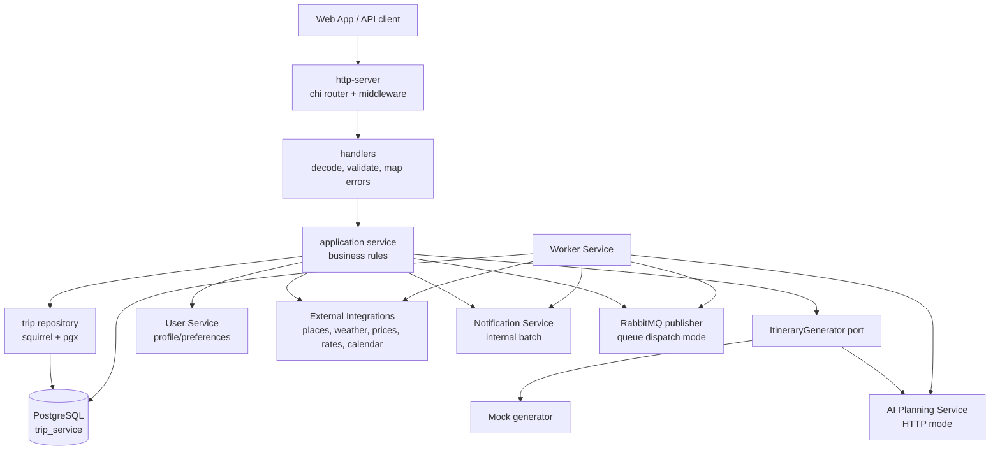
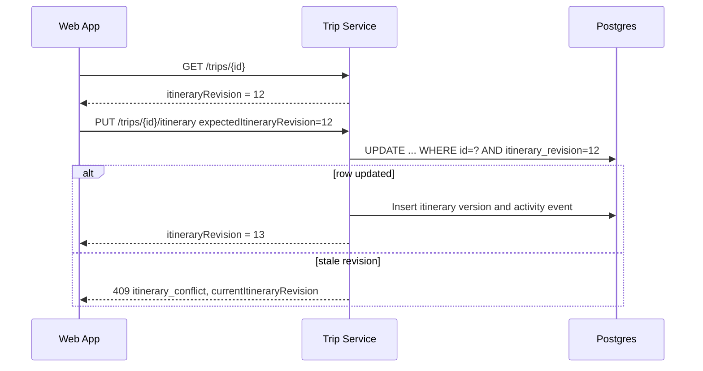
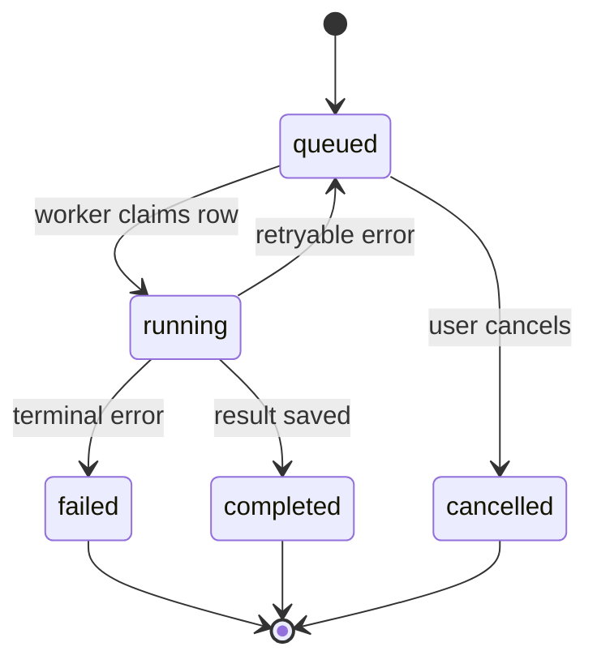

# Trip Service

Go service that owns trip planning state and the main domain workflow for the
Travel AI App. It stores trips, itineraries, revision history, collaborators,
comments, public shares, activity events, generation jobs, budget proposals,
calendar sync mappings, accommodation data, and enrichment metadata.

Trip Service is the orchestration point between user-facing APIs, AI generation,
external provider data, notifications, and background workers.

## Architecture



The service follows a layered structure: `http-server` -> `application` ->
`domain`, with adapters in `infrastructure`. The composition root in
`internal/app` wires config, logger, Postgres, providers, HTTP server, workers,
and graceful shutdown.

## Responsibilities

| Area | Owned by Trip Service |
| ---- | --------------------- |
| Trip access | Owner/collaborator access checks, role capabilities, public share redaction. |
| Itinerary safety | `itineraryRevision`, revision-aware writes, version snapshots, restore. |
| Generation | Job creation, sync compatibility routes, AI context assembly, result validation. |
| Collaboration | Invites, roles, accepted/shared trips, presence, soft edit locks. |
| Workspaces | Personal vs workspace trips, workspace role checks via User Service, combined effective access. |
| Activity | Persistent audit feed plus in-memory SSE best-effort updates. |
| Comments | Private item comments, counts, edit/delete permissions. |
| Budget | Trip budget, workspace shared budgets, item/accommodation costs, multi-currency summaries, cost splitting, analytics, proposals. |
| Accommodation | One private structured stay per trip, included in AI/budget/route context. |
| Sharing | One public read-only link per trip, optional expiry/password unlock. |
| Calendar | Per-trip/user sync state; provider operations delegated to External Integrations. |
| Trip templates | Private/workspace reusable itinerary structures with sanitized JSON, shifted-date instantiation, and workspace role enforcement. |

## Revision-Safe Writes



Every private itinerary-changing request must include
`expectedItineraryRevision`. Stale writes fail with `409 itinerary_conflict`.
Comments, collaborators, shares, presence, notifications, budget settings,
accommodation settings, exports, and public views do not increment the itinerary
revision.

## Background Jobs



Generation job types:

- `full_generation`
- `day_regeneration`
- `item_regeneration`
- `quality_improvement_day`
- `quality_improvement_item`
- `budget_optimization_day`

Dispatch modes:

- `GENERATION_JOB_DISPATCH_MODE=queue`: publish a small RabbitMQ message and let
  Worker Service process the existing DB job row.
- `GENERATION_JOB_DISPATCH_MODE=in_process`: use the Trip Service local poller
  for fallback and tests.

Queue messages intentionally contain only IDs, type, timestamps, and
correlation metadata. They do not contain access tokens, prompts, preferences,
or itinerary JSON.

## Endpoint Groups

| Group | Routes |
| ----- | ------ |
| Health | `GET /health`, `GET /ready`, `GET /metrics` |
| Trips | `POST /trips`, `GET /trips`, `GET /trips/shared-with-me`, `GET /trips/{id}` |
| Generation jobs | `POST /trips/{id}/generation-jobs`, `GET /trips/{id}/generation-jobs`, `GET /trips/{id}/generation-jobs/{jobId}`, `POST /trips/{id}/generation-jobs/{jobId}/cancel` |
| Sync generation compatibility | `POST /trips/{id}/generate`, day regeneration, item regeneration |
| Itinerary | `PUT /trips/{id}/itinerary`, version list/detail/restore routes |
| Budget | `GET /trips/{id}/budget-summary`, `PUT /trips/{id}/budget`, budget optimization job/proposal routes |
| Workspace budgets | `GET/POST /workspaces/{workspaceId}/budgets`, `GET/PATCH /workspaces/{workspaceId}/budgets/{budgetId}`, `POST /archive`, `POST /make-primary`, summary routes |
| Cost splitting | `/trips/{id}/travelers`, `GET /trips/{id}/cost-splitting/summary`, item/accommodation cost-split update routes |
| Cost analytics | `GET /trips/{id}/analytics/costs`, `GET /workspaces/{workspaceId}/analytics/costs` |
| Accommodation | `GET /trips/{id}/accommodation`, `PUT /trips/{id}/accommodation`, `DELETE /trips/{id}/accommodation` |
| Collaboration | collaborator CRUD/accept/decline, `GET /collaboration/invitations` |
| Presence and locks | `/trips/{id}/presence*`, `/trips/{id}/edit-lock` |
| Comments | `/trips/{id}/comments`, `/trips/{id}/comments/counts`, comment update/delete |
| Activity | `GET /trips/{id}/activity`, `GET /trips/{id}/activity/stream` |
| Sharing | `GET/POST/PATCH/DELETE /trips/{id}/share`, public share status/unlock/read routes |
| Calendar | `GET/POST/DELETE /trips/{id}/calendar-sync/google*` |
| Trip templates | `GET /trip-templates`, `POST /trips/{id}/templates`, `GET/PATCH /trip-templates/{templateId}`, archive/duplicate/create-trip routes, `GET /workspaces/{workspaceId}/templates` |

## Trip Templates

Trip Templates v1 lives in Trip Service and stores reusable private or
workspace-scoped itinerary structure in `trip_templates`. Templates include
metadata, destination hints, duration, tags, approximate item costs, and a
versioned `template_json` payload with `schemaVersion=1` and per-day
`dayOffset` values.

Visibility:

- `private`: visible, editable, usable, duplicable, and archivable only by the
  creator.
- `workspace`: visible to active workspace members. Owner/admin can edit or
  archive any workspace template; members can edit/archive their own; viewers
  can view only and cannot create trips from templates.

Saving a trip as a template requires edit access to the source trip. The
sanitizer keeps reusable day/item structure, place display data, and approximate
estimated costs, but removes comments, collaborators, activity/version history,
public share state, calendar sync IDs, booking/availability snapshots, provider
raw metadata, presence/edit locks, job metadata, exact dates, and notification
data.

Creating a trip from a template does not call AI and does not refresh providers.
It creates a personal or workspace trip, shifts day offsets from the requested
start date, writes a completed itinerary snapshot with
`CREATED_FROM_TEMPLATE`, records `trip_created_from_template`, and leaves
availability unchecked. Template prices are copied as approximate manual costs
with a verification note.

Limitations: templates are private/workspace only in v1; no marketplace,
ratings, comments, visual content editor, AI adaptation, destination
transformation, bookings, or availability refresh is included.

Private routes require `Authorization: Bearer <accessToken>` when
`AUTH_REQUIRED=true`. Public share routes use opaque share tokens and optional
short-lived public share unlock tokens.

## Workspace Trips

Trips now have nullable `workspace_id`. Existing rows remain personal trips with
`workspace_id=NULL`; workspace trips keep `user_id` as creator/audit owner while
access is granted through User Service workspace roles.

`POST /trips` accepts optional `workspaceId`. If present, Trip Service calls
User Service `POST /internal/workspaces/access-check` and requires workspace
`owner`, `admin`, or `member`; `viewer` can view but cannot create/edit.

`GET /trips` accepts:

- `scope=all|personal|workspace`
- `workspaceId=<uuid>` for a single workspace

For workspace listings, Trip Service calls
`POST /internal/workspaces/list-for-user` and returns only trips from active
memberships. Trip responses include `workspaceId`, `scope`, and access metadata
with `source=owner|workspace|collaborator|public`.

Effective access is the strongest safe permission from personal owner,
workspace role, direct trip collaborator, or public share. Workspace owner/admin
map to owner-level trip management, member maps to editor, and viewer maps to
viewer. Direct trip collaborators still work for workspace trips, including
non-workspace exceptions. Public share links remain separate anonymous read-only
access and never expose workspace member data.

## Cost Analytics

Cost Analytics Dashboard v1 is read-only and computed from existing Trip Service
data at request time. It does not add accounting records or booking/payment
data.

- `GET /trips/{id}/analytics/costs?currency=EUR` returns trip-level estimated
  totals, budget remaining/overage, cost by day/category/source/confidence,
  original currency totals, expensive items, missing/uncertain estimate counts,
  conversion warnings, and actionable planning insights.
- `GET /workspaces/{workspaceId}/analytics/costs?currency=EUR&from=2026-01-01&to=2026-12-31`
  aggregates accessible workspace trips by trip/category/source/month and
  includes top trips/items plus incomplete budget warnings. When an active
  primary workspace budget exists, the response includes `activeBudget` usage
  and budget limit insights.
- Trip analytics requires private trip access. Owners, editors, and viewers can
  read analytics; public share tokens do not expose analytics in v1.
- Workspace analytics requires an active workspace role through User Service.
  Owner, admin, member, and viewer roles can read the dashboard.

Calculations reuse the budget conversion rules used by `budget-summary`.
Accommodation cost is included once in total/category rollups and not forced
into daily totals. Currency conversion failures are returned as warnings and the
affected costs remain visible in original-currency totals.

Limitations: costs are estimates for planning only; exchange rates may be
approximate; provider prices and availability may change; missing estimates can
make totals incomplete; reports are not accounting, tax, invoice, payment, or
financial-advice features.

## Cost Splitting

Cost Splitting Between Travelers v1 is a planning-only allocation layer over
existing itinerary and accommodation estimates. It does not create payment,
settlement, reimbursement, debt, invoice, accounting, or booking records.

Data lives in `trip_travelers` for the roster. Individual split rules are stored
inline on `estimatedCost.split` for itinerary items and accommodation costs.
Supported rule types are:

- `all_equal`: split the cost evenly across active trip travelers.
- `selected_equal`: split evenly across the selected active traveler IDs.
- `custom_percentages`: allocate by traveler ID percentages that must total
  100 for saved rules.

Routes:

- `GET /trips/{id}/travelers`
- `POST /trips/{id}/travelers`
- `PATCH /trips/{id}/travelers/{travelerId}`
- `DELETE /trips/{id}/travelers/{travelerId}` soft-removes a traveler.
- `GET /trips/{id}/cost-splitting/summary?currency=EUR`
- `PATCH /trips/{id}/itinerary/days/{dayNumber}/items/{itemIndex}/cost-split`
- `PATCH /trips/{id}/accommodation/cost-split`

Owners and editors can manage travelers and split rules. Viewers can read the
roster and summary. Item split updates are revision-safe and increment
`itineraryRevision`; accommodation split updates do not. The summary is computed
at request time, defaults unconfigured costs to `all_equal`, includes
accommodation once, applies existing budget currency conversion rules, and
reports missing estimates, invalid references, and unassigned costs.

Limitations: v1 has no balances owed, payments, invitations from traveler rows,
group chat, receipt images, tax/tip handling, recurring expenses, booking
checkout, or settlement workflow. Removed travelers are retained for audit
visibility but are excluded from active allocations unless a stale rule still
references them, in which case the summary reports an invalid split.

## Workspace Shared Budgets

Workspace Shared Budgets v1 is owned by Trip Service because Trip Service owns
workspace trip costs, budget summaries, analytics, and currency conversion.

Data lives in `workspace_budgets`:

- `workspace_id`, `name`, optional `description`, `amount`, `currency`
- optional `period_start` / `period_end`; null dates mean open-ended
- `status=active|archived`, `is_primary`, creator/archive audit columns
- a partial unique index allows at most one active primary budget per workspace

Routes:

- `GET /workspaces/{workspaceId}/budgets?status=active|archived`
- `POST /workspaces/{workspaceId}/budgets`
- `GET /workspaces/{workspaceId}/budgets/{budgetId}`
- `PATCH /workspaces/{workspaceId}/budgets/{budgetId}`
- `POST /workspaces/{workspaceId}/budgets/{budgetId}/archive`
- `POST /workspaces/{workspaceId}/budgets/{budgetId}/make-primary`
- `GET /workspaces/{workspaceId}/budgets/{budgetId}/summary`
- `GET /workspaces/{workspaceId}/budgets/primary/summary`

Permissions use User Service workspace access checks. Owner/admin can create,
update, archive, and make primary; member/viewer can list and read summaries;
non-members are denied. Archived workspaces are read-only for budgets.

Successful create/update/archive actions emit best-effort in-app notifications
to active workspace owners/admins except the actor. Primary changes are sent as
`workspace_budget_updated`. Budget-threshold notifications are not emitted from
analytics reads in v1 to avoid repeated alerts.

Summary calculation is read-only and approximate. It includes workspace trips
whose `startDate` falls inside the budget period. If both dates are null, all
workspace trips are included, including trips without a start date. For dated
budgets, trips without a start date are excluded and reported as warnings.
Totals are converted into the budget currency using the existing budget
conversion provider and warnings are returned for unconverted costs.

Limitations: workspace budgets do not block trip edits, do not represent actual
payments, do not split costs between members, and are not accounting, tax,
invoice, reimbursement, or billing records.

## Workspace Approval Workflow

A lightweight review/approval flow for **workspace** trips. Personal trips are
always `not_required` and expose no approval actions.

### Storage

Approval state lives on the `trips` table (added in migration `000020`):

`approval_status`, `approval_submitted_at/_by_user_id`,
`approval_approved_at/_by_user_id`, `approval_changes_requested_at/_by_user_id`,
`approval_cancelled_at/_by_user_id`, `approval_note`, `approval_decision_note`,
and `approval_last_status_changed_at/_by_user_id`. Indexes cover
`(workspace_id, approval_status)`, `approval_submitted_at`, and
`approval_approved_at`.

Approval history is kept separately in `trip_approval_events`
(`event_type`, `from_status`, `to_status`, `note`, `checklist_snapshot` JSONB)
so decisions have a durable trail independent of the generic activity feed.

### Statuses and transitions

- `not_required` — personal trip; approval does not apply.
- `draft` — default for new/backfilled workspace trips; submittable.
- `pending_approval` — submitted, awaiting owner/admin review.
- `changes_requested` — owner/admin asked for changes; editable and resubmittable.
- `approved` — owner/admin approved.
- `cancelled` — a pending submission was withdrawn; resubmittable.

Submit is allowed from `draft`, `changes_requested`, or `cancelled`.
Approve / request-changes / cancel are only allowed from `pending_approval`.

### Endpoints

| Method | Path | Who |
| --- | --- | --- |
| `GET` | `/trips/{id}/approval` | any user with trip view access |
| `POST` | `/trips/{id}/approval/submit` | trip editor/owner (workspace trip) |
| `POST` | `/trips/{id}/approval/approve` | workspace owner/admin |
| `POST` | `/trips/{id}/approval/request-changes` | workspace owner/admin (note required) |
| `POST` | `/trips/{id}/approval/cancel` | submitter or workspace owner/admin |
| `GET` | `/trips/{id}/approval/events` | any user with trip view access |
| `GET` | `/workspaces/{workspaceId}/approvals` | any active workspace member |

`GET /approval` returns the state, a freshly computed checklist, and per-caller
`canSubmit/canApprove/canRequestChanges/canCancel` flags. The workspace queue
returns rows (with checklist status, warning/critical counts, estimated total),
per-status `counts`, and a `nextCursor`; it defaults to the active review set
(pending, changes requested, draft) and accepts
`status=pending_approval|changes_requested|approved|draft|cancelled|all`.

### Checklist

The pure calculator (`internal/approvals`) evaluates: `itinerary_exists`
(the only **blocker**), `budget_exists`, `workspace_budget_status`,
`trip_budget_status`, `cost_splitting_configured`, `availability_checked`, and
`missing_cost_estimates` (all warnings). Submission is blocked only by a failing
blocker (a missing itinerary), a missing permission, or a non-workspace trip;
warnings never block and can be acknowledged (stored in the submit event's
checklist snapshot). To keep the checklist lightweight, `workspace_budget_status`
is an existence check rather than a full cross-trip budget evaluation.

**Availability signals (Advanced Availability Provider Adapters v1).** When a
user applies a provider availability result to an item, the Web App persists a
lightweight `availabilityCheck` snapshot on the itinerary item
(`aggregate.AvailabilityCheckMeta`: `provider`, `status`, `checkedAt`,
`matchConfidence`, `selectedOptionId`, `fallbackUsed`, `priceChanged` — never the
raw provider response, option lists, or secrets). It round-trips through the
existing itinerary update path (`expectedItineraryRevision` conflict detection
preserved) and is validated/bounded in `validateAndNormalizeAvailabilityCheck`.
The checklist reads these to append richer **warning/info** checks only when
present: `availability_low_confidence`, `availability_unavailable`,
`availability_price_changed` (warnings) and `availability_fallback` (info). None
block submission in v1. An item counts as availability-checked once it has either
a price-enrichment or an applied `availabilityCheck`.

### Reset on edit

After a **successful** material change to an approved or pending workspace trip,
`ResetApprovalIfApproved` atomically moves it back to `draft`, records a
`reset_to_draft` event and activity, and notifies the previous submitter/approver.
It is best-effort and post-commit, so it never fails or rolls back the edit.
Material triggers: itinerary writes (manual edit, day/item regeneration, version
restore, generation completion, budget-optimization apply — all via the single
itinerary save path), plus budget, accommodation, cost-split, and traveler
changes. Comments, activity, notifications, presence, sharing, calendar sync,
export, and analytics are **not** material.

### Notifications and activity

Each action records a generic activity event (`trip_submitted_for_approval`,
`trip_approved`, `trip_changes_requested`, `trip_approval_cancelled`,
`trip_approval_reset_to_draft`) with `fromStatus`/`toStatus`/`noteSnippet`, and
sends matching notifications (submit → owners/admins; approve/request-changes →
submitter + trip editors; cancel → the other party; reset → previous
submitter/approver), always excluding the actor. Notification metadata is limited
to `tripId`, `workspaceId`, and `approvalStatus`.

Limitations: approval is lightweight planning approval, not a legal/compliance
workflow. It does not lock a trip from edits (editing an approved trip resets it
to draft), has no multi-step chains, delegation, due dates, or SLA escalation.

## Important Configuration

| Variable | Purpose |
| -------- | ------- |
| `HTTP_ADDRESS`, `HTTP_WRITE_TIMEOUT` | HTTP bind address and long generation response timeout. |
| `AUTH_REQUIRED`, `JWT_ACCESS_SECRET`, `AUTH_HEADER_NAME` | Auth Service JWT validation. |
| `ITINERARY_GENERATOR_MODE` | `mock` or `http` AI generator adapter. |
| `AI_PLANNING_SERVICE_URL`, `AI_PLANNING_TIMEOUT_SECONDS` | AI Planning Service client. |
| `USER_SERVICE_URL`, `USER_CONTEXT_*` | Profile/preference lookup for personalization. |
| `WORKSPACES_ENABLED`, `USER_SERVICE_URL`, `WORKSPACE_ACCESS_TIMEOUT_SECONDS`, `INTERNAL_SERVICE_TOKEN` | Workspace access checks and trip list scoping. |
| `EXTERNAL_INTEGRATIONS_SERVICE_URL` | Weather, places, prices, rates, and calendar calls. |
| `WEATHER_CONTEXT_*` | Optional weather context for AI prompts. |
| `PLACE_ENRICHMENT_*`, `PRICE_ENRICHMENT_*` | Auto-enrichment after generation. |
| `BUDGET_CONVERSION_*` | Exchange-rate conversion for budget summaries. |
| `PUBLIC_SHARING_*`, `PUBLIC_SHARE_ACCESS_*` | Public share link controls. |
| `TRIP_PRESENCE_*`, `TRIP_ACTIVITY_STREAM_*`, `TRIP_EDIT_LOCK_*` | In-memory SSE/advisory collaboration features. |
| `GENERATION_JOB_*`, `RABBITMQ_*` | Job queue, retry, DLQ, and worker behavior. |
| `OPS_DASHBOARD_ENABLED`, `OPS_ADMIN_EMAILS`, `OPS_STALE_RUNNING_JOB_SECONDS` | Allowlisted admin job monitor and safe job actions. |
| `NOTIFICATIONS_*`, `NOTIFICATION_SERVICE_*` | Synchronous fail-open notification fanout. |
| `CALENDAR_SYNC_*`, `DEFAULT_CALENDAR_TIMEZONE` | Calendar sync behavior. |
| `POSTGRES_*`, `POSTGRES_MIG_PATH` | Database and auto-migration settings. |

## Ops Dashboard Endpoints

When `OPS_DASHBOARD_ENABLED=true`, allowlisted users can inspect generation jobs
with `GET /ops/jobs`, `GET /ops/jobs/summary`, and `GET /ops/jobs/{jobId}`.
Safe mutations require a non-empty `reason`: retry creates a new queued job,
cancel only affects queued jobs, and mark-failed only affects stale running jobs.

See [configs/config.example.yaml](configs/config.example.yaml) and
[.env.example](.env.example) for the full local template.

## Run Locally

From this service directory:

```bash
cp .env.example .env
set -a; source .env; set +a
make run
```

Run with YAML config:

```bash
cp configs/config.example.yaml configs/config.yaml
make config-run
```

Run the full application stack from the repository root:

```bash
docker compose -f infra/docker-compose.yml --env-file infra/.env up --build
```

Migrations run automatically on startup. Manual migration commands:

```bash
make migrate-up
make migrate-down
```

## Development Checks

```bash
make fmt
make vet
make test
make build
```

## Operational Notes

- `queue` dispatch requires RabbitMQ and Worker Service. Keep `in_process` as a
  local fallback only.
- Notification calls are synchronous but fail-open by default; a notification
  outage must not break the originating trip action.
- Weather, place, price, and budget conversion provider calls are fail-open by
  default in local development and produce warnings or partial context.
- Presence, activity SSE, and edit locks are process-local v1 features. They do
  not provide cross-instance guarantees.
- Public share responses are sanitized and omit private collaborator,
  notification, activity, version-management, accommodation, and budget proposal
  surfaces.

## Observability And Safety

- `GET /metrics` exposes HTTP, job, notification, activity, provider, and domain
  metrics.
- Logs and internal calls propagate `X-Request-ID` and `X-Correlation-ID`.
- Do not log access tokens, internal service tokens, share passwords, public
  share access tokens, full prompts, full preference payloads, full private
  itinerary JSON, OAuth tokens, or provider API keys.
