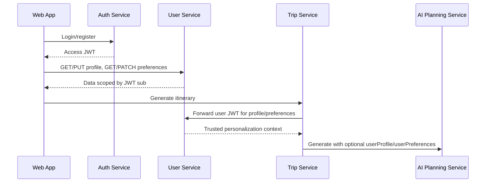

# User Service

Go service that owns each authenticated user's travel profile and preference
data. Identity stays in Auth Service; User Service validates the Auth Service
JWT locally and scopes all records by the token `sub` claim.

Trip Service forwards the user's bearer token to this service during itinerary
generation so AI Planning Service can receive trusted personalization context.

## Data Flow



## Endpoints

| Method | Path | Auth | Purpose |
| ------ | ---- | ---- | ------- |
| `GET` | `/health` | none | Liveness. |
| `GET` | `/ready` | none | PostgreSQL readiness. |
| `GET` | `/metrics` | none | Prometheus metrics. |
| `GET` | `/users/me/profile` | bearer access token | Read current user's profile. |
| `PUT` | `/users/me/profile` | bearer access token | Replace current user's profile fields. |
| `GET` | `/users/me/preferences` | bearer access token | Read travel preferences. |
| `PATCH` | `/users/me/preferences` | bearer access token | Partially update travel preferences. |

Clients never send `userId`; the user is derived from the JWT `sub`.

## Local Development

```bash
cd services/user-service
cp .env.example .env
set -a; source .env; set +a
make run
```

Run with YAML config:

```bash
cp configs/config.example.yaml configs/config.yaml
make config-run
```

Migrations run automatically on startup. Manual migration targets are available:

```bash
make migrate-up
make migrate-down
```

## Configuration

| Variable | Default | Notes |
| -------- | ------- | ----- |
| `APP_ENV` | `development` | Production rejects weak token settings. |
| `HTTP_ADDRESS` | `:8083` | Listen address. |
| `AUTH_REQUIRED` | `true` | Keep enabled outside local debugging. |
| `JWT_ACCESS_SECRET` | `change-me-in-development` | Must match Auth Service. |
| `AUTH_HEADER_NAME` | `Authorization` | Bearer token header. |
| `DEV_USER_ID` | fixed UUID | Only used when auth is disabled. |
| `POSTGRES_*` | local compose defaults | Database and pool settings. |
| `POSTGRES_MIG_PATH` | `./migrations` | Migration directory. |
| `CORS_ALLOWED_ORIGINS` | `http://localhost:3000` | Browser origin allowlist. |

## Example Calls

```bash
TOKEN="<access token>"

curl -H "Authorization: Bearer ${TOKEN}" \
  http://localhost:8083/users/me/profile

curl -X PUT http://localhost:8083/users/me/profile \
  -H "Authorization: Bearer ${TOKEN}" \
  -H "Content-Type: application/json" \
  -d '{"displayName":"Dmytro","homeCity":"Bratislava","preferredCurrency":"EUR"}'

curl -X PATCH http://localhost:8083/users/me/preferences \
  -H "Authorization: Bearer ${TOKEN}" \
  -H "Content-Type: application/json" \
  -d '{"travelStyles":["budget","food"],"pace":"balanced","maxWalkingKmPerDay":8}'
```

## Development Checks

```bash
make fmt
make vet
make test
make build
```

## Observability And Safety

- `GET /metrics` exposes HTTP and user-domain metrics.
- Request and correlation IDs are generated when missing, echoed in responses,
  and included in logs.
- Do not log access tokens, full preference payloads, private profile payloads,
  or raw Authorization headers.
