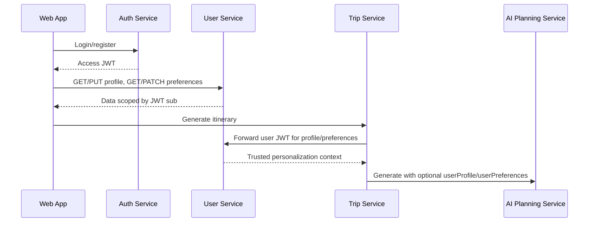

# User Service

Go service that owns each authenticated user's travel profile and preference
data. Identity stays in Auth Service; User Service validates the Auth Service
JWT locally and scopes all records by the token `sub` claim.

Trip Service forwards the user's bearer token to this service during itinerary
generation so AI Planning Service can receive trusted personalization context.
The service also owns Multi-Tenant / Team Workspace v1 membership data so Trip
Service can enforce workspace trip access through internal role checks.

## Data Flow



## Endpoints

| Method | Path | Auth | Purpose |
| ------ | ---- | ---- | ------- |
| `GET` | `/health` | none | Liveness. |
| `GET` | `/ready` | none | PostgreSQL readiness. |
| `GET` | `/metrics` | none | Prometheus metrics. |
| `GET` | `/users/me/profile` | bearer access token | Read current user's profile. |
| `PUT` | `/users/me/profile` | bearer access token | Replace current user's profile fields. |
| `GET` | `/users/me/preferences` | bearer access token | Read travel preferences. |
| `PATCH` | `/users/me/preferences` | bearer access token | Partially update travel preferences. |
| `POST` | `/workspaces` | bearer access token | Create a workspace and owner membership. |
| `GET` | `/workspaces` | bearer access token | List active workspaces for current user. |
| `GET/PATCH/DELETE` | `/workspaces/{workspaceId}` | bearer access token | Read, update, or archive a workspace. |
| `GET` | `/workspaces/{workspaceId}/members` | bearer access token | List workspace members. |
| `POST` | `/workspaces/{workspaceId}/members/invite` | bearer access token | Invite an admin/member/viewer. |
| `PATCH/DELETE` | `/workspaces/{workspaceId}/members/{memberId}` | bearer access token | Change role or remove/leave. |
| `GET` | `/workspace-invitations` | bearer access token | List current user's pending workspace invitations. |
| `POST` | `/workspace-invitations/{invitationId}/accept` | bearer access token | Accept a pending invitation. |
| `POST` | `/workspace-invitations/{invitationId}/decline` | bearer access token | Decline a pending invitation. |
| `POST` | `/internal/workspaces/access-check` | internal token | Check active membership and role for Trip Service. |
| `POST` | `/internal/workspaces/list-for-user` | internal token | List active workspace ids/roles for Trip Service filters. |
| `POST` | `/internal/workspaces/list-members` | internal token | List active workspace members for internal notification fan-out. |
| `POST` | `/internal/workspaces/batch` | internal token | Resolve workspace names/slugs for internal callers. |

Clients never send `userId`; the user is derived from the JWT `sub`.

## Workspaces

Workspaces are user-centric membership data stored in `workspaces`,
`workspace_members`, and `workspace_invitations`. Roles are intentionally simple:
`owner`, `admin`, `member`, and `viewer`.

- `owner`: full management, archive, admins/members/viewers, all workspace trips.
- `admin`: workspace settings and member/viewer invites/removal, no owners or archive.
- `member`: create/view/edit workspace trips.
- `viewer`: view workspace trips only.

Membership statuses are `active`, `invited`, and `removed`. Invitation statuses
are `pending`, `accepted`, `declined`, `revoked`, and `expired`. Invited emails
are normalized lowercase, pending invites are unique per workspace/email, and
active/invited memberships are unique per workspace/user. Owner transfer is out
of scope for v1; the service prevents removing the last owner.

## Local Development

```bash
cd services/user-service
cp .env.example .env
set -a; source .env; set +a
make run
```

Run with YAML config:

```bash
cp configs/config.example.yaml configs/config.yaml
make config-run
```

Migrations run automatically on startup. Manual migration targets are available:

```bash
make migrate-up
make migrate-down
```

## Go Package Layout

- `cmd/server` and `cmd/migrate` are thin executable entrypoints.
- `internal/app` is the composition root: config, logger, dependencies, HTTP server, and shutdown lifecycle.
- `internal/application`, `internal/domain`, and `internal/workspaces` contain user-service business rules.
- `internal/authusers` and `internal/notifications` are outbound adapters to other Travel AI services.
- `internal/httpserver` owns transport concerns: routing, middleware, request/response DTOs, and handlers.
- `internal/repository/postgres` owns user profile and preference persistence.
- `pkg` is reserved for project-agnostic plumbing that can be reused without knowing user-service domain rules: logger, shutdown stack, observability middleware, Postgres bootstrapping, and validation.

## Configuration

| Variable | Default | Notes |
| -------- | ------- | ----- |
| `APP_ENV` | `development` | Production rejects weak token settings. |
| `HTTP_ADDRESS` | `:8083` | Listen address. |
| `AUTH_REQUIRED` | `true` | Keep enabled outside local debugging. |
| `JWT_ACCESS_SECRET` | `change-me-in-development` | Must match Auth Service. |
| `AUTH_HEADER_NAME` | `Authorization` | Bearer token header. |
| `DEV_USER_ID` | fixed UUID | Only used when auth is disabled. |
| `POSTGRES_*` | local compose defaults | Database and pool settings. |
| `POSTGRES_MIG_PATH` | `./migrations` | Migration directory. |
| `CORS_ALLOWED_ORIGINS` | `http://localhost:3000` | Browser origin allowlist. |
| `INTERNAL_SERVICE_TOKEN` | development token | Protects `/internal/workspaces/*`. |
| `AUTH_SERVICE_URL`, `AUTH_USER_LOOKUP_TIMEOUT_SECONDS` | Auth Service URL/timeout for workspace invitation lookup and member display. |
| `NOTIFICATION_SERVICE_URL` | Notification Service URL | Best-effort workspace notifications. |
| `PUBLIC_WEB_BASE_URL` | `http://localhost:3000` | Link base for workspace invitation notifications. |

## Example Calls

```bash
TOKEN="<access token>"

curl -H "Authorization: Bearer ${TOKEN}" \
  http://localhost:8083/users/me/profile

curl -X PUT http://localhost:8083/users/me/profile \
  -H "Authorization: Bearer ${TOKEN}" \
  -H "Content-Type: application/json" \
  -d '{"displayName":"Dmytro","homeCity":"Bratislava","preferredCurrency":"EUR"}'

curl -X PATCH http://localhost:8083/users/me/preferences \
  -H "Authorization: Bearer ${TOKEN}" \
  -H "Content-Type: application/json" \
  -d '{"travelStyles":["budget","food"],"pace":"balanced","maxWalkingKmPerDay":8}'
```

## Development Checks

```bash
make fmt
make lint
make vet
make test
make build
```

## Observability And Safety

- `GET /metrics` exposes HTTP and user-domain metrics.
- Request and correlation IDs are generated when missing, echoed in responses,
  and included in logs.
- Do not log access tokens, full preference payloads, private profile payloads,
  or raw Authorization headers.
